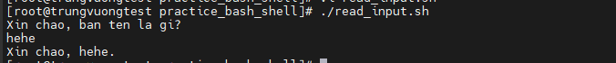
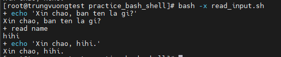
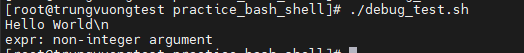
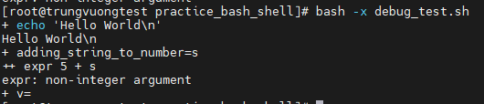

# Tìm hiểu cơ bản về Bash Shell part 1

### 1. Hello World

- Chế độ Shell tương tác (Interactive Shell): có thể hiểu đơn giản Interactive Shell là dạng sử dụng câu lệnh trực tiếp trên môi trường Unix như ví dụ dưới

```sh
echo "Hello World"
```

- Chế độ Shell không tương tác (Non-Interactive Shell): thay vì thực hiện từng câu lệnh, ta có thể đưa chúng vào 1 file script và có thể sử dụng lại nhiều lần

```sh
touch hello-world.sh
chmod +x hello-world.sh
```

- Thêm nội dung sau vào script

```sh
#!/bin/bash
echo "Hello World"
```

- Trong đó:
    - Dòng 1: dòng đầu tiên của script phải bắt đầu bằng ký tự ```#!``` theo đúng cấu trúc shebang. Cấu trúc shebang sẽ chỉ cho OS chạy chương trình ```/bin/bash``` để thực hiện các nội dung của script
    - Dòng 2: câu lệnh echo để in ra dòng ```Hello World```

- Có 3 cách để chạy lệnh bash trên

```sh
./hello-world.sh
/bin/bash hello-world.sh
bash hello-world.sh
```

### 2. Sử dụng các biến trong Linux

- Tạo 1 file mới tên gọi ```hello.sh``` với nội dung bên dưới và cấp quyền thực thi ```chmod +x hello.sh```

```sh
#!/usr/bin/env bash
who_variable="World"
prinf "Hello, %s\n" "$who_variable"
```

- Trong đó:
    - Dòng 1: cú pháp shebang để chỉ ra chương trình cần thực thi với Bash shell
    - Dòng 2: khởi tạo biến ```who_variable``` có nội dung là ```World```
    - Dòng 3:
        - ```prinf```: in ra màn hình
        - ```%s```: chỉ định biến này phải ở dạng string
        - ```\n```: ký tự xuống dòng
        - ```$who_variable```: biến được khai báo ở dòng trên

### 3. Truyền tham số vào biến với User Input

- Các biến có thể được truyền vào trực tiếp từ người dùng như sau

```sh
echo "Xin chao, ban ten la gi?"
read name
echo "Xin chao, $name."
```

- Khi script chạy tới dòng thứ 2, câu lệnh ```read``` sẽ đọc dữ liệu truyền vào từ người dùng, sau đó gán dữ liệu đó vào biến ```name```



### 4. Tầm quan trọng của các dấu nháy (quoting) với String

- Việc sử dụng dấu nháy rất quan trọng trong việc thể hiện string trong bash

- Có 2 dạng dấu nháy:
    - Weak quoting: dấu nháy kép ```"```
    - Strong quoting: dấu nháy đơn ```'```

- Với **Weak quoting**: sử dụng nháy kép khi muốn thực thi các biến String được truyền vào

- Với **Strong quoting**: sử dụng nháy đơn khi bạn muốn giữ nguyên nội dung trong dấu nháy. VD

```sh
#!/usr/bin/env bash
world="World"
echo 'Hello $world'
```

-> Output sẽ là ```Hello $world```. Cách viết sau cũng cho output tương tự:

```sh
#!/usr/bin/env bash
world="World"
echo "Hello \$world"
```

### 5. Chế độ Debug trong Shell

- Để có thể theo dõi quá trình thực thi script nhằm hiểu rõ hơn về cách script thực hiện, hoặc tìm lỗi trong script, chúng ta có thể dùng chế độ Debug
- Để thực hiện việc debug, cần thêm tổ hợp ký tự -x đằng sau cách mệnh lệnh run

- VD1:



- VD2: thực hiện debug với script sau

```sh
#!/bin/bash
echo "Hello World\n"
adding_string_to_number="s"
v=$(expr 5 + $adding_string_to_number)
```



- Output như trên có lẽ sẽ chưa đủ để tìm ra lỗi của script. Giờ thử với chế độ debug



-> Có thể thấy, do ```s``` không phải là 1 số nên toán tử trên không thể thực hiện được