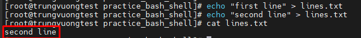
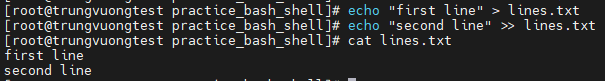

# Tìm hiểu cơ bản về Bash Shell part 2

### 1. Sử dụng Redirection trong Shell

- Kỹ thuật redirection là kỹ thuật dùng toán tử ```>``` để redirect từ luồng stream này sang luồng stream khác. Thường được dùng để thêm nội dung vào trong file. Có 2 kiểu redirection:
- Kiểu ```Trancate >```: kiểu này sẽ xóa toàn bộ nội dung cũ của file và chèn nội dung được thêm. VD:

```sh
echo "first line" > /tmp/lines
echo "second line" > /tmp/lines
```

- Khi đó nội dung file sẽ là



- Kiểu ```Append >>```: kiểu này sẽ chèn thêm nội dung mới vào file và không tác động gì tới nội dung cũ của file

```sh
echo "first line" > /tmp/lines
echo "second line" >> /tmp/lines
```

- Kiểm tra nội dung file



### 2. STDIN, STDOUT, STDERR

- Các câu lệnh trong Linux đều có 1 input - STDIN, 2 loại output là standard output - STDOUT và standard error - STDERR, được gọi là các dòng dữ liệu (stream)
- STDIN, STDOUT và STDERR được diễn đạt như 1 số nguyên dương như sau:
    - standard input: 0
    - standard output: 1
    - standard error: 2
    - STDIN: các dữ liệu nhập vào như khi sử dụng lệnh ```read``` để nhập dữ liệu từ người dùng
    - STDOUT: hiển thị kết quả các câu lệnh lên màn hình

- Trong Linux, mọi thứ đều là file, và ngay cả các standard input, output, error đều là file. Mỗi file đều cần phải có định danh gọi là ```file descriptor```, giá trị của file descriptor như đã nói ở bên trên
- ```/dev/null/``` là 1 file đặc biệt trong Linux, thường được dùng để chứa các dữ liệu rác từ các input stream mà chúng ta không muốn xử lý hay muốn hiển thị nó. Nói dễ hiểu thì ```/dev/null/``` giống như 1 hố đen, chứa tất cả các dữ liệu được redirect tới nó
- Như vậy ```echo hello >/dev/null 2>&1``` có nghĩa là:
    - ```>/dev/null```: redirect tất cả các standard output sang ```/dev/null/```, tương tự với cách viết ```1>/dev/null/```
    - ```2>&1```: redirect tất cả các standard error sang standard output. Nhưng thời điểm này standard output đang trỏ sang ```/dev/null/``` nên standard error sẽ redirect sang ```/dev/null/```
-> Tóm lại lệnh này ngụ ý là sẽ không in ra màn hình các output và error bằng cách đẩy chúng vào ```/dev/null/```