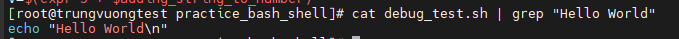
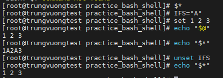
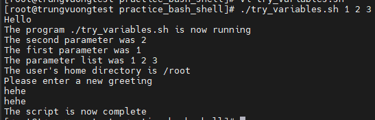

# Tìm hiểu cơ bản về Bash Shell part 3

### 1. Các ký tự đặc biệt kiểm soát tiến trình trong Shell

#### a. "&" (Ampersand)

Dấu "&" đặt một tiến trình vào chế độ chạy nền (background process). Bản thân Unix không có khái niệm về tiến trình này là chạy nền (background) hay là tiến trình tương tác (foreground), mà việc này sẽ do Shell điều khiển. Với "&", tiến trình sẽ tự chạy và shell sẽ quay về tương tác ngay với người dùng

Ví dụ: thực hiện sort 1 file đã có sẵn và thực hiện câu lệnh với "&" để câu lệnh được chạy nền

```sh
sort test2.sh > test1 &
```

Câu lệnh sẽ in ra ID của tiến trình đang chạy ngầm. Trên thực tế, "&" được dùng để thực hiện chạy các script dưới dạng các tiến trình ngầm. Ví dụ:

```sh
sh test1.sh &
sh test2.sh &
```

Show tất cả các job đang chạy ngầm ```jobs```

Để quay lại chế độ tương tác của tiến trình 1, sử dụng: ```fg 1```

#### b. "|" (Pipe)

Shell cho phép sử dụng đầu ra của lệnh, và kết nối trực tiếp tới đầu vào của 1 lệnh khác mà không cần xử lý trung gian

VD ta có file ```hello.sh``` với nội dung sau:

```sh
#!/bin/bash
echo "Hello World\n"
adding_string_to_number="s"
v=$(expr 5 + $adding_string_to_number)
```

Thực hiện việc grep ra dòng "Hello World có trong file ```hello.sh```

```sh
cat hello.sh | grep "Hello World"
```

Kết quả nhận được:



#### c. "\" (Backslash)

Dấu \ được dùng để giải trừ ý nghĩa đặc biệt của các dấu như "&", "?" hoặc "$"

VD: ta có 1 file ```file1&2```. Khi thực hiện đọc file này với cú pháp như sau

```sh
cat file1&2
```

Việc đọc sẽ xảy ra lỗi vì tiêu đề của file chứa ký tự đặc biệt "&". Để đọc được file như ý muốn, ta cần thực hiện như sau

```sh
cat file1\&2
```

### 2. Các biến trong Shell

#### a. Biến môi trường (environment variable)

Khi Shell khởi động, nó cung cấp 1 số biến được khai báo và có giá trị mặc định. Chúng được gọi là các biến môi trường. Các biến này thường được viết hoa để phân biệt với các biến do người dùng đặt ra (thường là các ký tự không hoa). Nội dung của các biến này thường tùy vào thiết lập của hệ thống. Một số biến môi trường phổ biến là:
- ```$HOME```: chứa nội dung của thư mục home
- ```$PATH```: chứa đường dẫn tới các trình thực thi
- ```PS1```: dấu nhắc hiển thị trên dòng lệnh. Thông thường là $user không phải user root
- ```PS2```: dấu nhắc thứ cấp, thông báo người dùng nhập thêm thông tin trước khi lệnh thực hiện. Thông thường là dấu ```>```
- ```IFS```: dấu phân cách các trường trong chuỗi. Biến này chứa các ký tự mà shell dùng tách chuỗi (thường là tham số trên dòng lệnh). Ví dụ $IFS thường chứa ký tự Tab, ký tự trắng hoặc ký tự xuống dòng
- ```$o```: chứa tên chương trình gọi trên dòng lệnh
- ```$#```: số tham số truyền trên dòng lệnh

#### b. Biến tham số (parameter variable)

Nếu cần tiếp nhận tham số trên dòng lệnh để xử lý, có thể dùng thêm các biến môi trường sau:
- ```$1```, ```$2```, ```$3```,...: vị trí và nội dung của các tham số trên dòng lệnh theo thứ tự từ trái sang phải
- ```$*```: danh sách shell của tất cả các tham số trên dòng lệnh. Chúng được lưu trong chuỗi duy nhất phân cách bằng ký tự đầu tiên quy định trong $IFS
- ```$@```: các tham số được chuyển thành chuỗi. Không sử dụng dấu phân cách của biến IFS



Ta thấy lệnh ```set``` tiếp nhận 3 tham số trên dòng lệnh lần lượt là ```1```,```2```,```3```. Chúng sẽ ảnh hưởng tới các biến môi trường ```$*``` và ```$@```. Khi IFS được quy định là ký tự ```A```, ```$*``` cho ra kết quả là các tham số đc phân tách vs nhau bởi ```A```. Khi ```unset IFS``` về null thì ```$*``` lại trả về là các tham số cách nhau bởi khoảng trắng giống ```$@``

VD sau sẽ minh họa 1 số cách đơn giản về việc xử lý và truy xuất biến môi trường. Ta có script ```try_variables.sh```



### 3. Điều kiện trong Shell

Một nền tảng cơ bản trong tất cả các ngôn ngữ lập trình đó chính là khả năng kiểm tra điều kiện và đưa ra quyết định thích hợp tùy theo điều kiện đúng hay sai. Trước khi tìm hiểu cấu trúc điều khiển của ngôn ngữ script, ta hãy xem qua cách kiểm tra điều kiện

Một script của shell có thể kiểm tra mã lỗi trả về của bất kỳ lệnh nào có khả năng gọi từ dòng lệnh, bao gồm cả những tập tin lệnh của script khác. Đó là lý do vì sao chúng ta thường sử dụng lệnh ```exit``` ở cuối script mỗi khi kết thúc

#### a. Lệnh ```test``` hoặc ```[]```

Thực tế, các script sử dụng lệnh ```[]``` hoặc ```test``` để kiểm tra điều kiện boolean 1 cách thường xuyên. Trong hầu hết các hệ thống UNIX và Linux thì ```[]``` và ```test``` đều có ý nghĩa tương đương nhau

Ví dụ, dùng lệnh test để kiểm tra file ```hello.c``` có tồn tại trong hệ thống hay không. Cú pháp của lệnh test

```sh
test -f <file_name>
```

Trong script, ta có thể dùng lệnh test theo cách sau

```sh
if test -f hello.c
then 
...
fi 
```

hoặc dùng ```[]``` để thay thế cho ```test```

```sh
if [ -f hello.c ]
then
...
fi
```

Mã lỗi và giá trị trả về của lệnh mà ```test``` kiểm tra sẽ quyết định điều kiện kiểm tra là đúng hay sai

**Lưu ý:** phải đặt khoảng trắng giữa lệnh ```[]``` và biểu thức kiểm tra

Điều kiện mà lệnh ```test``` cho phép kiểm tra có thể rơi vào 1 trong 3 kiểu sau:

- So sánh chuỗi:
    - ```string1 = string2```: ```true``` nếu 2 chuỗi bằng nhau
    - ```string1 != string2```: ```true``` nếu 2 chuỗi ko bằng nhau
    - ```-n string1```: ```true``` nếu string1 ko rỗng
    - ```-z string1```: ```true``` nếu string1 rỗng

- So sánh toán học:
    - ```expression1 -eq expression2```: ```true``` nếu 2 biểu thức bằng nhau
    - ```expression1 -ne expression2```: ```true``` nếu 2 biểu thức không bằng nhau
    - ```expression1 -gt expression2```: ```true``` nếu biểu thức expression1 lớn hơn
    - ```expression1 -ge expression2```: ```true``` nếu biểu thức expression1 lớn hơn hoặc bằng expression2
    - ```expression1 -lt expression2```: ```true``` nếu ex1 nhỏ hơn ex2
    - ```expression1 -le expression2```: ```true``` nếu ex1 nhỏ hơn hoặc bằng ex2
    - ```!expression```: ```true``` nếu biểu thức ex là false (toán tử not)

- Kiểm tra điều kiện trên tập tin
    - ```-d file```: ```true``` nếu file là thư mục
    - ```-e file```: ```true``` nếu file tồn tại trên đĩa
    - ```-f file```: ```true``` nếu file là tập tin thông thường
    - ```-g file```: ```true``` nếu set-group-id được thiết lập trên file 
    - ```-s file```: ```true``` nếu file có kích thước khác 0
    - ```-u file```: ```true``` nếu set-ser-id được áp đặt trên file
    - ```-w file```: ```true``` nếu file cho phép ghi
    - ```-x file```: ```true``` nếu file được phép thực thi

**Lưu ý:** tất cả lệnh kiểm tra tập tin đều yêu cầu file phải tồn tại trước đó