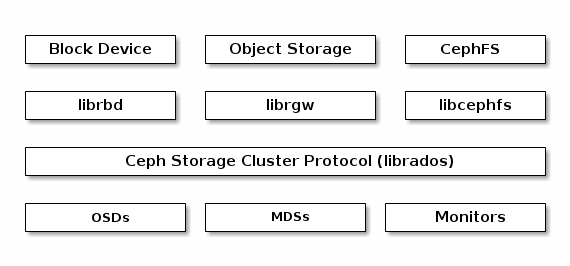
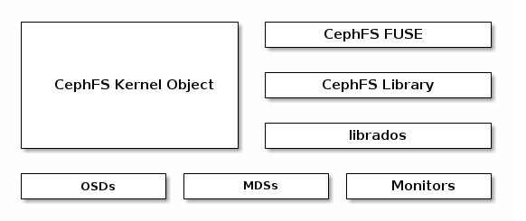
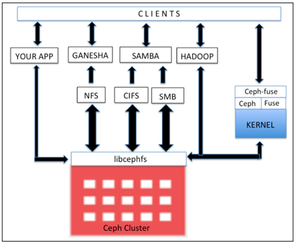
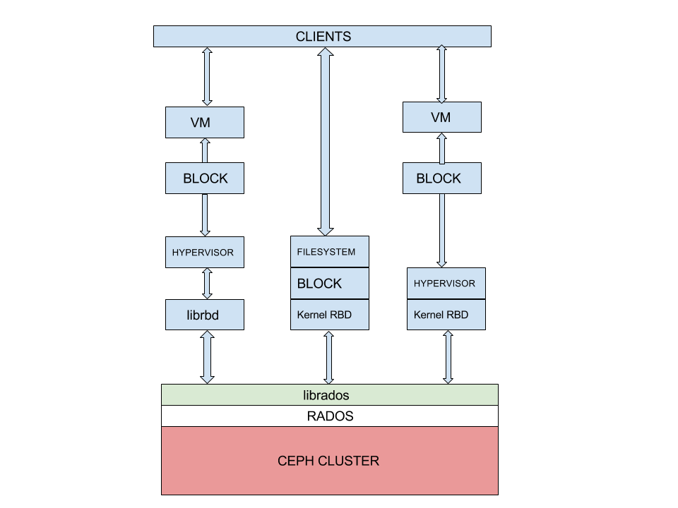

# Các kiểu tổ chức lưu trữ dữ liệu trong CEPH

Phía sâu bên trong, nội tại của CEPH data được phân bố dưới dạng ```object```, thông qua 1 lớp phủ hay giao thức ```Ceph Storage Cluster Protocol``` (librados) mà hỗ trợ nhiều kiểu lưu trữ dữ liệu phía client khác nhau như: CephFS, Object storage, Block Device, mỗi kiểu lưu trữ trong CEPH lại có 1 service để quản lý kiểu giao tiếp đó.



## CEPH Filesystem

Có thể hiểu đơn giản như là 1 kiểu tổ chức lưu trữ dữ liệu dạng truyền thống, hình dung như kiểu tổ chức thành các cây thư mục, ngoài cùng là thư mục cha, sâu vào các bên trong là thư mục con. Khi có 1 tác vụ đọc/ghi dữ liệu phải duyệt từ mức ngoài cùng vào bên trong để thấy được nơi cần thực hiện tác vụ đọc/ghi. Khi có sự thay đổi ảnh hưởng đến toàn bộ hệ thống filesystem.



CEPH filesystem hay CephFS, là POSIX-compliant filesystem (POSIX - Portable Operating System Interface for Unix là thuật ngữ biểu diễn các tổ chức dữ liệu dạng file trong CEPH), được sử dụng trong CEPH storage cluster dùng để lưu trữ user data. CephFS hỗ trợ tốt Linux kernel driver, kiến trúc CephFS tương thích tốt với các nền tảng Linux OS. CephFS lưu data và metadata riêng biệt, cung cấp hiệu năng, tính đảm bảo cho app host nằm trên nó

Trong Ceph cluster, CephFS lib (libcephfs) chạy Rados library (librados) - giao thức thuộc Ceph Storage - file, block, và object storage. Để sử dụng CephFS, cần ít nhất 1 Ceph metadata server (MDS) để chạy cluster nodes. Nếu chỉ có 1 MDS server nó sẽ ảnh hưởng tính chịu lỗi của CEPH. Khi cấu hình MDS, client có thể sử dụng CephFS theo nhiều cách. Để mount Cephfs, client cần sử dụng Linux kernel hoặc ceph-fuse (filesystem in user space) drivers được cung cấp bởi cộng đồng CEPH

Bên cạnh đó, client có thể sử dụng phần mềm thứ 3 như Ganesha cho NFS và Samba cho SMB/CIFS. Phần mềm cho phép tương tác với "libcephfs", bảo đảm lưu trữ user data phân tán trong Ceph Storage cluster. CephFS có thể sử dụng cho Apache Hadoop Filesystem (HDFS). Sử dụng libcephfs component để lưu trữ dữ liệu đến Ceph cluster. Để thực hiện, Ceph community cung cấp CephFS Java interface cho Hadoop và Hadoop plugins. Libcephfs và librados components rất linh hoạt và ta có thể xây dựng phiên bản tùy chỉnh, tương tác với nó, xây dựng data bên dưới ceph storage cluster.

**Một số ưu điểm:**
- Cung cấp an toàn dữ liệu mạnh hơn cho các ứng dụng quan trọng
- Cung cấp lưu trữ hầu như không giới hạn cho các hệ thống tập tin
- Các ứng dụng sử dụng hệ thống tệp có thể sử dụng CephFS (POSIX), không cần tích hợp hoặc tùy chỉnh
- Ceph tự động cân bằng hệ thống tệp tin để cung cấp hiệu suất tối đa



## Ceph Block Device

```CEPH Block Device``` hay ```CEPH Block Storage``` có thể hiểu 1 cách đơn giản, truyền thống khi ta muốn máy tính của ta có thêm dung lượng ổ đĩa thì ta sẽ mua thêm disk cắm vào máy tính và chia phân vùng để sử dụng. Còn đối với CEPH Block Device, ta sẽ được cung cấp 1 thiết bị block storage - giống như 1 hard drive - qua network mà không phải cắm thêm ổ đĩa vật lý. Quá trình truy xuất dữ liệu phải duyệt qua lần lượt các đơn vị tổ chức dữ liệu trong block đó dẫn tới phân mảnh dữ liệu

Sử dụng nó như 1 ổ đĩa bình thường, có thể định dạng với 1 hệ thống tập tin và lưu trữ các tập tin trên đó, kết hợp nhiều thiết bị vào 1 RAID

**Một số ưu điểm:**
- Có thể dễ dàng live snapshot toàn bộ thiết bị cho mục đích sao lưu
- Các thiết bị Block storage có thể được thay đổi kích thước theo nhu cầu ngày càng tăng (thin provisioning)
- Có thể dễ dàng gỡ và di chuyển các thiết bị block storage giữa các máy

Với bản chất RBD chia thành nhiều object, phân tán trên toàn Ceph Cluster, cung cấp tính đảm bảo, hiệu năng cao. RBD hỗ trợ mức Linux kernel, và được tích hợp sẵn với Linux kernel, cung cấp tính năng snapshot tốc độ cao, nhẹ, copy-on-write cloning. Hỗ trợ in-memory caching, nâng cao hiệu năng. Ceph RBD hỗ trợ image size tới 16EB. Image có thể được cung cấp dưới dạng ổ đĩa máy ảo, máy ảo,... Các công nghệ KVM, Zen hỗ trợ đầy đủ RBD, xử lý, lưu trữ trên các VM. Ceph block hỗ trợ đầy đủ các nền tảng ảo hóa mới Openstack, LIO iSCSI Gateway, QEMU, libvirt, CloudStack,...



Ceph Block Device hay RADOS block device (RBD) cung cấp giải pháp block storage tới physical hypervisors cung cấp cho VM

Linux host hỗ trợ đầy đủ Kernel RBD (KRBD) và maps Ceph block devices sử dụng librados. RADOS sau đó lưu trữ Ceph Block Device Objects trên các cụm trong mô hình phân tán. Khi Ceph block device được map với Linux host, nó có thể sử dụng như 1 phân vùng RAW hoặc được đánh nhãn với filesystem

RBD sử dụng ```librbd``` libraries để tận dụng tính năng RADOS, cung cấp tính bảo đảm, phân tán, object-based block storage. Khi client ghi tới RBD, librbd map data block tới object lưu trong Ceph Cluster, chia data object, nhân bản tới cluster, nâng cao tính tin cậy và hiệu năng. RBD phía trên RADOS layer hỗ trợ update trực tiếp tới object. Client có thể ghi, thêm, cắt trên object tồn tại. Kiểu RBD tối ưu giải pháp virtual machine volumes và việc thường xuyên ghi dữ liệu vào ổ đĩa.

## Ceph Object Storage

Ceph Object Storage hiểu đơn giản đúng như cái tên của nó là quản lý đối tượng lưu trữ, quá trình thao tác với các object dữ liệu ở lớp dưới cùng của Ceph không được client thao tác thẳng xuống mà thông qua 1 thành phần metadata quản lý tất cả các object ở dưới. Khi có thao tác với dữ liệu thì chỉ bị tác động tới object chứa data đó chứ không ảnh hưởng tới object khác trong tập rất nhiều object.

CEPH phân phối object storage system, cung cấp object storage interface thông qua Ceph's object gateway gọi là RADOS gateway (radosgw)

RADOS gateway (radosgw) sử dụng librgw (RADOS gateway library) và librados, cho phép app thiết lập kết nối với Ceph object storage. Ceph cung cấp giải pháp lưu trữ ổn định, và có thể truy cập thông qua RESTful API

RADOS gateway cung cấp RESTful interface để sử dụng cho application lưu trữ data trên Ceph storage cluster. RADOS gateway interfaces gồm:
- Swift compability: đây là chức năng lưu trữ đối tượng cho API Openstack Swift
- S3 compability: Đây là chức năng lưu trữ đối tượng cho Amazon S3 API
- Admin API: API gốc, có thể cấp quyền cho hệ thống quản lý lưu trữ

