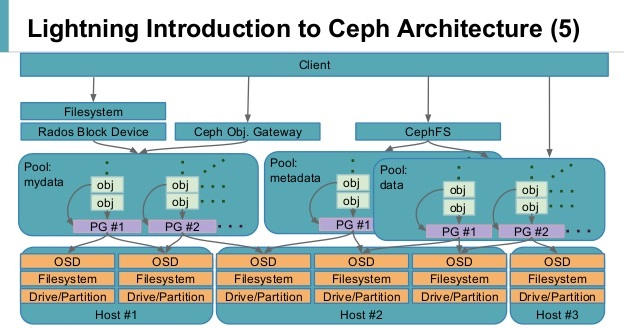

# Tìm hiểu về kiến trúc trong CEPH

Ceph storage cluster xây dựng từ các tiến trình service khác nhau. Mỗi tiến trình đều có vai trò riêng trong tính năng của Ceph

Nền tảng Ceph xây dựng dựa trên object, tổ chức object thành các Blocks. Tất cả các kiểu dữ liệu, block, file đều được lưu trên object thuộc Ceph cluster. Object storage là giải pháp thay thế cho hệ thống lưu trữ truyền thống, cho phép xây dựng kiến trúc hạ tầng độc lập với phần cứng. Ceph quản lý trên mức object, nhân bản obj toàn cluster, nâng cao tính bảo đảm. Trong Ceph, object sẽ không tồn tại đường dẫn vật lý, kiến trúc object linh hoạt khi lưu trữ tăng tính mở rộng.

Tuy CEPH có nhiều kiểu tổ chức lưu trữ dữ liệu nhưng ở mức độ nhỏ nhất trong CEPH dữ liệu được lưu trữ thành các object. Phía trên là 1 lớp phủ để quản lý, giao tiếp giữa client dưới dạng object (librados). Tầng trên cùng là các kiểu hỗ trợ client lưu trữ dữ liệu xuống dưới CEPH (CephFS, Block device, Object storage)

Service bắt buộc phải có trong Ceph cluster: Ceph MONS, Ceph OSD

**CEPH OSD:** Đây là thành phần lưu trữ dữ liệu thực sự trên các object. Phần lớn hoạt động bên trong Ceph Cluster được thực hiện bởi tiến trình Ceph OSD. Ceph OSD lưu tất cả dữ liệu người dùng dạng đối tượng. Ceph cluster bao gồm nhiều OSD. Trên mỗi hoạt động đọc ghi, yêu cầu của người dùng sẽ được đưa tới cluster map từ các tiến trình giám sát

Một Ceph cluster có rất nhiều OSD. Với bất cứ tác vụ đọc hoặc ghi nào, client gửi yêu cầu về cluster ánh xạ tới node monitor, và sau đó tương tác trực tiếp với OSD cho các tác vụ đọc ghi, mà không cần sự can thiệp của node monitor. Điều này giúp việc truyền tải dữ liệu nhanh chóng khi client có thể ghi trực tiếp vào các OSD mà không cần lớp xử lý dữ liệu trung gian. Cơ chế lưu trữ này là độc nhất trên Ceph khi so với các phương thức lưu trữ khác.

Ceph nhân bản mỗi object nhiều lần trên tất cả các node, nâng cao tính sẵn sàng và khả năng chịu lỗi. Mỗi object trong OSD có một primary copy và nhiều secondary copy, được đặt tại các OSD khác. Bởi Ceph là hệ thống phân tán và object được phân tán trên nhiều OSD, mỗi OSD đóng vai trò là primary OSD cho một số object, và là secondary OSD cho các object khác. Khi một ổ đĩa bị lỗi, Ceph OSD daemon tương tác với các OSD khác để thực hiện việc khôi phục. Trong quá trình này, secondary OSD giữ bản copy được đưa lên thành primary, một secondary object được tạo, tất cả đều trong suốt với người dùng. Điều này làm Ceph Cluster tin cậy và nhất quán. Thông thường, một OSD daemon đặt trên một ổ đĩa vật lý, tuy nhiên có thể đặt OSD daemon trên một host, hoặc 1 RAID. Ceph Cluster thường được triển khai trong môi trường JBOD, mỗi OSD daemon trên 1 ổ đĩa.

**CEPH MONS:** Là thành phần giám sát trạng thái toàn cluster, bao gồm trạng thái của OSD, MON, PG, CRUSH map. Các cluster nodes sẽ giám sát, chia sẻ thông tin về những thay đổi. Quá trình giám sát sẽ không lưu dữ liệu (công việc này là của OSD)
- **Monitor map**: map này lưu trữ thông tin về các node monitor, gồm CEPH Cluster ID, monitor hostname, địa chỉ IP và số port. Nó cũng giữ epoch (phiên bản map tại 1 thời điểm) hiện tại để tạo map và thông tin về lần thay đổi map cuối cùng
- **OSD map**: map này lưu trữ các trường như cluster ID, epoch cho việc tạo map OSD và lần thay đổi cuối, và thông tin liên quan đến pool như tên, ID, loại, mức nhân bản và PG. Nó cũng lưu trữ các thông tin OSD như tình trạng, trọng số, thông tin host OSD
- **PG map**: map này lưu giữ các phiên bản của PG (thành phần quản lý các object trong ceph), timestamp, bản OSD map cuối cùng, tỉ lệ đầy và gần đầy dung lượng. Nó cũng lưu các ID của PG, object count, tình trạng hoạt động và srub (hoạt động kiểm tra tính nhất quán của dữ liệu lưu trữ)
- **CRUSH map**: map này lưu các thông tin của các thiết bị lưu trữ trong Cluster, các rule cho từng vùng lưu trữ
- **MDS map**: lưu thông tin về thời gian tạo và chỉnh sửa, dữ liệu và metadata pool ID, cluster MDS count, tình trạng hoạt động của MDS