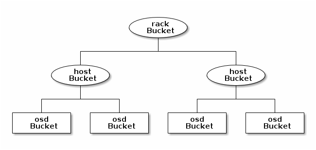

# Crush map trong CEPH

Thuật toán CRUSH xác định cho ta cách lưu trữ và truy xuất dữ liệu bằng cách tính toán vị trí lưu của các dữ liệu. CRUSH cho phép client kết nối, truyền thông nói chuyện trực tiếp với OSD thay vì việc phải thông qua một server trung gian. Với phương pháp lưu trữ và truy xuất dữ liệu CEPH tránh single point of failure, giảm hiệu suất và giới hạn vật lý đối với khả năng mở rộng.

CEPH yêu cầu bắt buộc phải có 1 map sử dụng để hình thành kiểu lưu trữ và truy xuất dữ liệu trong OSD và phân phối dữ liệu trong toàn cụm. CRUSH - Controlled Replication Under Scalable Hashing, thay vì lưu trữ metadata, CRUSH tính toán theo yêu cầu.

Crush map chứa danh sách các OSD, một list ```buckets``` và các quy tắc cho biết cách sao chép dữ liệu trong cluster. Phản ánh lại sơ đồ tổ chức thiết bị vật lý cơ bản của cụm và thiết lập các quy tắc, cơ chế sao lưu dữ liệu trên các thành phần, vị trí vật lý khác nhau.

Khi tạo 1 file cấu hình và deploy ceph với ceph-deploy, CEPH sẽ tạo crush map mặc định cho cấu hình phù hợp với môi trường triển khai. Khi triển khai với quy mô lớn phải cân nhắc tùy chỉnh crush map, việc này sẽ giúp quản lý cụm CEPH, cải thiện hiệu suất và đảm bảo an toàn dữ liệu.

VD: Khi một OSD hỏng, CRUSH sẽ giúp xác định vị trí bị lỗi để giúp xử lý nhanh chóng

## CRUSH Location

Vị trí của 1 OSD theo hệ thống phân cấp của crush map được gọi là ```crush location```, diễn tả vị trí theo kiểu key - value:
- Thứ tự của key không quá quan trọng
- Key name (bên trái dấu ```=```) phải là một trong các giá trị hợp lệ, mặc định bao gồm: ```root, datacenter, room, now, pod, pdu, rack, chassis, host``` nhưng có thể tùy chỉnh bằng cách sửa crush maps
- Không phải tất cả các key cần phải được chỉ định, CEPH tự động đặt CEPH OSD daemon là root=default và host=HOSTNAME

### CEPH-CRUSH-LOCATION HOOK

Mặc định ```ceph-crush-location``` sẽ tạo 1 ```CRUSH location string``` cho một daemon nhất định, vị trí được dựa trên thứ tự ưu tiên (trong file ceph.conf hoặc mặc định)

Có thể quản lý crush maps thủ công bằng tay bằng cách tắt ```location hook``` trong cấu hình:

```sh
osd crush update on start = false
```

### CUSTOM LOCATION HOOKS

Có thể tùy chỉnh hook location thay cho hook chung trong cấu trúc OSD phân cấp

```sh
osd crush location hook = /path/to/script
```

Hook được truyền qua bởi một số đối số và sẽ stdout với CRUSH location

```sh
ceph-crush-location --cluster CLUSTER --id ID --type TYPE
```

CLUSTER thường là ceph, id định danh OSD, daemon thường là osd

## Chỉnh sửa 1 CRUSH map

Các bước thực hiện:
- Lấy CRUSH map
- Giải biên dịch CRUSH map
- Chỉnh sửa Device(s), Bucket(s), Rule(s)
- Biên dịch lại CRUSH map
- Thiết lập CRUSH map

Cụ thể:

**Lấy CRUSH map:** Xuất thông tin về cluster đang chạy với 1 tên chỉ định. Lúc này CRUSH maps ở dạng được biên dịch, bạn phải dịch ngược nó trước khi bạn có thể chỉnh sửa nó

```sh
ceph osd getcrushmap -o {compiled-crushmap-filename}
```

**Giải biên dịch:** Biên dịch ngược 1 CRUSH map và ghi ra 1 file với tên đặc biệt

```sh
crushtool -d {compiled-crush-filename} -o {decompiled-crushmap-filename}
```

**Chỉnh sửa:** Chỉnh sửa. (chứ sao?)

**Biên dịch lại CRUSH map:** Thực hiện sau khi đã chỉnh sửa CRUSH map

```sh
crushtool -c {decompiled-crush-map-filename} -o {compiled-crush-map-filename}
```

**Thiết lập CRUSH map:**

```sh
ceph osd setcrushmap -i {compiled-crushmap-filename}
```

## CRUSH map parameters

4 thành phần chính của CRUSH map:
- **Devices:** Bao gồm các thiết bị lưu trữ
- **Bucket Types:** Định nghĩa các kiểu của bucket được sử dụng trong hệ thống phân cấp CRUSH. Bao gồm tập hợp các storage location (rows, racks, chassis, hosts,...)
- **Bucket Instances:** Khi xác định mỗi bucket type, phải khai báo các bucket instances cho host
- **Rules:** Bao gồm các quy tắc lựa chọn bucket

### CRUSH map devices

Để ánh xạ tổ chức lưu trữ của các OSD, CRUSH map bắt buộc phải có một danh sách các OSD devices (name của OSD daemon từ file CEPH config). Danh sách các devices đầu tiên xuất hiện trong CRUSH maps. ĐỂ khai báo một devices vào trong CRUSH maps, tạo một dòng ở dưới danh sách devices, bắt buộc phải tuân thủ theo cú pháp:

```sh
# devices
device {num} {osd.name}
```

VD:

```sh
# devices
device 0 osd.0 class hdd
device 1 osd.1 class hdd
device 2 osd.2 class hdd
device 3 osd.3 class hdd
device 4 osd.4 class hdd
device 5 osd.5 class hdd
device 6 osd.6 class hdd
device 7 osd.7 class hdd
device 8 osd.8 class hdd
device 9 osd.9 class hdd
device 10 osd.10 class hdd
device 11 osd.11 class hdd
```

Nguyên tắc: 1 OSD ánh xạ tới 1 thiết bị lưu trữ độc lập hoặc RAID

### CRUSH map bucket types

Dòng thứ 2 trong CRUSH maps định nghĩa ```'bucket' types```, bucket phân cấp node và leaves. Sử dụng trong ngữ cảnh cho một vị trí phần cứng vật lý, thường đại diện cho các vị trí vật lý trong hệ thống phân cấp

Để thêm bucket vào trong list phải tuân thủ quy tắc:

```sh
# types
type {num} {bucket-name}
```

VD:

```sh
# types
type 0 osd
type 1 host
type 2 chassis
type 3 rack
type 4 row
type 5 pdu
type 6 pod
type 7 room
type 8 datacenter
type 9 region
type 10 root
```

### CRUSH map bucket hierarchy

CRUSH là một cơ sở hạ tầng đầy đủ, nó duy trì một hệ thống phân cấp lồng nhau cho các thành phần của cơ sở hạ tầng. Danh sách thiết bị bao gồm disk, node, row, switch, power curcuit, room, datacenter. Các thành phần này được gọi là failure zones hoặc CRUSH buckets. CRUSH map chứa danh sách các buckets có sẵn để tổng hợp vào physical locations. Nó cũng bao gồm danh sách các rules giúp cho CRUSH biết làm thế nào để replicate data giữa các CEPH pool

CRUSH phân phối các đối tượng cũng như các bản sao của chúng theo sơ đồ phân cụm đã được xác định. CRUSH map đại diện cho các thiết bị lưu trữ sẵn có và các yếu tố logic

Để ánh xạ các group tới vị trí các OSD trên các miền khác nhau, CRUSH map xác định danh sách phân cấp các loại nhóm, các nút lá đại diện cho OSD, phần còn lại của hệ thống phân cấp có thể tùy chỉnh theo nhu cầu riêng



## CRUSH map rules

CRUSH map hỗ trợ các rules, đó là quy tắc xác định vị trí lưu trữ: như việc tạo bao nhiêu bản sao, replicate theo node, datacenter,...

```sh
rule <rulename> {
    ruleset <ruleset>
    type [ replicated | erasure ]
    min_size <min-size>
    max_size <max-size>
    step take <bucket-name>
    step [choose | chooseleaf] [firsttn | indep] <N> <bucket-type>
    step emit
}
```

VD:

```sh
# rules
rule replicated_rule {
    id 0
    type replicated
    min_size 1
    max_size 10
    step take default
    step chooseleaf firstn 0 type host
    step emit
}
```

Trong đó:

```ruleset```:

- Mô tả: Phân lớp các rule thuộc về một bộ quy tắc
- Mục đích: Một thành phần của rule
- Type: Integer
- Required: Yes
- Default: 0

```type```:

- Mô tả: thể hiển quy tắc cho một thiết bị lưu trữ hoặc raid
- Mục đích: Một thành phần của rule
- Type: String
- Require: Yes
- Default: replicated
- Giá trị khả dụng: **replicated** hoặc **erasure**

```min_size```:

- Mô tả: Nếu một pools tạo ra với số bản replicate ít hơn số này thì CRUSH sẽ không chọn rule này
- Mục đích: Một thành phần của rule
- Type: Integer
- Required: Yes
- Default: 1

```max_size```:

- Mô tả: Nếu pool được tạo với số bản replicate lớn hơn số này thì CRUSH sẽ không chọn rule này
- Mục đích: Một thành phần của rule
- Required: Yes
- Default: 10

```step take```:

- Mô tả: Lấy 1 tên bucket và lặp từng phần tử của cây. Nếu đối số ```device-class``` được chỉ định, đối số này phải khớp với 1 class được gán vào OSD bên trong cluster. Chỉ bao gồm những device thuộc class
- Mục đích: Một thành phần của rule
- Require: Yes
- Example: step take data

```step choose firstn {num} type {bucket-type}```:

- Mô tả: Chọn số bucket của type được chỉ định từ bên trong bucket hiện tại. Số này thường là số replicas trong pool (hay gọi là pool size)
   - Nếu {num} == 0, chọn số bucket là ```pool-num-replicas``` (tất cả bucket khả dụng)
   - Nếu {num} > 0 && < ```pool-num-replicas```, chọn ngần ấy bucket
   - Nếu {num} < 0, số bucket sẽ là ```pool-num-replicas``` - ```{num}```
- Mục đích: Một thành phần của rule
- Prerequisite: ```step take``` hoặc ```step choose```
- Example: step choose firstn 1 type row

```step emit```:

- Mô tả: Kết quả hiện tại đổ vào đầu ra stack, thường sử dụng ở phần cuối của rule, nhưng cũng có thể sử dụng từ 1 cây khác trong cùng rule
- Mục đích: Một thành phần của rule
- Prerequisite: Follow step choose
- Example: step emit