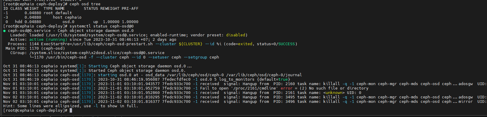
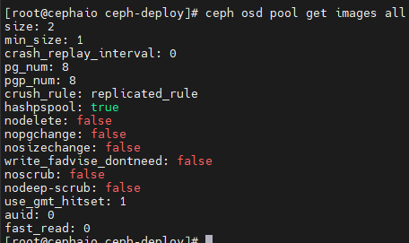
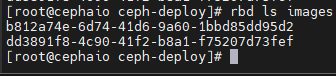
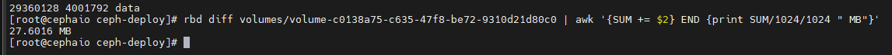

# Các lệnh thường dùng trong CEPH

## CEPH-DEPLOY

- Cài đặt ceph trên client

```sh
ceph-deploy install <client-host-name> --release <release-name>
```

VD:

```sh
ceph-deploy install --release luminous ceph1 ceph2 ceph3
```

- Khởi tạo cụm

```sh
ceph-deploy mon create-initial
```

- Copy key admin và config

```sh
ceph-deploy --overwrite-conf admin <host-name>
```

- Tạo mới OSD

```sh
# Zapdisk
ceph-deploy disk zap <host> /dev/<disk>
```

```sh
# Create OSD
ceph-deploy osd create --data /dev/<disk> <host-name>
```

```sh
# Create node mon
ceph-deploy mon create <host-name>
```

```sh
# Delete node mon
ceph-deploy mon destroy <host-name>
```

```sh
# Create node MGR
ceph-deploy mgr create <host-name>
```

```sh
# Write config to client node
ceph-deploy --overwrite-conf config push <host>
```

```sh
# Create node RGW
ceph-deploy rgw create <host-name>
```

## Ceph service systemd

### MON

Thành phần tập trung vào trạng thái toàn cluster, giám sát trạng thái OSD, MON, PG, CRUSH map. Các cluster nodes sẽ giám sát, chia sẻ thông tin về những thay đổi. Quá trình giám sát sẽ không lưu trữ dữ liệu (công việc này là của OSD)

```sh
systemctl start/stop/restart/status ceph-mon@$(hostname)
```

### OSD

Đa phần CEPH Cluster được thực hiện bởi tiến trình CEPH OSD. CEPH OSD lưu tất cả dữ liệu người dùng dạng đối tượng. CEPH cluster bao gồm nhiều OSD, CEPH có cơ chế phân phối object vào các OSD khác nhau nhằm đảm bảo tính toàn vẹn và sẵn sàng của dữ liệu

OSD trên node nào thì đứng trên node đó để kiểm tra trạng thái của OSD đó

Xác định ID của OSD

```sh
ceph osd tree
```

```sh
systemctl start/stop/restart/status ceph-osd@<osd-id>
```

VD:

```sh
systemctl status ceph-osd@0
```



### MDS

CEPH MDS tập trung vào metadata server và yêu cầu riêng cho CephFS, cùng 1 số storage methods block. Trong khi object-based storage không yêu cầu MDS services

```sh
systemctl start/status/restart/stop ceph-mds@$(hostname)
```

### RGW

CEPH phân phối object storage system, cung cấp object storage interface thông qua CEPH's object gateway, đặc biệt là RADOS gateway (radosgw)

```sh
systemctl status ceph-radosgw@rgw.$(hostname)
```

### MGR

MGR chạy song song với monitor daemons để cung cấp khả năng giám sát và giao diện bổ sung cho hệ thống giám sát và quản lý từ bên ngoài

```sh
systemctl start/status/restart ceph-mgr@$(hostname)
```

## Kiểm tra trạng thái hệ thống

- Hiển thị trạng thái cụm CEPH

```sh
ceph -s
```

```sh
ceph health
```

- Hiển thị chi tiết trạng thái cụm CEPH theo thời gian thực

```sh
ceph -w
```

Kiểm tra trạng thái sử dụng disk của mỗi pool

```sh
ceph df
```

Kiểm tra trạng thái sử dụng disk của mỗi pool theo Object

```sh
rados df
```

## Lệnh MGR service

- Kiểm tra thông tin các module của MGR, hiển thị tất cả các module mà hệ thống CEPH hỗ trợ cho việc giám sát, quản lý từ bên ngoài, như zabbix, influx, prometheus,...

```sh
ceph mgr dump
```

- Enable các module MGR

```sh
ceph mgr module enable <module>
```

## Lệnh thao tác với OSD

- Kiểm tra OSD được tạo từ phân vùng ổ LVM nào trên server vật lý

```sh
ceph-volume lvm list
```

- Hiển thị trạng thái các OSD trong cụm

```sh
ceph osd stat
```

- Hiển thị tình trạng used, r/w, state của các OSD

```sh
ceph osd status
```

- Hiển thị crushmap OSD

```sh
ceph osd tree
ceph osd crush tree
ceph osd crush tree --show-shadow
```

- Kiểm tra chi tiết location của 1 OSD

```sh
ceph osd find <osd-id>
```

```sh
ceph osd find 0
```

- Kiểm tra chi tiết metadata của 1 OSD

```sh
ceph osd metadata <osd-id>
```

- Benchmark OSD

```sh
ceph tell osd.<osd-id> bench
```

- Hiển thị trạng thái sử dụng của các OSD

```sh
ceph osd df
ceph osd df tree
```

- Hiển thị độ trễ commit/apply data trên các OSD

```sh
ceph osd perf
```

- Xóa 1 OSD ra khỏi cụm CEPH (thực hiện trên node của OSD đó)

```sh
ceph osd out osd.<osd-id>
ceph osd down osd.<osd-id>
systemctl stop ceph-osd@<osd-id>
ceph osd crush rm osd.<osd-id>
ceph osd rm osd.<osd-id>
ceph auth del osd.<osd-id>
```

## Các lệnh thao tác trên pool

- Tạo pool

```sh
ceph osd pool create <pool-name> <pg-num> [<pgp-num>] [replicated] [crush-ruleset-name] [expected-num-objects]
```

- Enable application pool

```sh
osd pool application enable <pool-name> <application>
```

VD:

```sh
osd pool application enable images rbd
```

- Hiển thị toàn bộ tham số của 1 pool

```sh
ceph osd pool ls detail
```

- Hiển thị tham số của 1 pool

```sh
ceph osd pool get <pool-name> all
```

VD:

```sh
ceph osd pool get images all
```



- Điều chỉnh lại giá trị của pool

```sh
ceph osd pool set <pool-name> <key> <value>
```

- Xóa pool

```sh
ceph osd pool delete <pool-name>
```

## Thao tác đối với RBD

- Hiển thị các images trong pool

```sh
rbd ls <pool-name>
```



- Create 1 images

```sh
rbd create <pool-name>/<images> --size <size>
```

VD:

```sh
rbd create images/vol-test --size 15G
```

- Hiển thị chi tiết images

```sh
rbd info <pool-name>/<images>
```

- Hiển thị dung lượng thực tế của images

```sh
rbd diff <pool-name>/<images> | awk '{SUM += $2} END {print SUM/1024/1024 " MB"}'
```

VD:

```sh
rbd diff volumes/volume-c0138a75-c635-47f8-be72-9310d21d80c0 | awk '{SUM += $2} END {print SUM/1024/1024 " MB"}'
```



- Hiển thị images đang được mapped (trên client)

```sh
rbd showmapped
```

- Xóa images

```sh
rbd rm <pool-name>/<images>
```

- Create snapshot

```sh
rbd snap create <pool-name>/<images>@<snap-name>
```

VD:

```sh
rbd snap create volumes/vol-test@vol-snap-test
```

- Liệt kê các bản snapshot của 1 volume

```sh
rbd snap ls <pool-name>/<images>
```

- Protect bản snapshot

```sh
rbd snap protect <pool-name>/<images>@<snap-name>
```

- Rollback snapshot

```sh
rbd snap rollback <pool-name>/<images>@<snap-name>
```

- Clone snapshot thành 1 images mới

```sh
rbd clone <pool-name>/<images>@<snap-name> <pool-name>/<child-images>
```

- Kiểm tra các images được clone từ snapshot

```sh
rbd children <pool-name>/<images>@<snap-name>
```

- Tách hẳn images mới ra khỏi images parent

```sh
rbd flatten <pool-name>/<child-images>
```

- Unprotect bản snapshot

```sh
rbd snap unprotect <pool-name>/<images>@<snap-name>
```

- Xóa 1 bản snapshot

```sh
rbd snap rm <pool-name>/<images>@<snap-name>
```

- Xóa toàn bộ snapshot của 1 volume

```sh
rbd snap purge <pool-name>/<images>
```

- Export volume

```sh
rbd export --rbd-concurrent-management-ops 20 --pool=<pool-name> <images> <images>.img
```

## Các lệnh thao tấc đôi với Object

- Show toàn bộ pool name

```sh
rados ls pools
```

- Show toàn bộ Object trên cụm

```sh
rados -p <pool-name> ls
```

- Upload Object lên cụm Ceph

```sh
rados -p <pool-name> put <object-file
```

- Download Object từ cụm CEPH

```sh
rados -p <pool-name> get <object-file>
```

- Xóa 1 object cụm CEPH

```sh
rados -p <pool-name> rm <object-file>
```

- Kiểm tra các client kết nối đến Object

```sh
rados -p <pool-name> listwatchers <object-file>
```

- Benchmark Object bằng rados bench

```sh
rados -p <pool-name> listwatchers <object-file>
```

## Các lệnh thao tác xác thực trên CEPH

- Hiển thị toàn bộ các key authen của cụm CEPH

```sh
ceph auth list
```

- Create/Get key

```sh
ceph auth get-or-create <key-name> mon <permission> osd <permission> mds <permission> > <key-name>.keyring
```

- Cập nhật permission key đã có

```sh
ceph auth caps <key-name> mon <permission> osd <permission> mds <permission>
```

- Xóa key

```sh
ceph auth delete <key-name>
```