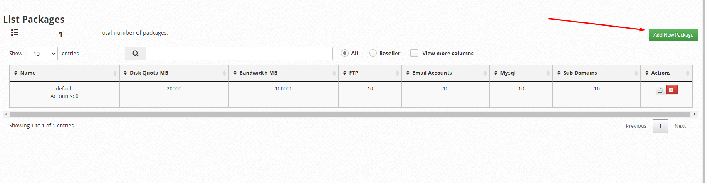
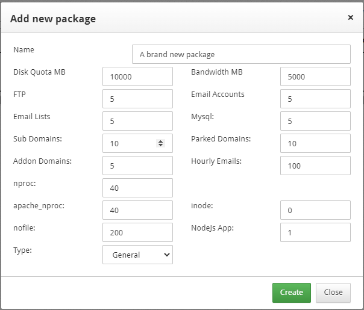
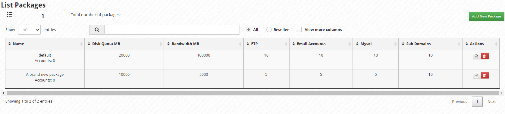
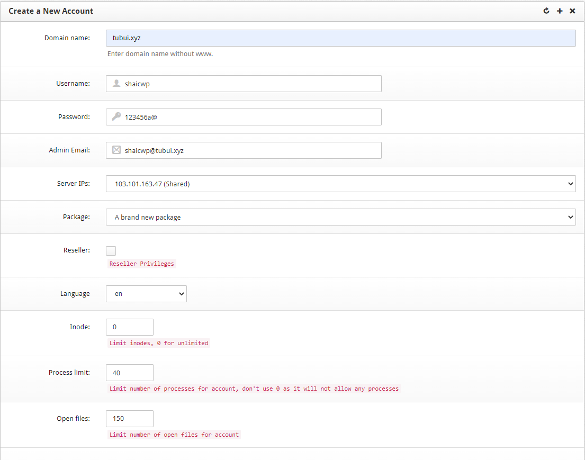
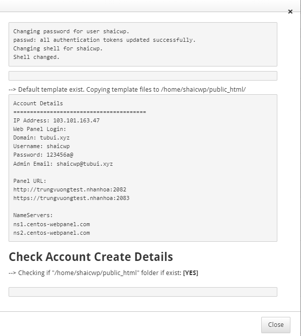
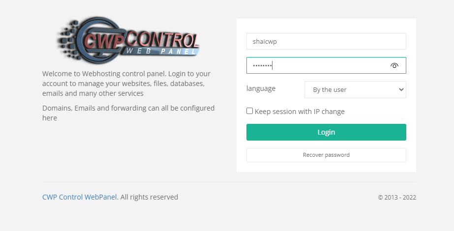
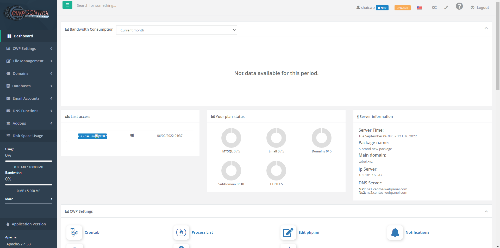
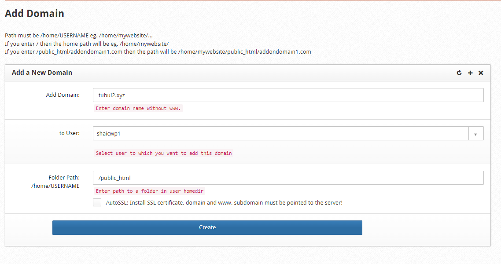
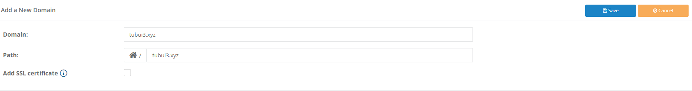

# Package, User và Domain trong CWP

## Package

1. Package là gì?

Package là công cụ dùng để phân chia tài nguyên cho các tài khoản user, nếu bạn có nhu cầu chia nhỏ các gói host với những cấu hình khác nhau về tài nguyên cho từng user tương ứng thì đây chính là chức năng của Package, hầu hết các control panel hiện nay đều có hỗ trợ tính năng này

2. Tạo và quản lí Package trong CWP

- Để tạo 1 Package trên CWP, tại thanh **Navigation**, chọn ```Packages``` -> ```Packages```

- Chọn ```Add New Package```



- Nhập thông tin của package và chọn ```Create``` để tạo mới



Trong đó:
- **Name:** tên package
- **Disk Quota MB:** dung lượng lưu trữ được phép sử dụng (đơn vị MB)
- **Bandwwidth MB:** băng thông được phép sử dụng
- **FTP:** số lượng tài khoản FTP được tạo
- **Email Accounts:** số lượng mail account được sử dụng trên mỗi domain
- **Email Lists:** số lượng mail list được phép tạo
- **DB:** số lượng database được phép tạo
- **Sub Domains:** số lượng subdomain được phép tạo
- **Parked Domains:** số lượng Parked Domain được phép tạo (Alias Domain)
- **Addon Domains:** số lượng Domain được phép tạo
- **Hourly Emails:** số lượng email được phép gửi mỗi giờ

Các thông số còn lại có thể để **0** tức là Unlimited

- Sau khi tạo mới, ta có thể sửa/xóa package ở phần **Actions**



## User

1. User là gì?

User là tài khoản con được tạo ra để cấp cho người dùng, nó sử dụng Package để điều chỉnh và giới hạn các thông số cho từng User khác nhau. Việc tạo User sẽ giúp dễ dàng kiểm soát và quản lý vì các User được tạo ra sẽ có thông tin đăng nhập và giao diện quản trị riêng biệt, bạn chỉ cần cung cấp cho người dùng thông tin User của họ để họ chủ động quản lý

2. Tạo và quản lý User trên CentOS Web Panel

- Để tạo 1 User trên CWP, tại thanh **Navigation**, chọn ```User Accounts``` -> ```New Account```

- Nhập thông tin User và chọn ```Create```



- Trong đó:
    - **Domain name:** tên Domain làm Domain chính trên tài khoản mới
    - **Username:** tên tài khoản
    - **Password:** mật khẩu tài khoản
    - **Admin Email:** email quản trị tài khoản
    - **Server IPs:** lựa chọn IP mà tài khoản này sẽ dùng 
    - **Language:** ngôn ngữ
    - **Inode:** số lượng file tài khoản được phép sử dụng
    - **Processes:** số tiến trình tối đa mà tài khoản được phép tạo ra
    - **Open Files:** số lượng file tối đa được phép mở
    - **Backup user account:** bật tính năng backup trên tài khoản
    - **Shell Access:** cho phép có thể ssh vào server thông qua tài khoản được cấp
    - **AutoSSL:** tự động cài đặt SSL (nếu muốn sử dụng tính năng này thì cần phải trỏ domain về IP của server trước)

- Sau khi tạo user thành công thì sẽ có thông báo như hình



- Truy cập vào trang quản trị của user bằng cổng 2083, tài khoản và mật khẩu như vừa tạo



- Giao diện quản trị của user



## Addon Domain

1. Thêm Addon Domain từ tài khoản Administrator

- Tại giao diện quản trị của Admin, vào mục ```Domains``` -> ```Add Domain```

- Nhập thông tin Domain và chọn ```Create```



2. Thêm Addon Domain từ tài khoản User

- Tại giao diện quản trị của User, chọn ```Domains```-> ```Domains``` -> ```Add a New Domain```

- Nhập thông tin Domain và chọn ```Save```



*Những Domain này có thể được xóa đi ở giao diện danh sách Domain*

