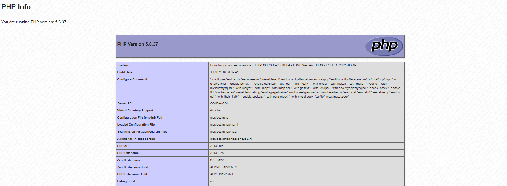
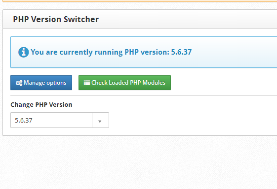
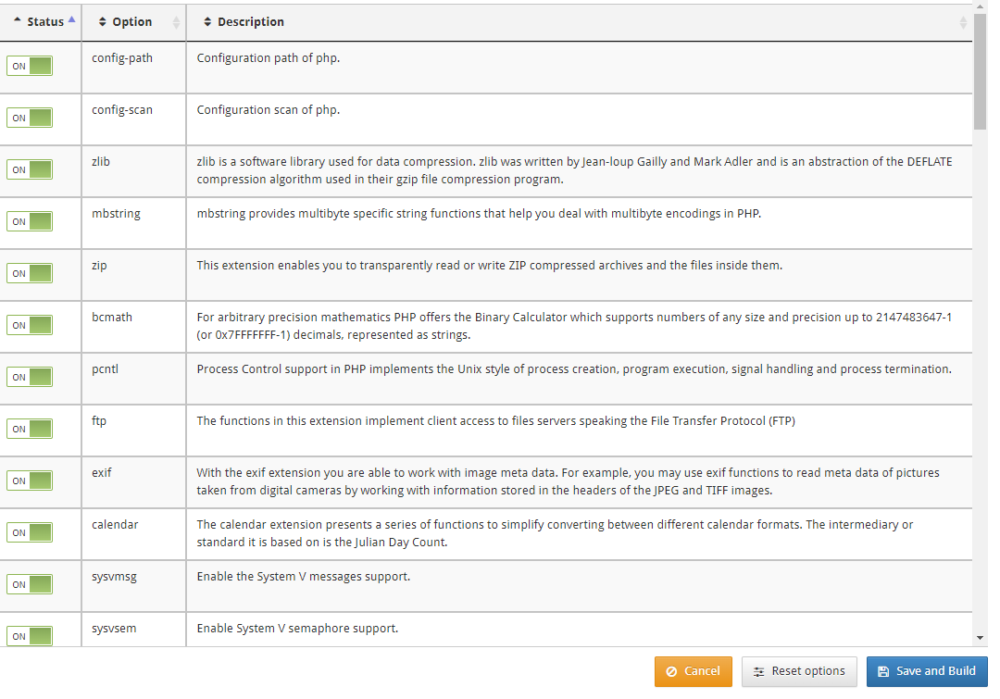
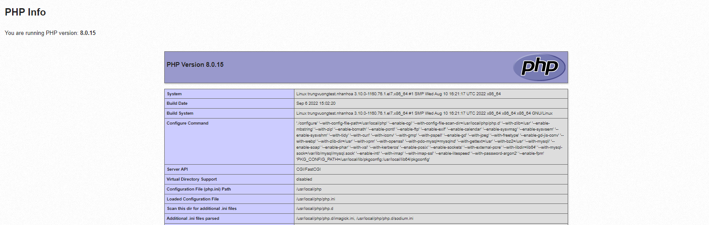

# Thay đổi phiên bản PHP trên CentOS Web Panel

Mặc định, CWP sẽ chỉ cài đặt phiên bản PHP mặc định là 5.6 cho chúng ta mà thôi

Và phiên bản miễn phí của CentOS Web Panel (CWP) cũng không hỗ trợ cài nhiều phiên bản PHP tại 1 thời điểm. Để sử dụng tính năng đa phiên bản PHP và thay đổi phiên bản PHP giữa nhiều site khác nhau thì bạn cần nâng cấp lên phiên bản CWP PRO

Tuy nhiên với phiên bản miễn phí, ta vẫn có thể thay đổi phiên bản PHP của CWP

1. Kiểm tra phiên bản PHP hiện tại của CWP

- Tại thanh **Navigation**, chọn ```PHP Settings``` -> ```PHP Info```



2. Thay đổi phiên bản PHP

- Tại thanh **Navigation**, chọn ```PHP Version Switcher```, sau đó nhấn vào dấu mũi tên cạnh phiên bản PHP và chọn phiên bản muốn cài đặt trong drop down list



3. Chọn những thành phần muốn build và nhấn ```Save and Build```



4. Chờ đợi, quá trình cài đặt PHP thường kéo dài từ 15-20p



