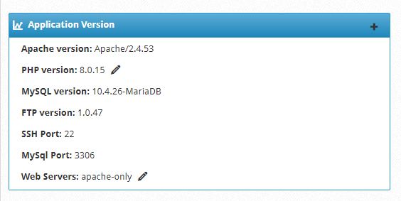
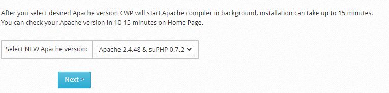
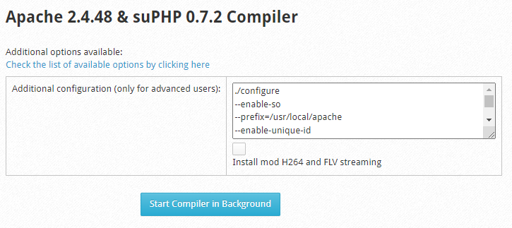
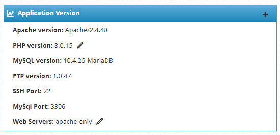

# Thay đổi phiên bản Apache trên CWP

1. Kiểm tra phiên bản Apache hiện tại

- Tại giao diện quản trị Root, ngay tại ```Dashboard```, ở phần **Application Version** có hiện phiên bản của nhiều thành phần trên CWP, trong đó có cả **Apache version**



2. Thay đổi phiên bản Apache

- Tại giao diện quản trị Root, trên thanh **Navigation**, chọn ```WebServer Settings``` -> ```Apache Re-Build```

- Tiếp đến, chọn phiên bản Apache muốn cài đặt ở phần **Select NEW Apache version** và nhấn ```Next```



- Nhấn ```Start Compiler in Background``` để bắt đầu quá trình cài đặt dưới nền



- Có thể kiểm tra quá trình cài đặt bằng lệnh

```sh
tail -f /var/log/apache-rebuild.log
```

- Kiểm tra phiên bản Apache sau khi đã cài đặt sau



