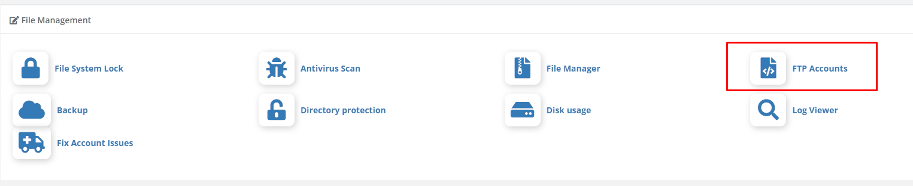
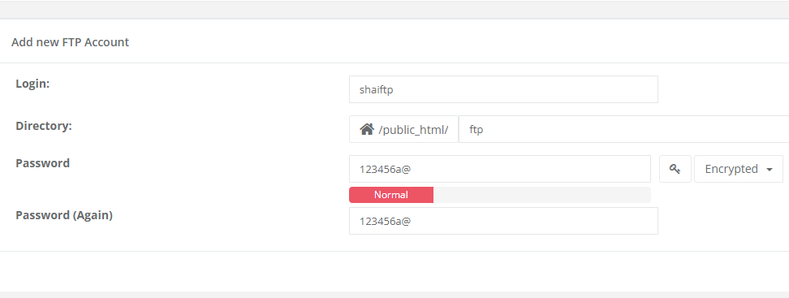
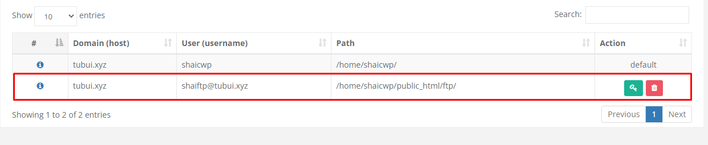
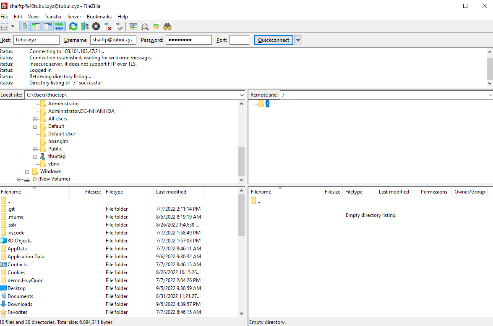

# Tạo tài khoản FTP

1. Đăng nhập vào tài khoản User, tại phần ```File Management```, chọn ```FTP Accounts```



2. Chọn ```Create FTP Accounts``` và nhập vào thông tin cần thiết để tạo FTP account



3. Có thể sửa xóa tài khoản FTP ở đây



4. Thử kết nối bằng FileZilla

