# Tạo Email trên CWP

### Tạo Email bằng tài khoản quản trị Admin (root)

- Ở thanh **Navigation**, chọn ```Email``` -> ```Email Accounts```

- Chọn ```Add new domain mail```

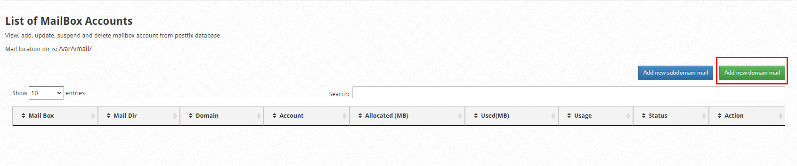

- Chọn User, sau đó nhập thông tin cần thiết và nhấn ```Create Mail``` để tạo email

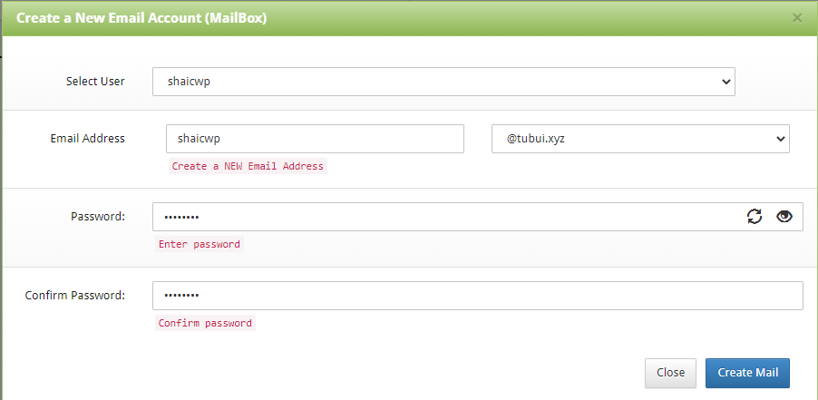

### Tạo Email bằng tài khoản User

- Ở thanh **Navigation**, chọn ```Email Accounts``` -> ```Email Accounts```

- Chọn ```Add a New MailBox```, nhập thông tin để tạo email

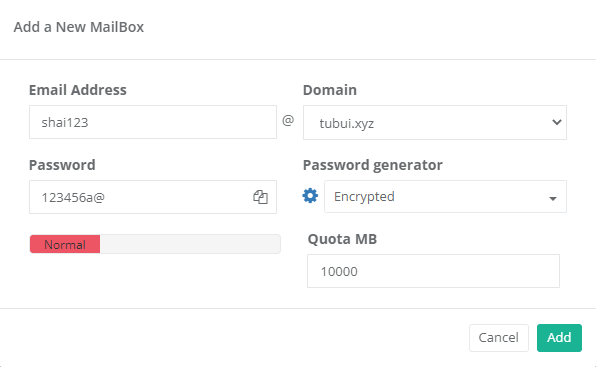

- Nhấn ```Create``` để tạo

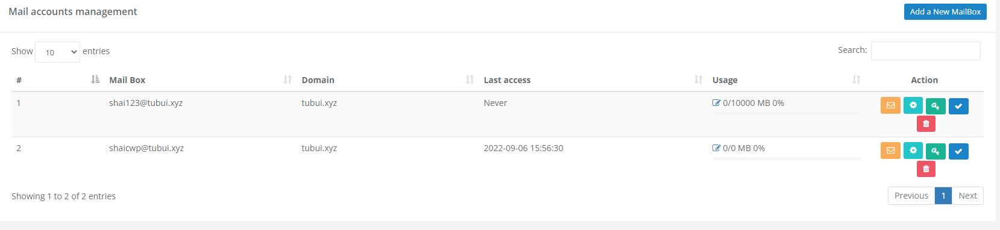

### Truy cập Roundcube Webmail

- Tại giao diện Admin, ở thanh **Navigation**, chọn ```Email``` -> ```Roundcube Webmail```

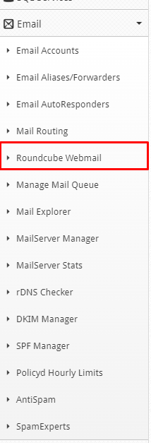

- Tại giao diện User, ở thanh **Navigation**, chọn ```Email Accounts``` -> ```Roundcube Webmail```


- Đăng nhập bằng tài khoản Email vừa tạo

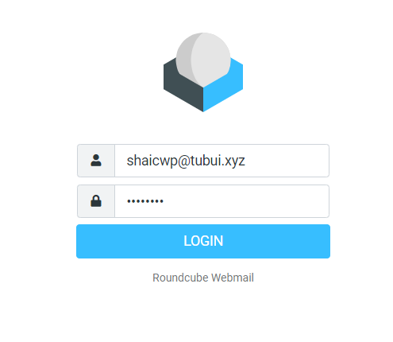

- Giao diện Roundcube Webmail

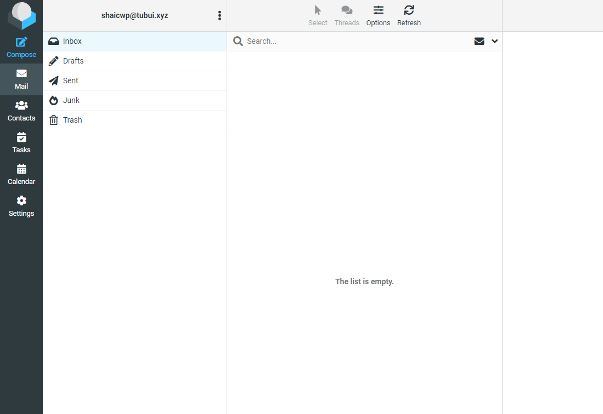

### Kiểm tra gửi/nhận mail

- Gửi ok

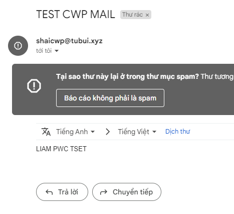

- Nhận ok

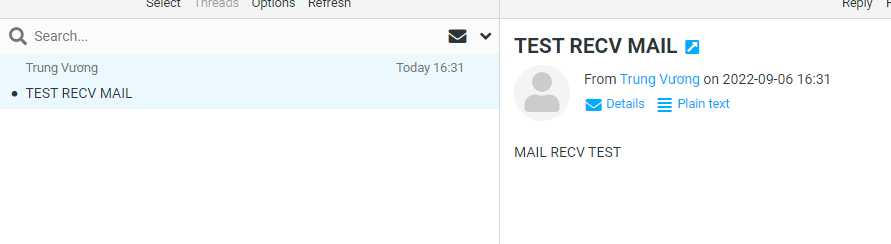

### Tạo bản ghi DKIM 

- Tại giao diện quản trị Admin, trên thanh **Navigation**, chọn ```Email``` -> ```MailServer Manager```

- Tích chọn ```Install DKIM & SPF```, nhập lại hostname của VPS, tên miền và nhấn ```Rebuild Mail Server```

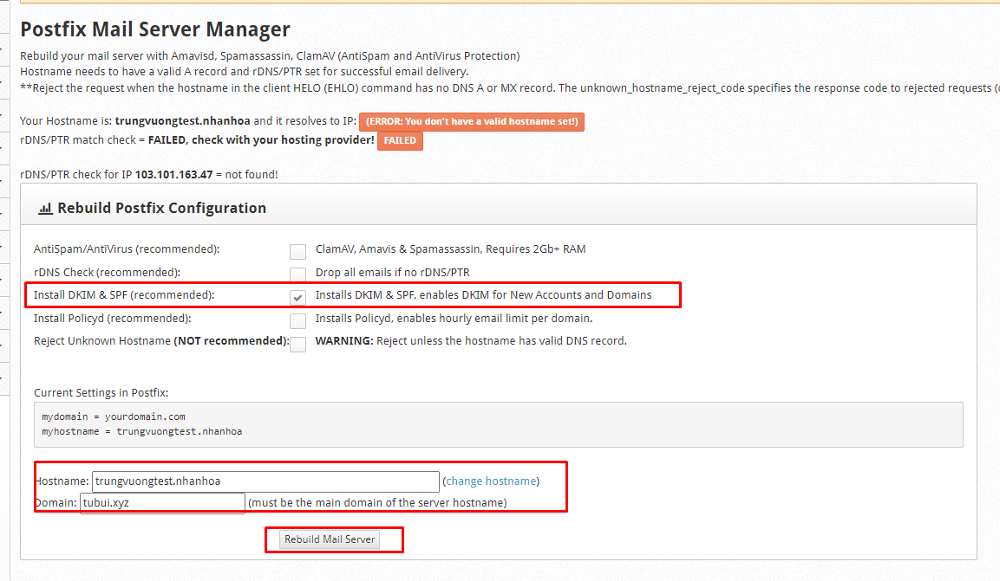

- Sau đó, trên thanh **Navigation**, chọn ```Email``` -> ```DKIM Manager```

- Chọn tên miền cần active DKIM, tích ```enable SPF``` (nếu chưa tích), nhấn vào ```Add DKIM``` và ```Edit Records``` để lấy bản ghi DKIM sau khi đã kích hoạt

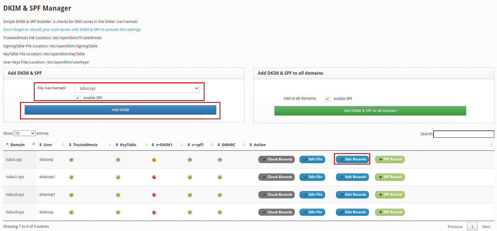

- Tạo bản ghi với thông tin bản ghi có được

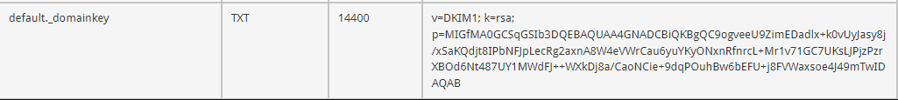

- Bản ghi DKIM trên nameserver

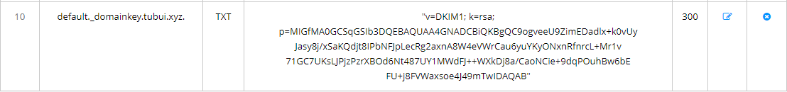

- Kiểm tra bản ghi DKIM

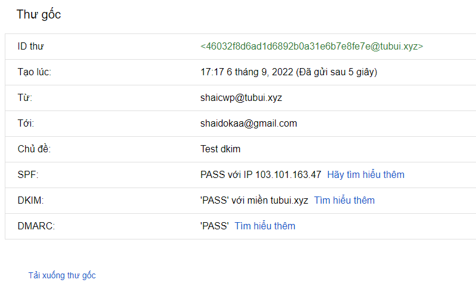