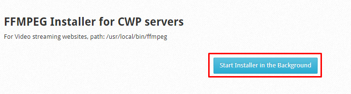
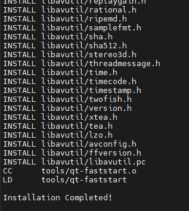
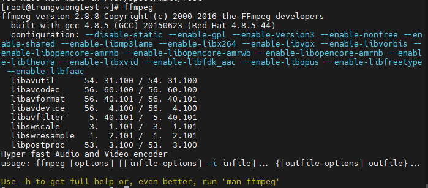

# Hướng dẫn cài đặt FFMPEG trên CWP

FFMPEG là 1 framework miễn phí hàng đầu về đa phương tiện (xử lý audio, video). Nó có thể decode (giải mã), encode (mã hóa), transcode (chuyển mã), mux (ghép kênh), demux (phân kênh, tách kênh), stream (livestream youtube, facebook,...), filter (lọc) và play (chạy, phát video),...

FFMPEG hỗ trợ hầu hết các định dạng. Và nó khá là linh hoạt, có thể compile, run và chạy trên nhiều nền tảng như Linux, Mac OS X, MS Windows, BSD, Solaris,... và nhiều môi trường, kiến trúc khác nhau

Nó chứa các thư viện libavcodec, libavutil, libavformat, libavfilter, libavdevice, libswscale và libswresample. Chúng có thể được sử dụng bởi ứng dụng. Cũng giống như ffmpeg, ffserver, ffplay và ffprobe được sử dụng ddeeer transcoding, streaming và playing

Rõ ràng, FFMPEG là 1 phần mềm xử lý audio, video đơn giản, miễn phí và hiệu quả. Dù là lập trình viên hay người dùng bình thường thì cũng đều có thể sử dụng được FFMPEG

## Hướng dẫn cài đặt

- Tại giao diện quản trị Root, trên thanh **Navigation**, chọn ```PHP Settings``` -> ```FMPEG Installer```

- Nhấn ```Start Installer in the Background``` để bắt đầu quá trình cài đặt



- Quá trình cài đặt sẽ được diễn ra tự động, ta có thể theo dõi quá trình này bằng lệnh

```sh
tail -f /var/log/ffmpeg-installer.log
```

- Việc cài đặt có thể kéo dài 20-30p! Sau khi hoàn tất sẽ có thông báo như sau



- Có thể kiểm tra FFMPEG có hoạt động hay không bằng lệnh ```ffmpeg```



