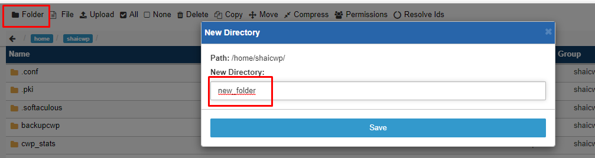
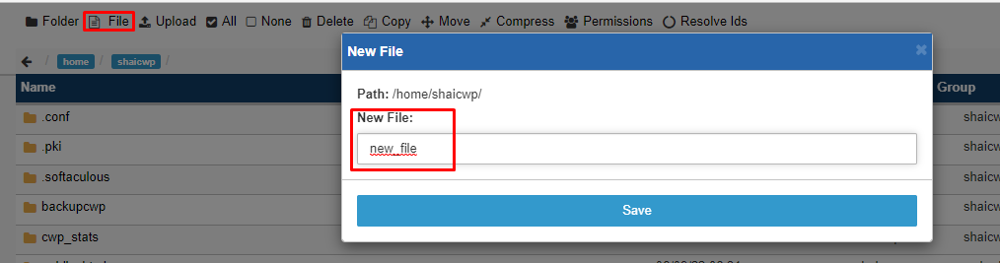
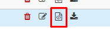
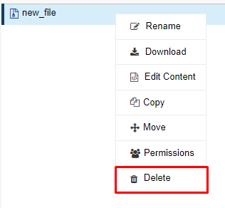
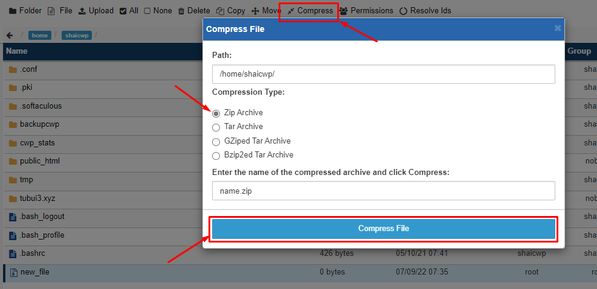
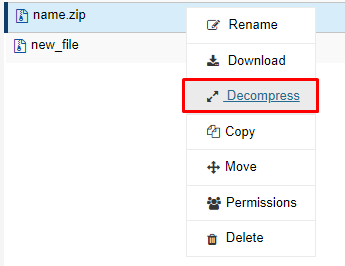
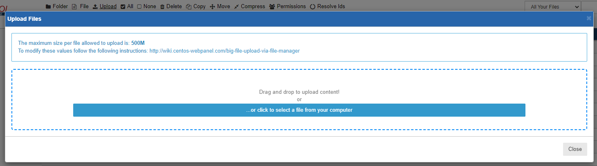
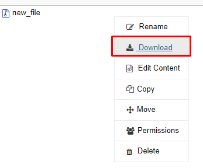

# File Manager trong CWP

File Manager là 1 công cụ quản lý File/Folder mạnh mẽ và tiện dụng, với File Manager bạn chỉ cần thực hiện mọi thao tác đơn giản chỉ bằng vài thao tác Click chuột. Qua đó File Manager đã trở thành 1 công cụ gần như không thể thiếu trên các Control Panel thông dụng hiện nay. Với các Panel thông dụng như cPanel, DA, Cyber Panel, aaPanel, HestiaCP thì đều có tích hợp File Manager, tuy nhiên giao diện quản lý thì có đôi phần khác nhau.

CWP cũng được tích hợp sẵn File Manager và có thể thực hiện được nhiều thao tác thông dụng như:

#### 1. Tạo Folder/File





#### 2. Sửa/Xóa

- Để sửa file/folder ta chọn biểu tượng sau ở bên cạnh file cần sửa



- Để xóa file/filder, ta có thể chuột phải vào file/folder cần xóa và chọn ```Delete```



#### 3. Nén/Giải nén file/folder

- Để nén file/folder, ta chọn file/folder cần nén và nhấn ```Compress```, sau đó chọn loại file nén, đường dẫn file sau khi nén, tên file, cuối cùng là ấn ```Compress`` để nén file



- Để giải nén file/folder, ta chuột phải vào file nén, chọn ```Decompress`` để giải nén



#### 4. Upload/Download file

- Để Upload file, ta chọn ```Upload``` rồi kéo thả file cần Upload vào, hoặc Browse đến file cần upload



- Để Download file, ta cũng có thể chuột phải vào file cần tải và chọn ```Download```



#### 5. Copy file/folder

- Để Copy file/folder, ta có thể chuột phải vào file/folder cần copy và chọn ```Copy```, sau đó chọn đường dẫn mới của file/folder copy và nhấn xác nhận


#### 6. Ngoài ra, File Manager của CWP cũng cho phép ta đổi tên, di chuyển, thay đổi Permission của file/folder, Let's explore it yourself!!!

