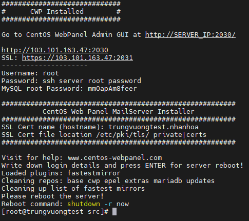
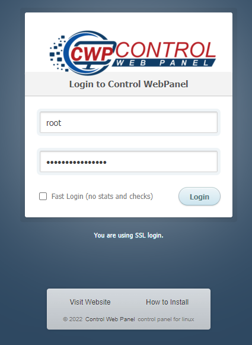
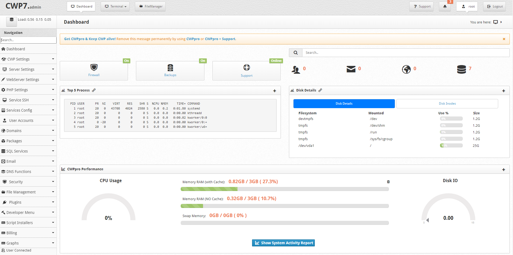

# CentOS Web Panel

### Giới thiệu chung

CWP là 1 control panel miễn phí, có đầy đủ chức năng như 1 control có license, giúp bạn quản trị VPS/Dedicated server mà không cần đăng nhập SSH hay thao tác qua giao diện. CWP có thể giúp bạn dễ dàng quản lý mọi thứ trên server mà không phải gõ từng dòng lệnh phức tạp. Điểm nổi bật của CWP là rất dễ sử dụng, sau khi cài đặt hoàn tất CWP, bạn có thể chạy tốt WordPress như 1 share hosting

Mặc dù phiên bản miễn phí đã rất đầy đủ, CWP cũng có cả bản trả phí để được support về mặt kỹ thuật và nhiều tiện ích khác

Trang chủ của CentOS Web Panel: http://centos-webpanel.com

### Các chức năng chính của CWP

- Apache Web Server (ModSecurity + OWASP)
- PHP 5.x -> 7.x (suPHP, SuExec, PHP, version PHP)
- MySQL (mariadb) + phpMyAdmin
- Postfix + Dovecot + roundcube webmail (Antivirus, Spamassassin)
- CSF Firewall (mặc định sẽ được tắt đi)
- File System Lock (khóa các file hệ thống quan trọng)
- Backups (lưu ý khi tạo user)
- AutoFixer để có thể fix các lỗi config server
- Varnish Cache Server (cấu hình cache để cải thiện tốc độ truy cập website)
- Compiles Apache from source
- Apache reCompiler + Additional
- Apache Server Status: cài đặt nâng cao file config webservice qua giao diện
- Chỉnh sửa apache vhosts, vhosts template: hỗ trợ edit vhost qua giao diện
- Rebuild tất cả apache Virtual
- ModSecurity + OWASP Rules: cấu hình filewall qua giao diện
- Tomcat 8 server management
- Chống DoS với Slow-Loris attacks
- Compiles PHP from source
- Thay đổi các phiên bản PHP dễ dàng (5.x -> 7x)
- Có trình php editor: tăng các thông số php qua giao diện
- Cài thêm PHP addons: wordpress, Prestashop, Joomla, Drupal,...
- Chỉnh sửa PHP.ini, PHP info, List modules
- Tùy chỉnh PHP.ini cho mỗi user qua giao diện
- Postfix và Dovecot
- MailBoxes và Alias
- Roundcube webmail
- Postfix Mail
- rDNS Checker
- AntiSPAM
- Re-Build Postfix/Dovecot Mail Server
- Email Auto Responder
- Quản lý MySQL Database
- Thêm local hoặc remote access user
- Hiện thời gian thực Monitor MySQL, Bandwidth, process thời gian thực hoạt động

### Yêu cầu phần cứng

- Đối với CentOS 32 bit, yêu cầu tối thiểu 512MB RAM
- Đối với CentOS 64 bit, yêu cầu tối thiểu 1024MB RAM
- Dung lượng ổ cứng trống tối thiểu 10GB
- Nếu muốn cài đặt đầy đủ tính năng của CWP đặc biệt là tính năng quét virus cho mail thì cần dung lượng RAM từ 4GB trở lên để hệ thống hoạt động nuột nà

### Cài đặt CWP lên máy chủ CentOS 7

1. Cập nhật hệ thống, tắt các dịch vụ có thể gây xung đột

```sh
yum -y update
```

2. Cài đặt CWP

```sh
cd /usr/local/src
wget http://centos-webpanel.com/cwp-el7-latest
sh cwp-el7-latest
```

3. Chờ đợi qúa trình cài đặt hoàn tất



4. Truy cập vào trang quản trị thông qua cổng 2030 (hoặc 2031) và đăng nhập với tài khoản root và mật khẩu root của VPS



5. Giao diện quản trị chính của CWP

