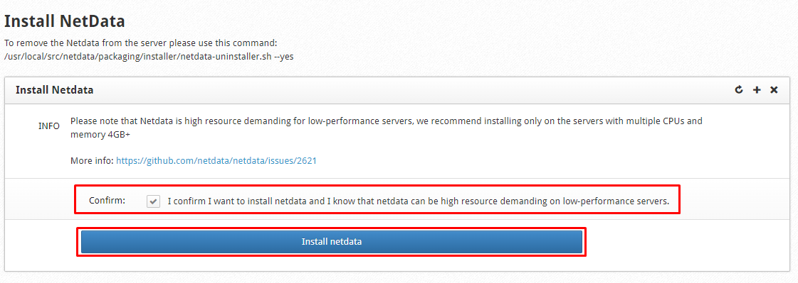

# Netdata trên CWP

Netdata là 1 giải pháp mã nguồn mở của tổ chức Firehol được thiết kế hoạt động trên hệ thống Linux. Cung cấp chức năng chính là giám sát thời gian thực đối với nguồn tài nguyên và ứng dụng đang hoạt động trên hệ thống Linux

**Tính năng:**
- Dashboard bootstrap bắt mắt
- Có thể custom Dashboard
- Tốc độ nhanh và ổn định, viết bằng ngôn ngữ C, chiếm ít RAM
- Không phải phụ thuộc các nguồn hỗ trợ thư viện
- Có thể mở rộng monitor thêm tài nguyên theo nhu cầu

**Những thành phần mà Netdata tham gia giám sát:**
- Total and Per Core CPU usage, interrupts, softirqs and frequency
- Total Memory, RAM, Swap, Kernel usage
- Disk I/O (per disk: bandwidth, operations, backlog, utilization, etc)
- Monitors Network interfaces including: bandwidth, packets, errors, drops, etc
- Monitors Netfilter/iptables Linux firewall connections, events, errors, etc
- Processes (running, blocked, forks, active, etc)
- System Applications with the process tree (CPU, memory, swap, disk reads/writes, threads, etc)
- Apache and Nginx Status monitoring with mod_status
- MySQL database monitoring: queries, updates, locks, issues, threads, etc
- Postfix email server mesage queue
- Squid proxy server bandwidth and requests monitoring
- Hardware sensors (temperature, voltage, fans, power, humidity, etc)
- SNMP devices

### Cài dặt Netdata trên CWP

- Tại giao diện quản trị Root, trên thanh **Navigation**, chọn ```Graphs``` -> ```Netdata```

- Tích chọn ```Confirm``` -> Nhấn ```Install netdata```



- Chờ quá trình cài đặt hoàn tất. Sau khi cài đặt xong có thể truy cập vào Netdata thông qua liên kết ```https://<domain>:2087/netdata``` và đăng nhập bằng tài khoản mật khẩu root VPS

**Lưu ý:** Netdata rất tốn tài nguyên hệ thống, hãy đảm bảo là chỉ cài Netdata trên những máy chủ có CPU đa nhân và RAM từ 4GB trở lên (minimum system requirement)