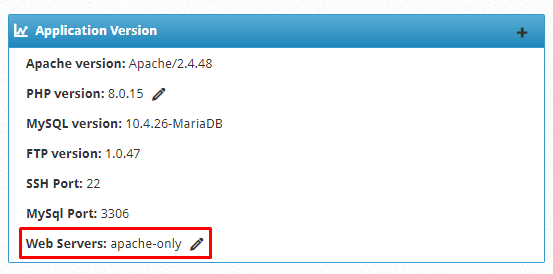
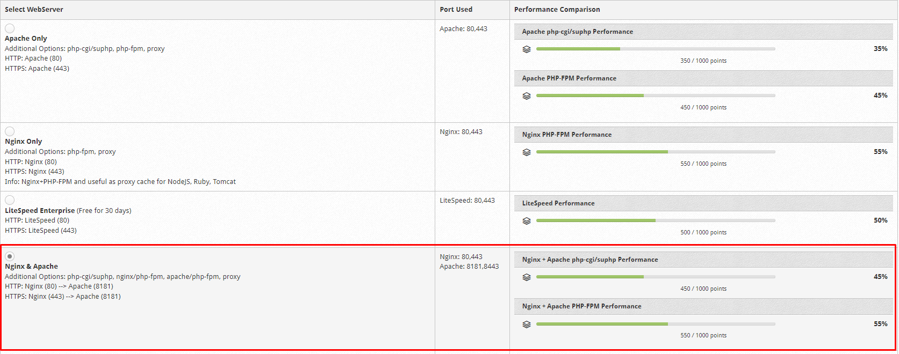
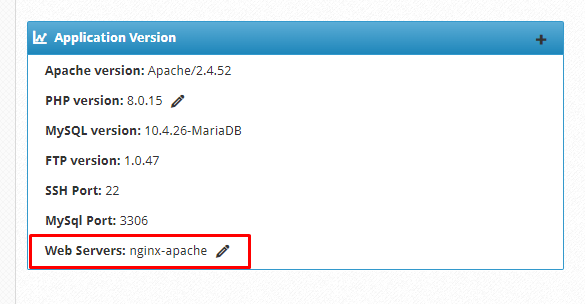

# Build Reverse proxy Nginx-Apache trên CWP

1. Kiểm tra Web Server đang sử dụng



2. Rebuild Webserver Apache thành Nginx-Apache

- Tại giao diện quản trị của Root user, trên thanh **Navigation**, chọn ```WebServer Settings``` -> ```Select WebServers```

- Chọn phiên bản WebServer muốn cài đặt



- Sau đó nhấn ```Save & Rebuild Configuration``` để tiến hành cài đặt

- Quá trình cài đặt diễn ra trong vài phút, sau khi cài đặt xong ta có thể kiểm tra phiên bản web server

