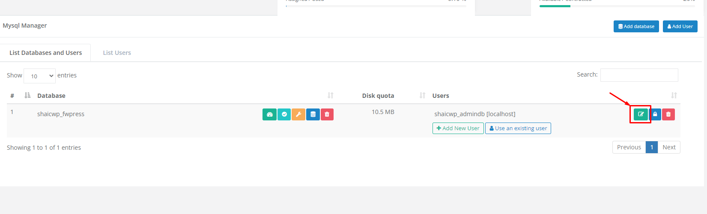
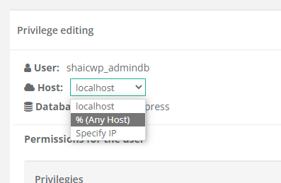

# Tính năng Remote Database trên CWP

*Lưu ý, để bật tính năng Remote Database thì trước tiên phải có Database đã (tất nhiên rồi?)*

- Tại giao diện quản trị của User (sở hữu database cần bật remote ấy), trên thanh **Navigation**, chọn ```Databases``` -> ```Mysql Manager```

- Trong giao diện này, ta có thể làm nhiều thứ với Database như Optimize, Check, Repair, Backup, Delete Databse. Để bật Remote Database, ta chọn ```Edit privileges```



- Trường **Host** mặc định sẽ chỉ cho kết nối từ **localhost**, tuy nhiên chúng ta có thể thay đổi tùy theo mục đích
    - **localhost:** chỉ cho phép kết nối trên chính server
    - **% any host:** cho phép kết nối từ mọi IP
    - **Specify IP:** cho phép từ một số IP được chỉ định

Để có thể Remote vào được Database, ta chọn ```% (Any Host)``` sau đó ```Save``` lại



- Giờ Database đã có thể kết nối từ bên ngoài, ta có thể sử dụng 1 phần mềm thứ 3 như **Sequel Pro** để kết nối. Sử dụng các thông tin sau:
    - Host: IP VPS
    - Username: tên tài khoản của user sở hữu database
    - Password: mật khẩu của tài khoản trên
    - Database: tên của database cần kết nối
    - Port: điền port của MySQL, mặc định là 3306
    - Connect using SSL: không tích

