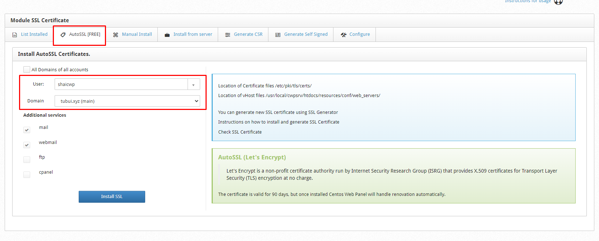
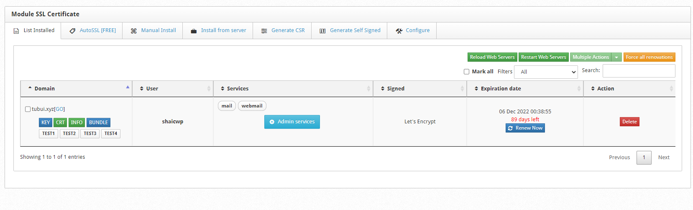
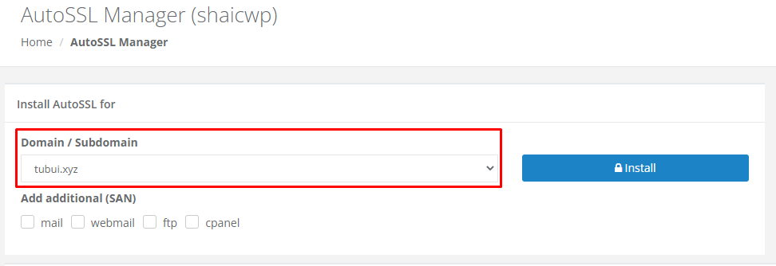
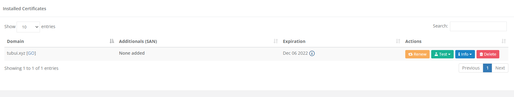
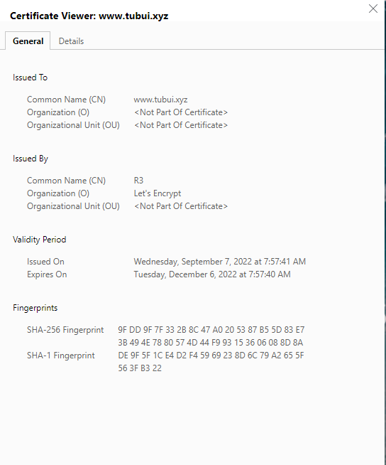

# Cài đặt SSL Let's Encrypt trên CWP

### 1. Thực hiện tại User Root

- Tại giao diện quản trị Root, trên thanh **Navigation**, truy cập ```WebServer Settings``` -> ```SSL Certificate```

- Chọn ```AutoSSL [FREE]```, sau đó chọn User và Domain muốn cài đặt SSL cùng với các subdomain muốn cài SSL



- Nhấn Install và quá trình cài đặt sẽ được diễn ra tự động



### 2. Thực hiện tại tài khoản User

- Tại giao diện quản trị của User, trên thanh **Navigation**, truy cập ```Domains``` -> ```AutoSSL```

- Ở phần ```Domain/Subdomain```, chọn domain cần cài đặt, sau đó nhấn ```Install```





- Kiểm tra

