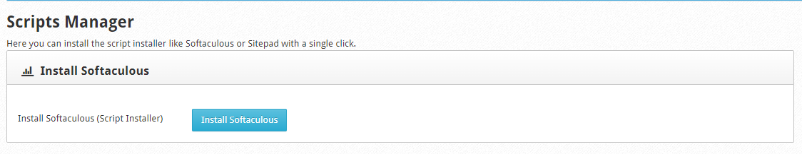
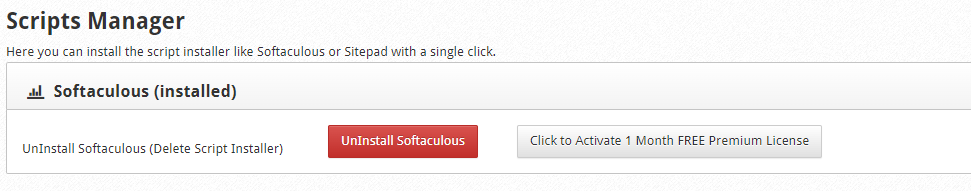
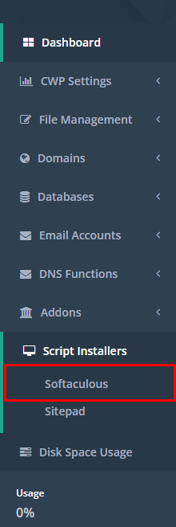
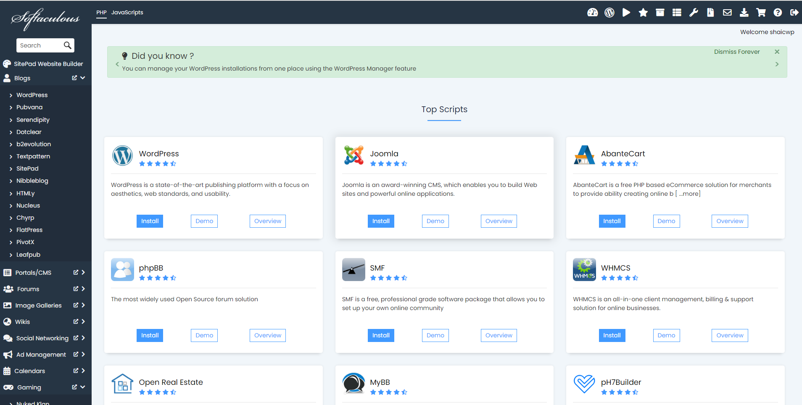

# Cài đặt Softaculous trên CWP

Softaculous là 1 thư viện scripts thương mại, có khả năng tự động cài đặt các ứng dụng web thương mại và mã nguồn mở lên 1 trang web thông qua các control panel phổ biến như cPanel, DirectAdmin, Plesk, và 1 số panel khác. Với Softaculous việc cài đặt các mã nguồn mở trở nên cực kỳ nhanh chóng chỉ với vài thao tác click chuột

Softaculous có 2 phiên bản Pro (trả phí) và Free. Phiên bản Pro cung cấp khả năng cài đặt nhanh chóng hơn 280 ứng dụng, trong khi bản miễn phí chỉ cung cấp cài đặt trên dưới 50 ứng dụng

### Cài đặt Softaculous

- Tại giao diện quản trị của Root user, trên thanh **Navigation**, chọn ```Script Installers``` -> ```Scripts Manager```

- Tiếp đó, chọn ```Install Softaculous```



- Có thể check log quá trình cài đặt bằng lệnh

```sh
tail -f /var/log/softaculous-installer.log
```

- Sau khi cài đặt xong, ta có thể kích hoạt bản quyền Premium trong vòng 1 tháng



- Để kiểm tra hoạt động của Softaculous, ta có thể log in tài khoản User, tại thanh **Navigation**, chọn ```Script Installers``` -> ```Softaculous```



- Giao diện của Softaculous

