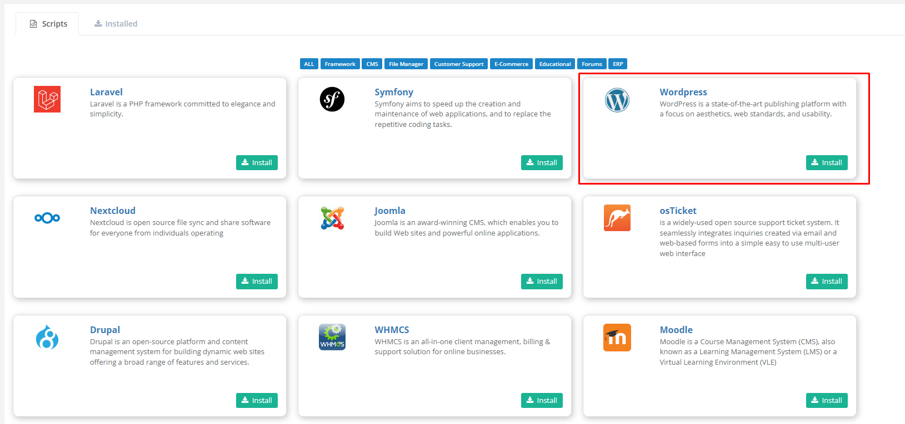
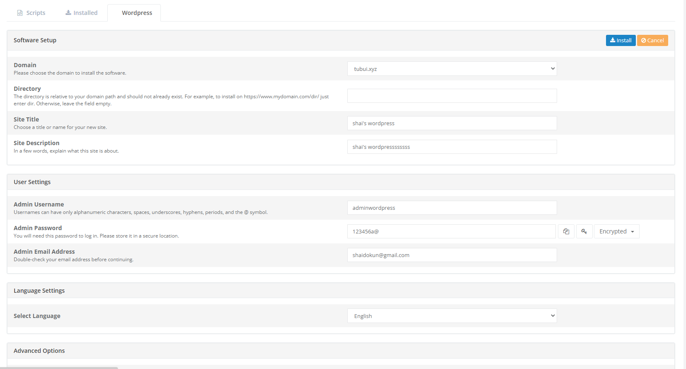
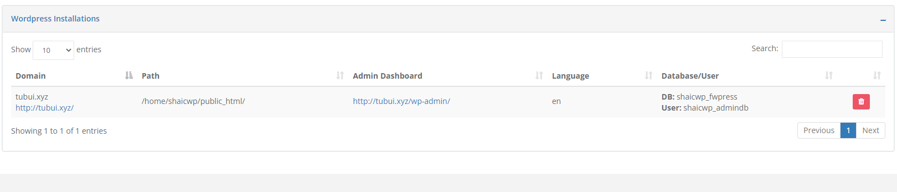
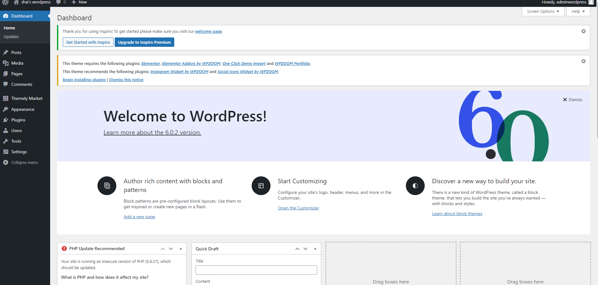

# Cài đặt WordPress trên CWP

1. Truy cập trang quản trị CWP của User cần tạo website Wordpress (thông qua giao diện admin hoặc thông qua cổng 2083)

2. Tại thanh **Naviagation**, chọn ```Addons``` -> ```Scripts```, sau đó tìm Wordpress và chọn ```Install```



3. Nhập các thông tin cần thiết để tạo trang Wordpress và chọn ```Install```



4. Chờ quá trình cài đặt hoàn tất



5. Trang quản trị WordPress

