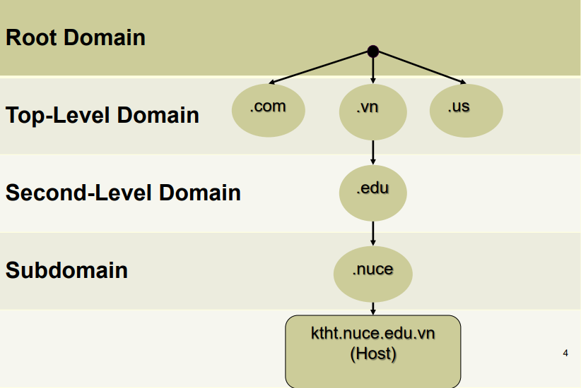
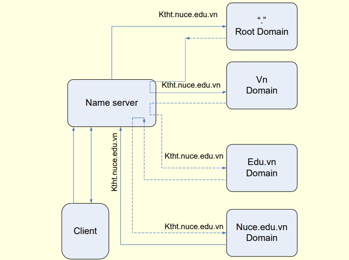

# Dịch vụ DNS

#### Giới thiệu về dịch vụ DNS

DNS (hay Domain Name System) là hệ thống phân giải tên miền được phát minh vào năm 1984 nhằm mục đích phân giải tên miền thành địa chỉ IP và ngược lại

Phân loại máy chủ DNS:
- Primary server DNS
- Secondary server DNS (được dùng đến khi primary server không khả dụng)

#### Cấu trúc của một tên miền

Tên miền được chia thành một số cấp độ:
- Root Domain
- Top-level Domain
- Second-level Domain
- Subdomain

#### Quá trình phân giải tên miền

Như hình trên, khi một máy tính muốn phân giải tên miền *ktht.nuce.edu.vn*, nó sẽ hỏi đến Name server là nơi ghi lại những máy chủ phụ trách việc phân giải tên miền. Sau đó, tên miền *ktht.nuce.edu.vn* được gửi đến những máy chủ này theo thứ tự từ cao xuống thấp

#### Các bản ghi thường thấy trong DNS

- Bản ghi **SOA** (Start of Authority): dùng để chỉ ra máy chủ Name Server là nơi cung cấp thông tin tin cậy từ dữ liệu có trong Zone
- Cú pháp: 
   - [tên-miền] IN SOA [tên-server-dns][địa-chỉ-email](serial number; refresh number; retry number; experi number; Time-to-live number)
   - VD: 
> ktht.nuce.edu.vn IN SOA server1.ktht.nuce.edu.vn root(42, 3H, 15M, 1w, 1D)

- Bản ghi **NS** (Name Server): chỉ ra máy chủ DNS quản lý tên miền của hệ thống
- Cú pháp: 
   - [tên-miền] IN NS [tên-server-dns]
   - VD:
> ktht.nuce.edu.vn IN NS server1.ktht.nuce.edu.vn

> ktht.nuce.edu.vn IN NS server2.ktht.nuce.edu.vn

- Bản ghi **host A**: dùng để ánh xạ tên máy thành địa chỉ IP
   - Cú pháp: [tên-máy-tính] IN A [địa-chỉ-IP]
   - VD:
> server1 IN A 10.0.0.1

> server2 IN A 10.0.0.2

- Bản ghi **PTR**: dùng để ánh xạ địa chỉ ip thành tên máy
   - Cú pháp: [địa-chỉ-ip] IN PTR [tên-máy-tính]
   - VD: 
> 10.0.0.1 IN PTR server1.ktht.nuce.edu.vn

- Bản ghi **CNAME**: dùng để tạo tên gọi khác cho một máy chủ
   - Cú pháp: [tên-bí-danh] IN CNAME [địa-chỉ-IP]
   - VD:
> www IN CNAME 10.0.0.1

- Bản ghi **MX**: dùng cho việc chuyển mail
   - Cú pháp: [tên-miền] IN MX [thứ-tự-ưu-tiên] [tên-máy-chủ-mail]
   - VD:
> ktht.nuce.edu.vn IN MX 1 server1.ktht.nuce.edu.vn

> ktht.nuce.edu.vn IN MX 2 server2.ktht.nuce.edu.vn

#### Các Zone trong DNS

- Zone thuận:
   - Chức năng: Zone thuận dùng để phân giải tên miền thành địa chỉ ip
   - Cú pháp: zone "[tên-miền]" IN {
       type [tên-kiểu];
file "[tên-file-cấu-hình]";
   }
   - VD:

> zone "ktht.nuce.edu.vn" IN {
    type master;
    file "ktht.db";
> }

- Zone nghịch:
   - Chức năng: Zone nghịch dùng để phân giải địa chỉ IP thành tên miền
   - Cú pháp: zone "địa-chỉ-lớp-mạng.in-addr.arpa" IN {
       type [kiểu];
file "tên-file-cấu-hình";
   }
   - VD: 

> zone "0.0.10.in-addr.arpa" IN {
    type master;
    file "0.0.10.in-addr.arpa.db";
}