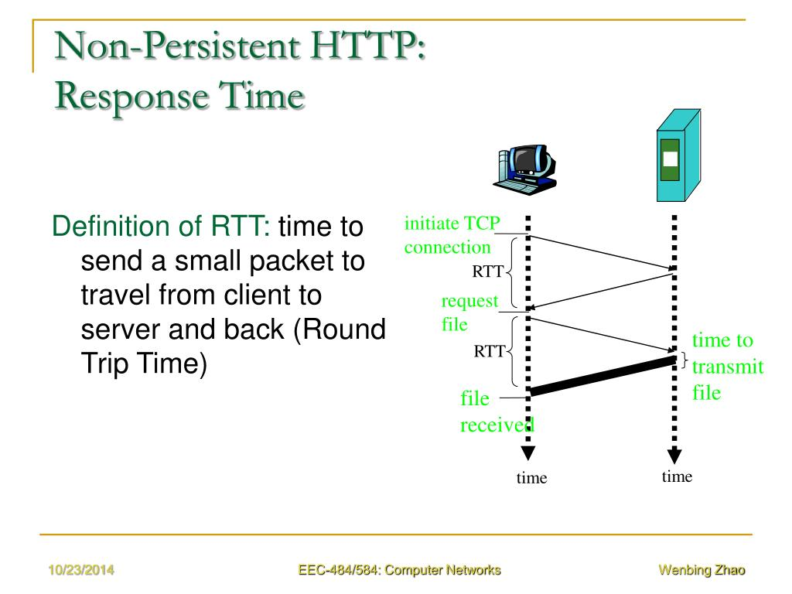
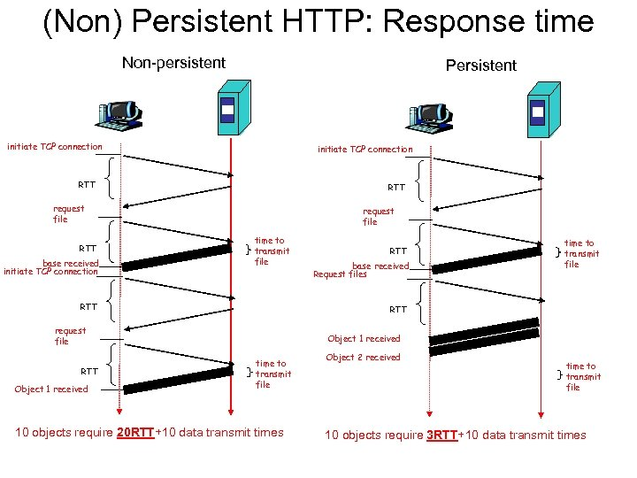
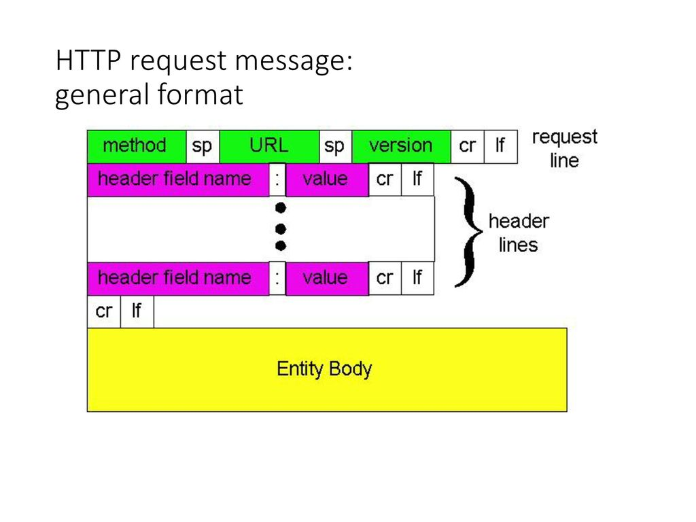
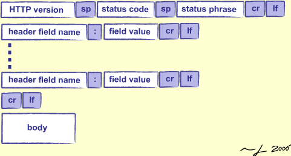

# Giới thiệu chung về HTTP

HTTP (Hypertext Transfer Protocol) - giao thức truyền siêu văn bản là giao thức quy định cách truyền các đối tượng của web 

HTTP dựa theo mô hình Client/Server
- Client: thường là trình duyệt web, gửi yêu cầu, nhận dữ liệu, và hiển thị đối tượng
- Server: gửi nội dung dữ liệu của đối tượng tương ứng với yêu cầu

HTTP sử dụng dịch vụ giao vận dữ liệu của TCP: Client (browser) khi cần tải một trang sẽ mở một kết nối TCP đến server qua cổng 80
- Server khi đó chấp hận kết nối với Client 
- Client và Server trao đổi các bản tin theo quy định của giao thức 
- Sau khi trao đổi hoàn tất thì đóng kết nối TCP

HTTP là giao thức "stateless" (không lưu trạng thái): Server không lưu lại thông tin về yêu cầu trước của Client

# HTTP không duy trì kết nối và HTTP duy trì kết nối

|Nonpersistent HTTP|Persistent HTTP|
|:-|:-|
|Mỗi kết nối TCP giữa Client và Server chỉ vận chuyển nhiều nhất 1 đối tượng|Nhiều đối tượng có thể được tải thông qua 1 lần kết nối duy nhất|
|1 yêu cầu và 1 phản hồi trên 1 kết nối|Nhiều yêu cầu và phản hồi trên 1 kết nối TCP|

#### HTTP không duy trì kết nối

Minh họa 1 phiên làm việc:



- HTTP client khởi tạo kết nối TCP đến HTTP Server qua cổng 80, Server lúc này đang trong trạng thái lắng nghe sẽ chấp nhận kết nối TCP với Client
- HTTP client gửi HTTP request message (gồm cả URL) qua kết nối TCP socket chỉ ra rằng Client muốn tải đối tượng /index.html
- HTTP Server nhận được request message, tạo ra 1 response message chứa đối tượng được yêu cầu và gửi vào socket. Sau đó, Server đóng kết nối TCP.
- HTTP Client nhận được response message chứa file HTML yêu cầu. Khi phân tích cú pháp thì thấy có 5 đối tượng ảnh cần tham chiếu đến
- Client lúc này sẽ lặp lại các bước trên với mỗi đối tượng ảnh cần tải

#### HTTP duy trì kết nối

Minh họa 1 phiên làm việc:



# Cú pháp bản tin HTTP request

Bản tin yêu cầu của HTTP có dạng text, chia thành dòng và có thể đọc được. Cú pháp:

```sh
GET /ktht/index.html HTML\1.1
Host: www.nuce.edu.vn
User-agent: Mozilla/4.0
Connection: close
Accept-language: VN
(CRLF)
```

Cú pháp tổng quát:



**Các kiểu method trong http:**
- HTTP/1.0:
   - GET: lấy về bất kỳ thông tin gì được yêu cầu ở trong bản tin
   - POST: gửi lên 1 đoạn văn bản, 1 khối dữ liệu hay 1 thực thể nào đó để thêm vào database
   - HEAD: yêu cầu Server gửi bản tin response chỉ có phần tiêu đề

- HTTP/1.1:
   - GET, POST, HEAD
   - PUT: tạo mới hoặc sửa đổi thực thể đã có sẵn
   - DELETE: yêu cầu xóa thực thể chỉ ra trong URL

# Cú pháp bản tin HTTP response

Bản tin phản hồi của HTTP có dạng:

```sh
HTTP/1.1 200 OK
Connection close
Date: Thu, 06 Aug 1998 12:00:15 GMT
Server: Apache/1.3.0 (Unix)
Last-Modified: Mon, 22 Jun 1998 …...
Content-Length: 6821 Content-Type: text/html

data data data data data ...
```

Cú pháp tổng quát:



**Một vài status code trong HTTP**
- 200 OK: yêu cầu được đáp ứng và dữ liệu được yêu cầu nằm trong thông điệp
- 301 Moved Permanently: cho biết đối tượng đã được chuyển và sẽ tự động chuyển hướng tới đối tượng tại địa chỉ URL mới
- 400 Bad Request: Server không hiểu được yêu cầu từ Client
- 404 Not Found: Đối tượng không còn được lưu trên Server
- 500 Internal Server Error: Server gặp điều kiện chưa lường trước ngăn nó không đáp ứng được yêu cầu của Client