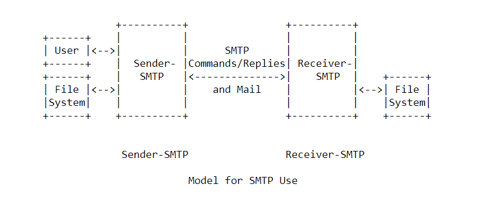

# Giao thức SMTP

### Giới thiệu chung 

SMTP là 1 giao thức hoạt động ở tầng ứng dụng. Mục đích chính của SMTP là để truyền email tin cậy và hiệu quả từ người gửi đến người nhận. Giao thức không phụ thuộc vào hệ thống cụ thể bên tham gia vào giao thức, chỉ cần các bên có kết nối qua 1 kênh truyền dữ liệu tin cậy (sử dụng TCP).

Các bên tham gia vào giao thức gồm có User Agent (Mail Client) và Mail Server. Một đặc tính quan trọng của giao thức SMTP là cho phép chuyển tiếp email từ User-Agent qua các hệ thống Mail Server trung gian cho đến Mail Server của địa chỉ người nhận.

### Mô hình hoạt động của giao thức SMTP


Giao thức SMTP được thiết kế theo mô hình truyền thông như sau:
- Sender-SMTP là chương trình Client. Khi người dùng user có yêu cầu gửi email, Client sẽ thiết lập 1 kết nối TCP đến Receiver-SMTP (chính là chương trình Server)
- SMTP Server có thể là điểm đến cuối cùng (end-to-end) của email hoặc một điểm trung chuyển (store-and-forward)
- Client sẽ tạo các bản tin request chứa các lệnh SMTP và gửi đến Server
- Server xử lý lệnh và trả lời bằng cách gửi bản tin phản hồi cho Client

**Một giao dịch truyền mail giữa Client và Server diễn ra như sau:**

- Sau khi kết nối được thiết lập, Server gửi 1 bản tin thông báo trạng thái hiện tại của Server
- Client gửi lệnh HELO và thông báo tên Client. Server gửi phản hồi thông báo tên của Server
- Nếu trạng thái của Server sẵn sàng phục vụ và Server trả lời OK với lệnh HELO của Client, Client gửi lệnh MAIL để bắt đầu phiên giao dịch email và báo cho Server địa chỉ người
- Nếu Server chấp nhận người gửi đó, sẽ gửi một phản hồi báo là đồng ý
- Client sau đó gửi lệnh RCPT để báo cho Server địa chỉ người nhận email (Có thể gồm cả tên và email người nhận)
- Server có thể trả lời đồng ý nếu chấp nhận hoặc từ chối nếu không chấp nhận. Lý do không chấp nhận có thể là do Server không trực tiếp quản lý địa chỉ email của người nhận hoặc không thể chuyển tiếp email cho người nhận đó
- Client và Server có thể tiếp tục trao đổi thỏa thuận về những người nhận tiếp theo (Một email có thể gửi đến cho nhiều người nhận)
- Sau khi đã hoàn thành việc cung cấp địa chỉ người nhận cho Server, Client sẽ chuyển nội dung email cho Server, kết thúc bằng 1 chuỗi kí hiệu đặc biệt
- Server nhận xong email sẽ lưu thành file vào thư mục email của người nhận trên ổ đĩa của Server. Sau khi xử lý thành công, Server gửi phản hồi đã hoàn thành cho Client

Các bước trên phải thực hiện theo đúng thứ tự để Client gửi thành công 1 email. Nếu Client muốn gửi tiếp email trong cùng 1 phiên thì quay lại bước gửi lệnh MAIL. Nếu Client không còn email để gửi thì có thể kết thúc phiên bằng QUIT. Server sẽ phản hồi và đóng kết nối TCP.

### Một số lệnh thường dùng trong SMTP

Các lệnh SMTP là các chuỗi ký tự được kết thúc bởi cặp carriage return và line feed (CRLF). Bản thân các mã lệnh là các ký tự chữ cái được kết thúc bởi space (SP), có thể có tham số theo sau hoặc là (CRLF) nếu không có tham số nào.

1. Lệnh ```HELO```

Lệnh này được sử dụng để xác định người gửi SMTP (Client) với người nhận SMTP (Server). Trường tham số chứa tên máy của Client. Server tự xưng danh với Client trong câu trả lời chào kết nối và trong phản hồi lệnh này. Lệnh này và câu trả lời OK với mã 250 xác nhận rằng cả Client và Server đều ở trạng thái ban đầu, nghĩa là không có giao dịch email nào đang diễn ra và tất cả các bảng trạng thái và bộ đệm đều bị xóa

*Cú pháp:* ```HELO (SP) (Client name) (CRLF)```

*Phản hồi:* ```250 (SP) (Server name) is ready```

2. Lệnh ```MAIL```

Lệnh này sẽ báo cho Server biết một giao dịch chuyển email mới bắt đầu để Server thiết lập lại các bảng trạng thái phiên, các vùng đệm chứa dữ liệu, các danh sách địa chỉ email người gửi và người nhận mà Server quản lý trong phiên này. Nếu chấp nhận lệnh này, Server sẽ gửi trả lời với mã 250

*Cú pháp:* ```MAIL (SP) FROM: <(email addres)> (CRLF)```

*Phản hồi:* ```250 (email address) is ok (CRLF)```

3. Lệnh ```RCPT```

RCPT sẽ báo cho Server biết 1 địa chỉ email của 1 người nhận đối với giao dịch email này. Nếu chấp nhận, Server sẽ gửi trả lời với mã 250. Nếu không biết địa chỉ người nhận, Server sẽ trả về mã 550. Lệnh RCPT có thể lặp lại nhiều lần cho nhiều người nhận email

*Cú pháp:* ```RCPT (SP) TO:<email address> (CRLF)```

*Phản hồi:* ```250 (email address) is ok (CRLF)```

4. Lệnh ```DATA```

Nếu chấp nhận lệnh, Server sẽ trả lời với mã 354 và sau đó coi những dữ liệu nhận được sau đó từ Client là nội dung của email. Trong quá trình nhận, Server sẽ lưu dữ liệu email vào file trong thư mục hộp thư của người nhận. Khi hoàn thành nhận nội dung email, Server sẽ trả lời với mã 250. Dấu chỉ báo kết thúc email là *(CRLF).(CRLF)*

*Cú pháp:* ```DATA (CRLF)```

*Phản hồi:* ```354 End data with CRLF.CRLF (CRLF)```

Sau khi nhận xong dữ liệu của email, Server phản hồi: ```250 Received email successfully (CRLF)```

5. Lệnh ```QUIT```

Lệnh QUIT báo hiệu rằng bên nhận cần gửi 1 phản hồi OK, sau đó đóng kênh truyền thông TCP. Server sẽ chưa đóng kênh truyền thông nếu chưa gửi bản tin phản hồi, và bên Client cũng sẽ giữ kết nối cho tới khi nhận được phản hồi cho lệnh QUIT

*Cú pháp:* ```QUIT (CRLF)```

*Phản hồi:* ```221 Bye (CRLF)```