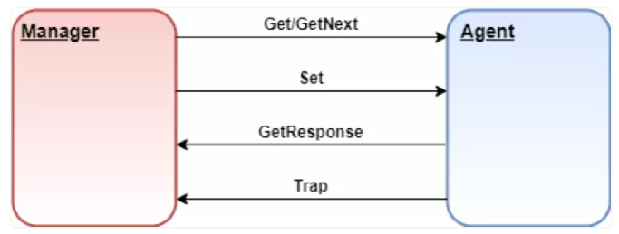

# Giao thức SNMP

### Giới thiệu chung

SNMP (hay Simple Network Manangement Protocol) là một giao thức tầng Application được mô tả trong RFC 1157 được sử dụng để trao đổi thông tin quản lý giữa các thiết bị mạng. SNMP cũng là 1 phần của mô hình TCP/IP

Hầu hết các thiết bị mạng được cung cấp đi kèm với SNMP agent. Các agent này phải được kích hoạt và cấu hình để giao tiếp với các công cụ giám sát mạng hoặc hệ thống quản lý mạng (NMS)

### Các thành phần có trong SNMP

**1. SNMP Manager**

Trình quản lý hoặc hệ thống quản lý là một thực thể riêng biệt có trách nhiệm giao tiếp với các thiết bi mạng được triển khai SNMP agent

Các chức năng chính:
- Truy vấn agent
- Nhận response từ các agent
- Đặt các biến trong agent
- Xác nhận các sự kiện không đồng bộ từ các agent

**2. Các thiết bị được SNMP quản lý**

Thiết bị được quản lý hoặc phần tử mạng là một phần của mạng mà yêu cầu giám sát và quản lý (như router, switch, server, máy trạm, ...)

**3. SNMP Agent**

Agent là một chương trình được đóng gói trong các thiết bị mạng. Kích hoạt Agent cho phép nó thu thập cơ sở dữ liệu thông tin quản lý từ thiết bị cục bộ và cung cấp nó cho SNMP manager khi được truy vấn

Các chức năng chính của SNMP Agent:
- Thu thập thông tin quản lý về các chỉ số hoạt động của thiết bị
- Lưu trữ và truy xuất thông tin quản lý như được định nghĩa trong MIB
- Báo hiệu sự kiện cho trình quản lý
- Hoạt động như một proxy cho một số nút mạng không quản lý được

**4. SMI**

SMI (Cấu trúc của thông tin quản lý) là một thành phần được sử dụng trong quản lý mạng. Chức năng chính của nó là xác định loại dữ liệu có thể được lưu trữ trong một đối tượng và chỉ ra cách mã hóa dữ liệu để truyền qua mạng

**5. MIB**

MIB (Cơ sở thông tin quản lý) là thành phần thứ hai để quản lý mạng
Mỗi tác nhân có MIB riêng, là tập hợp của tất cả các đối tượng mà Manager có thể quản lý. MIB được phân loại thành 8 nhóm: hệ thống, giao diện, dịch địa chỉ, ip, icmp, tcp, udp, egp. Các nhóm này nằm dưới đối tượng MIB

### Cách thức hoạt động

SNMP sử dụng một số command cơ bản để giao tiếp giữa Manager và Agent

**1. GET: Yêu cầu thông tin**

Để nhận thông tin trạng thái từ agent, manager có thể đưa ra Get hay GetNext để yêu cầu thông tin cho một biến cụ thể. Sau khi nhận được message Get hoặc GetNext, agent sẽ gửi message GetResponse cho manager. Bản tin phản hồi chứa thông tin được yêu cầu hoặc lỗi giải thích tại sao không thể xử lý được request

**2. SET: Điều khiển thiết bị từ xa**

Message SET cho phép manager yêu cầu thực hiện thay đổi với đối tượng được quản lý. Sau đó, agent sẽ trả lời bằng message SetResponse báo thay đổi đã được thực thi hoặc lỗi giải thích tạo sao không thực hiện được

**3. TRAP: SNMP message phổ biến nhất**

Message TRAP được tạo ra bởi agent và gửi đến manager khi một sự kiện quan trọng xảy ra. TRAP dùng để cảnh báo cho manager mà không cần phải chờ bản tin request từ phía manager

**4. INFORM**

INFORM gần giống với TRAP, khi manager nhận được bản tin này, nó sẽ gửi lại bản tin phản hồi cho agent. Nếu agent không nhận được phản hồi từ manager, agent sẽ gửi lại message INFORM

### Cách bản tin vận chuyển trong SNMP

Xét 1 bản tin SNMP Request GET từ agent

*Bước 1:* SNMP manager muốn biết tên hệ thống của agent và chuẩn bị message GET cho OID thích hợp

*Bước 2:* Message sau đó được chuyển đến lớp UDP. Lớp UDP thêm một khối dữ liệu xác định cổng manager mà response packet sẽ được gửi đến

*Bước 3:* Sau đó packet được chuyển đến lớp IP, nơi khối dữ liệu chứa địa chỉ IP và các địa chỉ Media Access của manager và agent được thêm vào

*Bước 4:* Toàn bộ packet được chuyển đến lớp Network interface. Lớp Network interface xác minh khả năng truy cập và tính khả dụng của phương tiện. Sau đó, nó đặt packet trên phương tiện truyền thông để vận chuyển

*Bước 5:* Sau khi qua các cầu nối và thông qua các router dựa trên thông tin IP, packet cuối cùng cũng đến được agent

*Bước 6:* Ở đây nó đi qua 4 lớp giống nhau theo thứ tự ngược lại với manager 