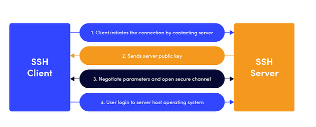

# Giao thức SSH

#### Giới thiệu chung

SSH (hay Secure Socket Shell) là một giao thức hỗ trợ cho người quản trị mạng truy cập an toàn vào máy chủ từ xa bằng mạng internet không bảo mật.

SSH cung cấp nhiều tiện ích như khả năng xác thực mật khẩu mạnh mẽ, xác thực public key, mã hóa dữ liệu trao đổi qua internet.

SSH giúp quản trị viên quản lý trực tuyến nhờ vào các ứng dụng quản lý từ xa. Họ có thể đăng nhập vào một máy tính khác và thực hiện trao đổi tệp từ máy này sang máy khác thông qua internet.

Mô hình hoạt động của SSH là client/server. Máy client là phần cuối của vùng hiển thị session, còn máy chủ là vùng session chạy.

#### Cách thức hoạt động của SSH

SSH giúp hoạt động các chức năng tương tự (hoặc tốt hơn) và có thể thay thế cho cả Telnet và FTP

SSH chạy ở mô hình client-server, có nghĩa là kết nối được khởi tạo bởi client tới server. Client SSH điều khiển tiến trình thiết lập kết nối và sử dụng mã hóa public key để xác thực danh tính của Server SSH. Sau phiên thiết lập, SSH sử dụng mã hóa đối xứng và thuật toán băm để đảm bảo tính bảo mật và tính toàn vẹn của dữ liệu được truyền tải giữa client và server

Dưới đây là thể hiện quá trình thiết lập của ssh



#### SSH và Telnet

- Telnet cũng là giao thức dùng để mô phỏng đăng nhập đầu cuối vào máy chủ từ xa
- Tuy nhiên SSH dùng key public để xác thực thiết bị đầu cuối, mã hóa các lệnh, đầu ra của phiên
- Telnet chỉ mô phỏng thiết bị đầu cuối. SSH còn có thể truyền lệnh từ xa, truyền tệp bằng SFTP và tạo đường hầm cho ứng dụng

#### SSH và SSL/TLS

-  SSL/TLS hỗ trợ bảo mật trong việc truyền mạng ở lớp truyền tải
- Cả SSL và SSH đều dùng cặp khóa public/private để xác thực máy chủ, nhưng với SSL thì chỉ có máy chủ được xác thực bằng cặp khóa, trong khi SSH dùng cặp khóa thứ 1 để kết nối máy cục bộ đến máy chủ từ xa, cặp khóa thứ 2 thì ngược lại
- SSL hỗ trợ xác thực kết nối giữa các thiết bị mà không cần mã hóa hoặc ngược lạu. SSH thì mã hóa và xác thực tất cả các kết nối
- SSH giúp bảo mật an toàn để kiểm soát các máy khách từ xa. Với mỗi lần kết nối, SSH tự xác thực mà không cần đăng nhập lại

#### Một số lệnh cơ bản trong SSH

```ssh server.example.org``` Lệnh giúp kết nối với máy chủ đích server.example.org, máy chủ sẽ yêu cầu password của ID mà máy khách đang dùng. Nếu ID người dùng cho máy chủ từ xa là ID khác, dùng câu lệnh sau ```ssh remote_host_userID@server.example.org```

```sshd``` khởi tạo máy chủ SSH

```ssh-keygen``` giúp tạo cặp key mới cho SSH, dùng để tự động đăng nhập, thực thi SSO, xác thực máy chủ

```ssh-copy-id``` giúp sao chép, cài đặt và định cấu hình khóa SSH trên máy chủ để tự động đăng nhập và SSO không cần mật khẩu

```ssh-agent``` giúp theo dõi key xác thực và mật khẩu

```ssh-add``` dùng để thêm khóa vào yếu tố xác thực và kết hợp với ssh-agent để thực thi SSO bằng SSH

```sftp``` giúp sao chép tệp từ máy này sang máy khác sử dụng SFTP