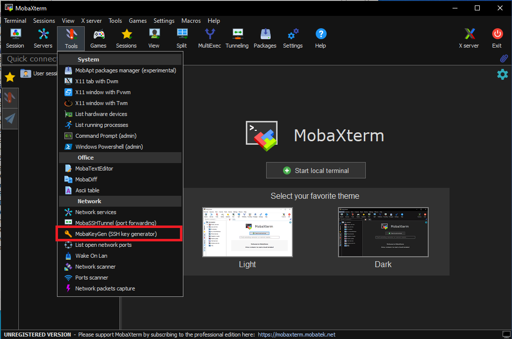
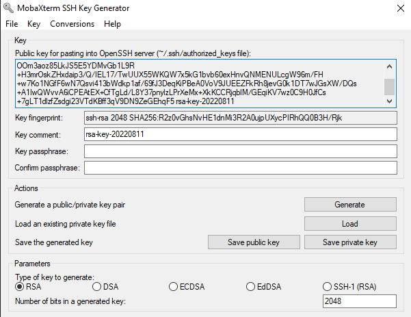
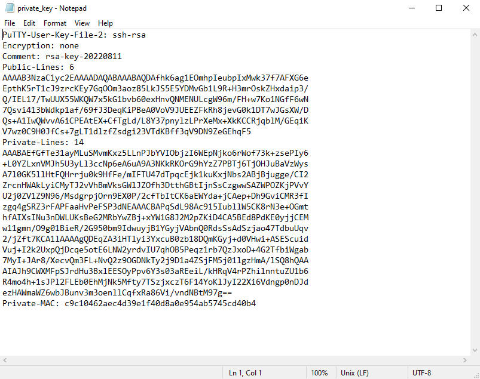
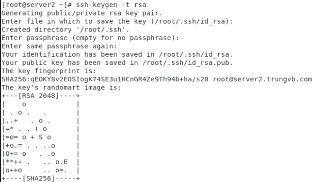
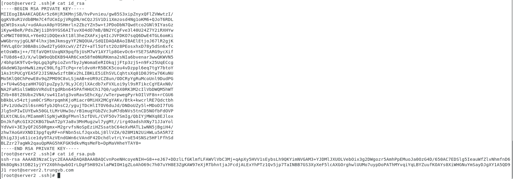
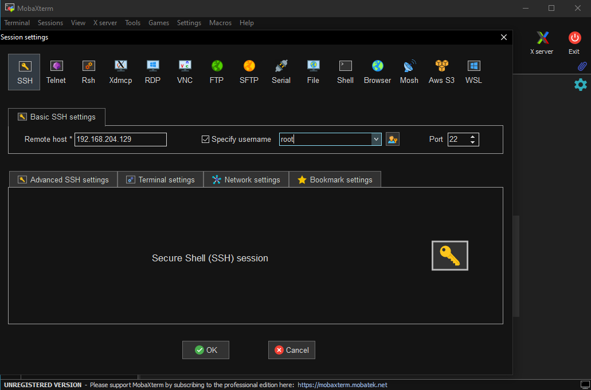
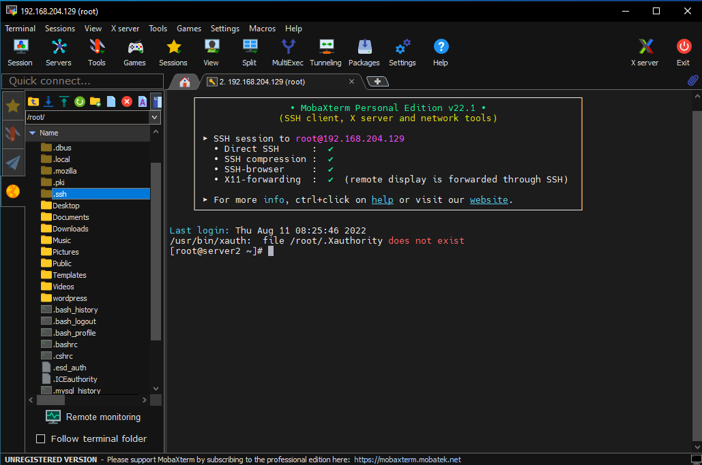
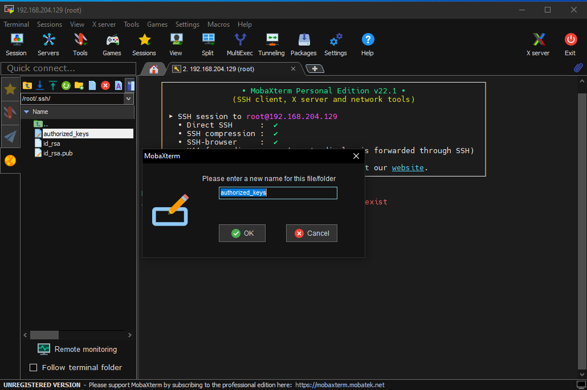
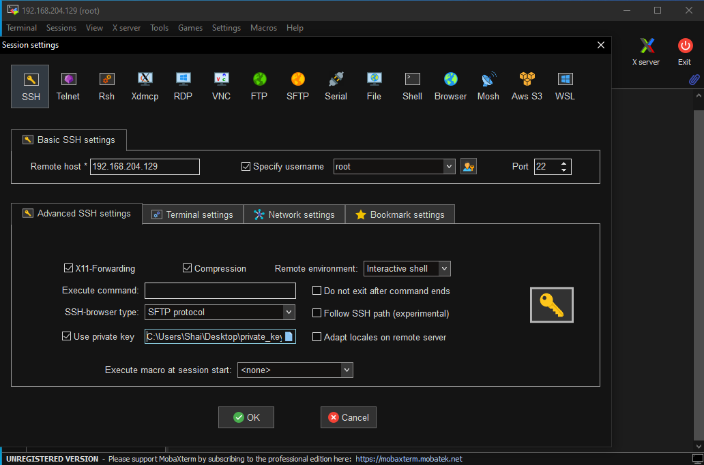
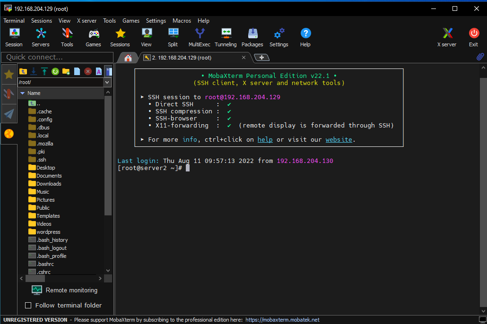

# SSH Key

## Giới thiệu chung

SSH key có thể hiểu đơn giản là một kiểu xác thực đối chiếu giữa người dùng (Private key) và Server/VPS (Public key)

Lợi ích của SSH key: nhờ SSH key, người sử dụng có thể đăng nhập vào Server/VPS mà không cần dùng username và password như thông thường. Nhờ đó tăng tính tiện lợi và bảo mật

Các thành phần của SSH key:
- Public key: Lưu trữ tại Server đóng vai trò làm ổ khóa. Lưu tại file /root/.ssh/authorized_keys trên Server
- Private key: Lưu trữ tại máy tính cá nhân, đóng vai trò làm chìa khóa
- Keyphrase: Mật khẩu để mở Private key. Nếu ta đặt mật khẩu cho Private key thì khi SSH vào Server sẽ cần nhập Keyphrase để có thể kết nối

Nguyên tắc hoạt động:
- Private key và Public key được sử dụng để nhận diện lẫn nhau. Khi tạo SSH key, người dùng sẽ có 1 cặp key này. Sau đó, Public key được tải lên máy chủ còn Private key thì lưu ở máy tính cá nhân
- Khi đăng nhập vào Server, người dùng sẽ phải gửi yêu cầu đăng nhập kèm theo Private key mình đang nắm giữ, Server kiểm tra xem cặp Private key và Public key có khớp không, nếu có thì chấp nhận kết nối

## Cách tạo SSH Key

1. Tạo SSH key trên Windows

- Download phần mềm MobaXterm tại [đây](https://mobaxterm.mobatek.net/download.html)

- Chọn tool để sử dụng công cụ SSH key generator của MobaXterm



- Click vào Generate sau đó di chuột quanh màn hình để tạo key

- Chọn **Save private key** để lưu lại key, trước đó có thể nhập key passphrase nếu cần thiết



- Tiếp tục **Save public key** để lưu khóa công khai, khóa này sau đó được tải lên Server



2. Tạo SSH key trên Linux

Trên hệ điều hành Linux, sử dụng lệnh sau để tạo SSH key

```ssh-keygen -t rsa```

Sau đó, tiến hành nhập đường dẫn lưu key và nhập key passphrase (có thể để trống để lưu tại đường dẫn mặc định hay không dùng key passphrase)



Kiểm tra key tại đường dẫn ```/root/.ssh/```



## Cách upload Public key lên Server và connect bằng SSH key

1. Kết nối với Server bằng username root và password để upload Private key



Tại giao diện chính của MobaXterm, chọn **Session** -> **SSH**. Sau đó tích chọn **Secify username** và nhập vào tài khoản root. Nhấn **OK** và nhập mật khẩu root để đăng nhập vào Server

2. Tại cửa sổ bên trái, ta tìm tới đường dẫn /root/.ssh/



Ở đây, nhấn vào biểu tượng mũi tên lên màu xanh để upload file Public key. Sau khi upload thành công, chuột phải vào Public key và chọn **Rename** để đổi tên Public Key thành **authorized_keys**



3. Sau khi đã có SSH key, việc đăng nhập vào Server sẽ chỉ cần sử dụng Private key có sẵn trong máy mà không cần phải nhập password nữa



Chọn **Session** -> **SSH**. Nhập vào IP server, tên tài khoản root. Sau đó chọn **Advanced SSH settings**, tích chọn **Use private key** và dẫn đến file Private key có trong máy. Cuối cùng chọn **OK** để đăng nhập



