# Cài đặt CentOS 6.9 trên máy chủ vật lý

-  Chuẩn bị USB boot CentOS 6.9
    - Tải file iso của CentOS 6.9
    - Dùng ```rufus``` tạo USB boot

- Cài đặt CentOS 6.9

- Khởi động lại máy chủ sau đó nhấn F11 để vào Boot Manager

- Tại ```Boot Manager``` chọn ```BIOS Boot Menu```

- Thực hiện Boot vào USB để cài đặt CentOS 6.9

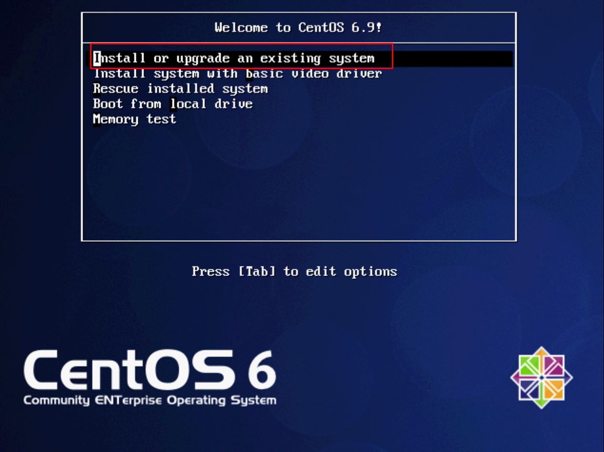

- Chọn ngôn ngữ mặc định là English rồi nhấn ```OK```

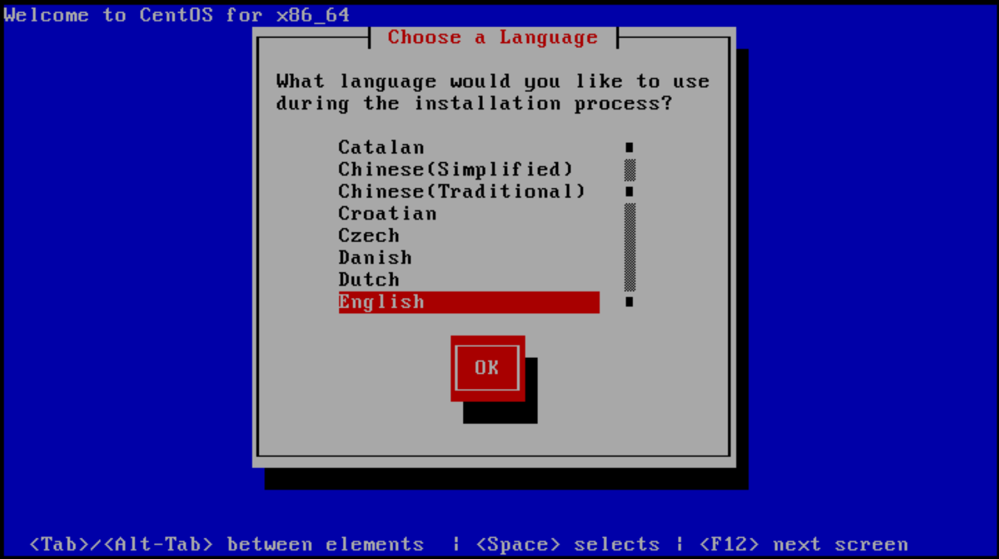

- Chọn phương pháp cài đặt là ```Hard Drive``` -> ```OK```

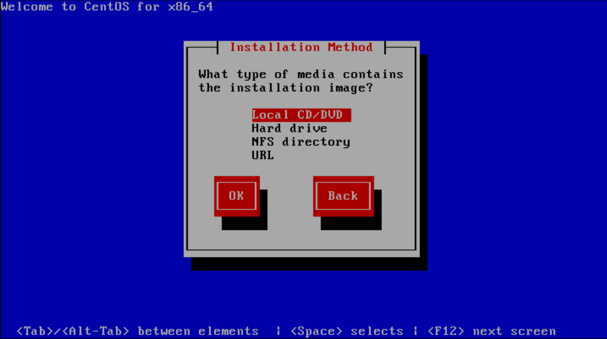

- Chọn ```Next```

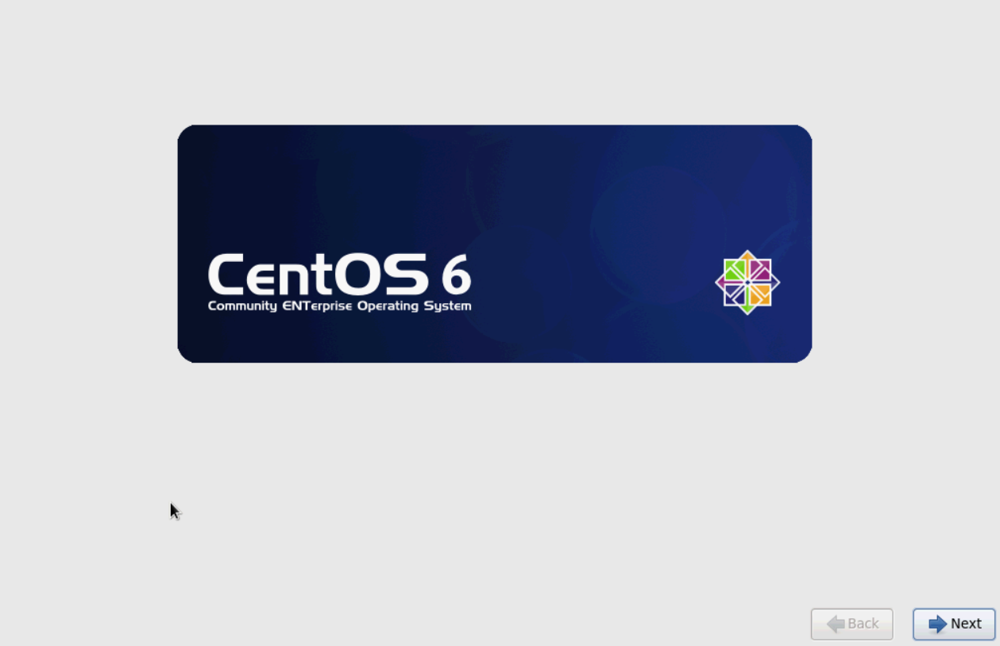

- ```Basic Storage Devices``` -> ```Next```

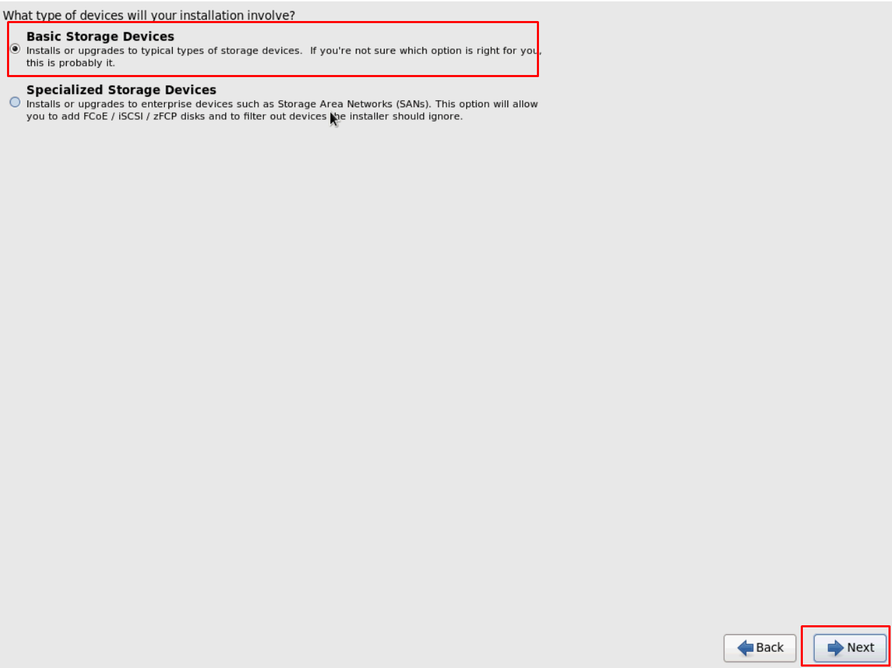

- Đặt hostname -> ```Next```

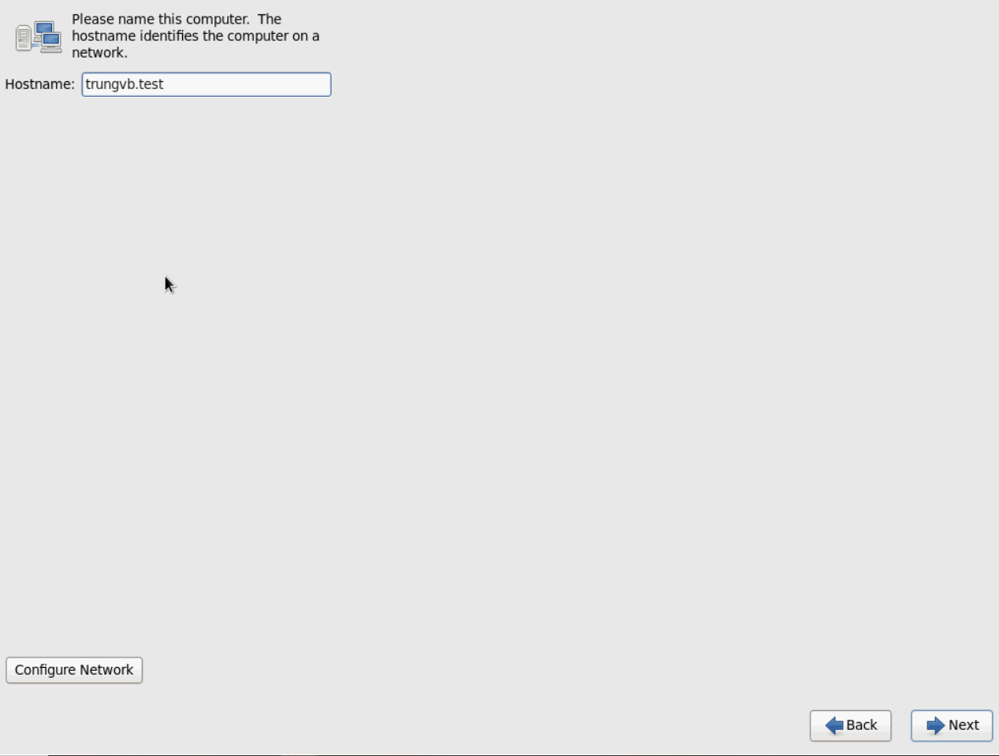

- Thiết lập lại timezone -> ```Next```

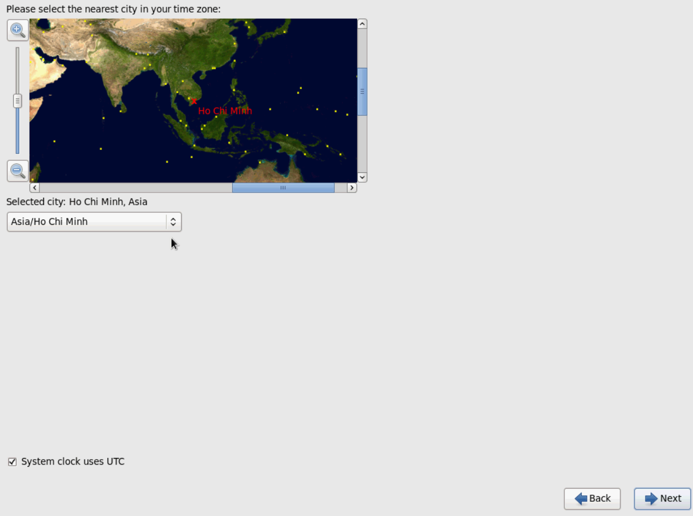

- Đặt mật khẩu cho tài khoản root -> ```Next```

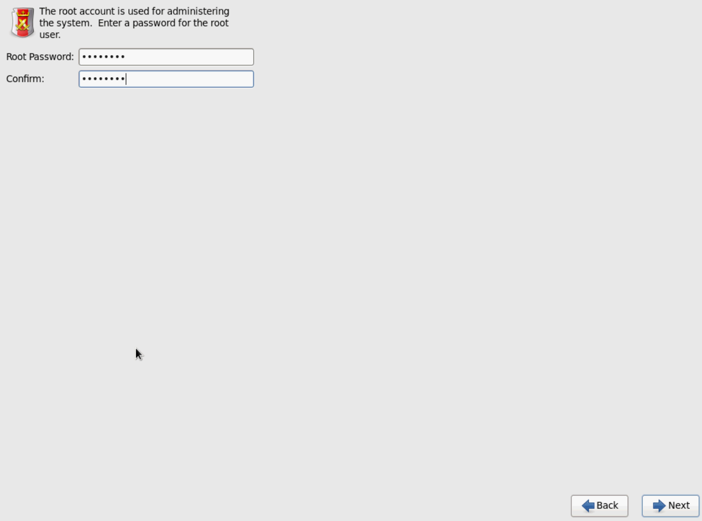

- Chọn ```Create Custom Layout``` -> ```Next```

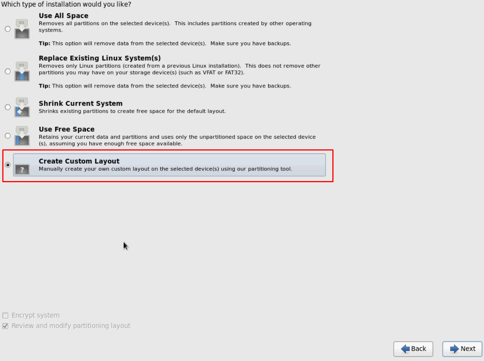

- Tạo các phân vùng

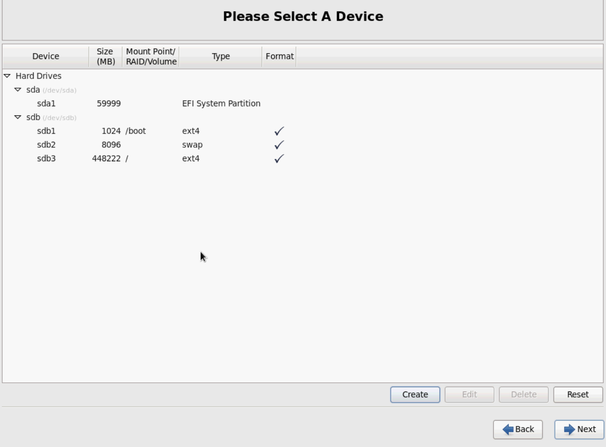

- Nhấn ```Next``` -> ```Write change to disk```

- Chọn ```Install boot loader on /dev/sdb1``` -> ```Next```

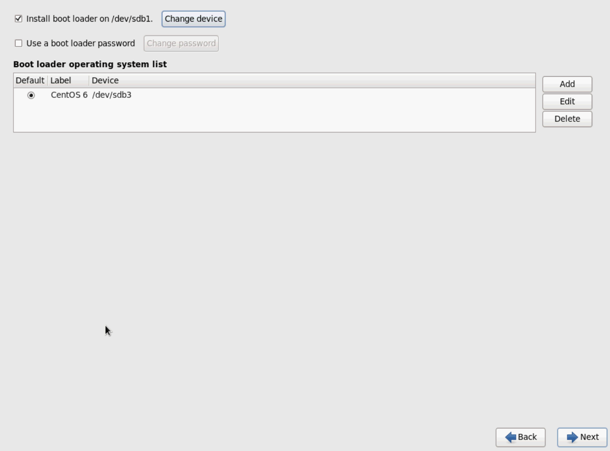

- Chờ hệ thống tiến hành cài đặt

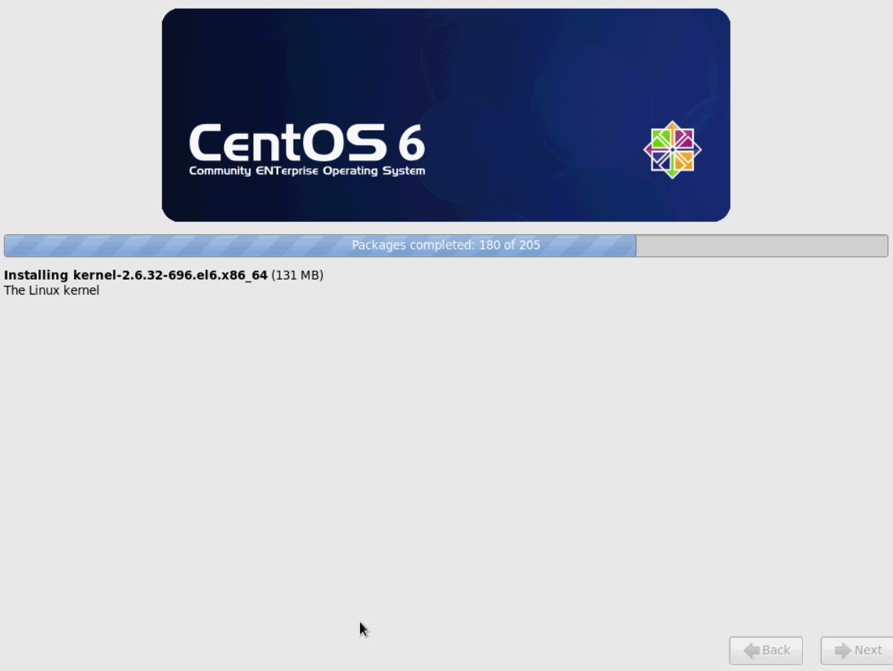

- Reboot để khởi động lại hệ thống là xong


