# Cài đặt CentOS 7 lên server vật lý

- Cài lại RAID

- Boot vào USB chứa file cài CentOS 7

- Chọn ```Install CentOS 7```

- Lựa chọn ngôn ngữ

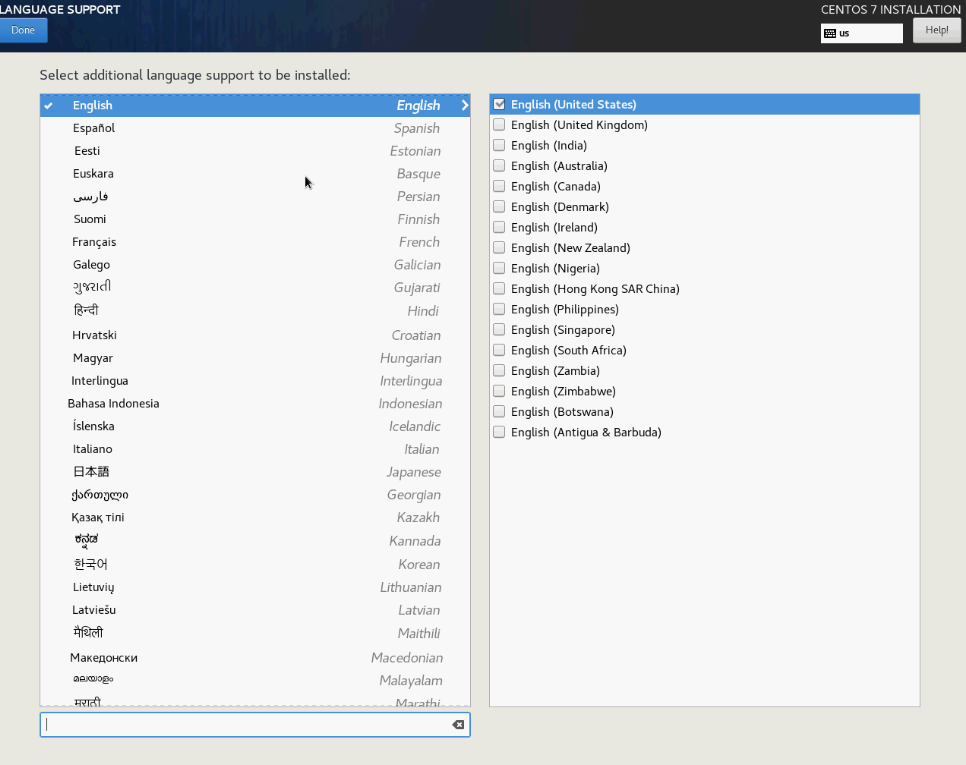

- Thiết lập ngày giờ

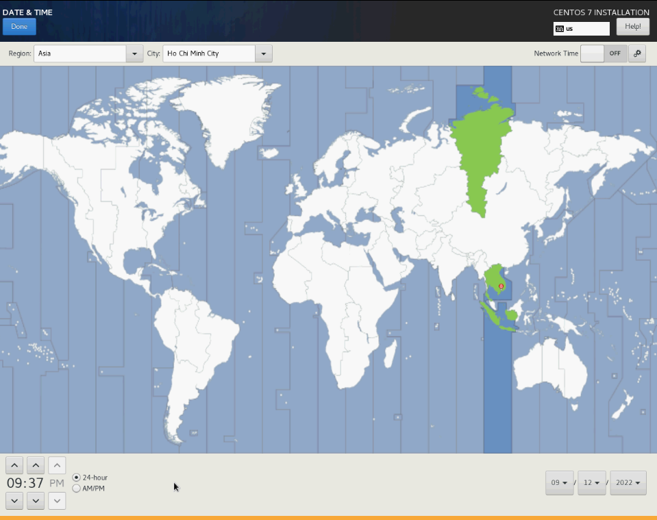

- Phân vùng ổ cứng

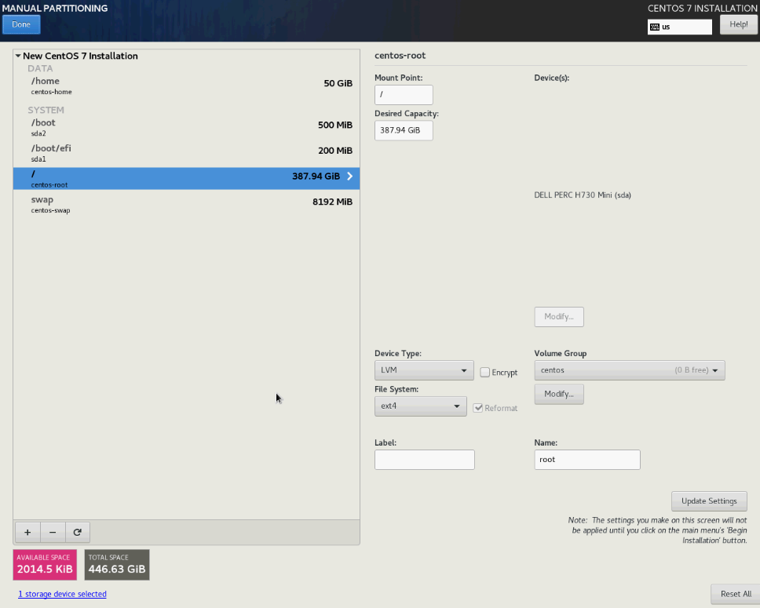

- Hostname + network


- ```Begin Installation```

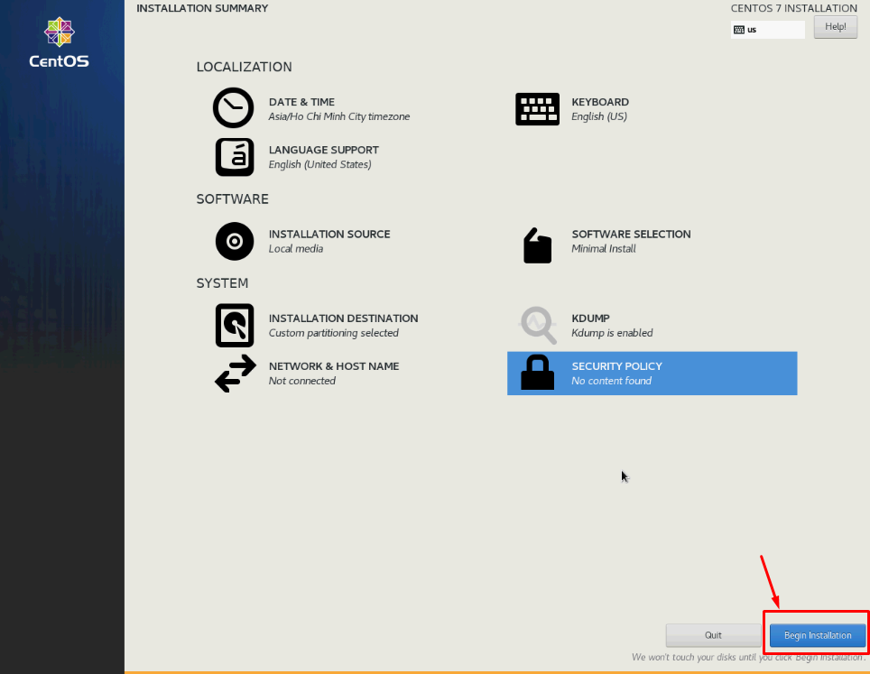

- Đặt mật khẩu cho tài khoản root

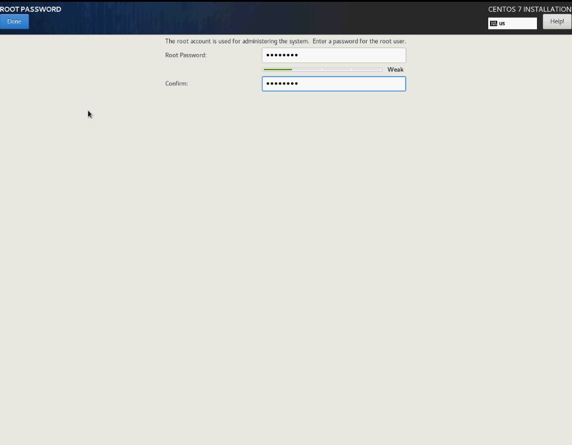

- Wait

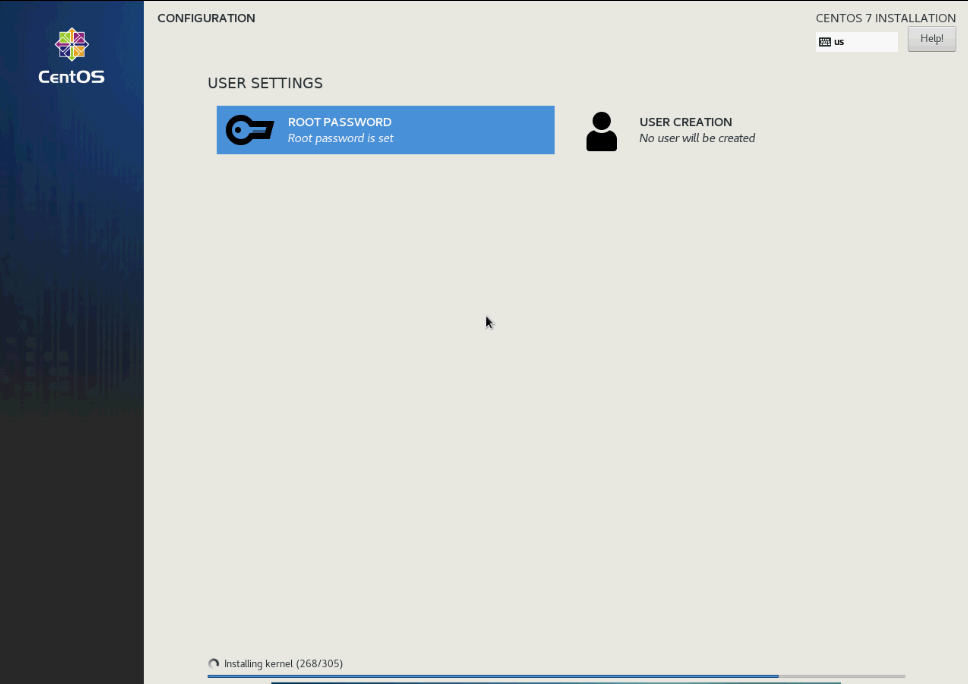

- OK

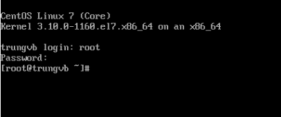

### Đổi mật khẩu root mà không cần ssh vào sv

- Reboot

- Tại giao diện này, nhấn ```e``` trên bàn phím

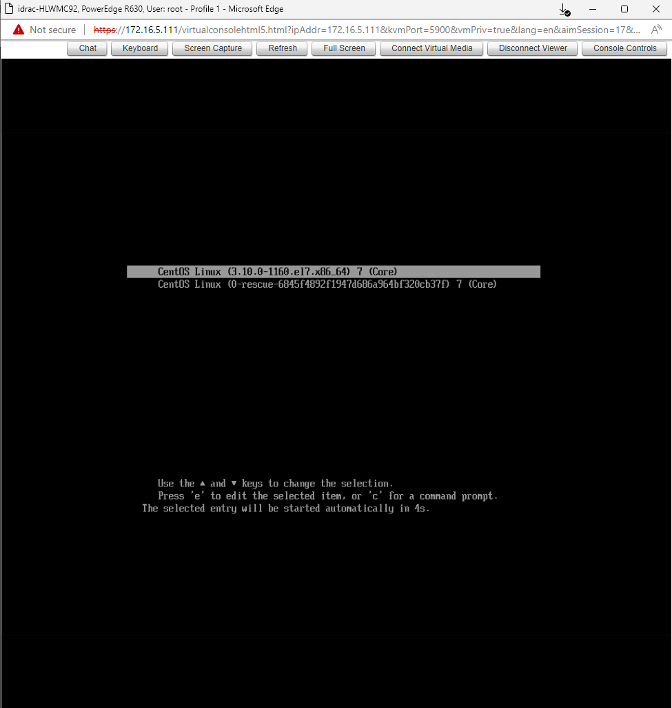

- Tìm dòng có chữ ```/ro``` như sau

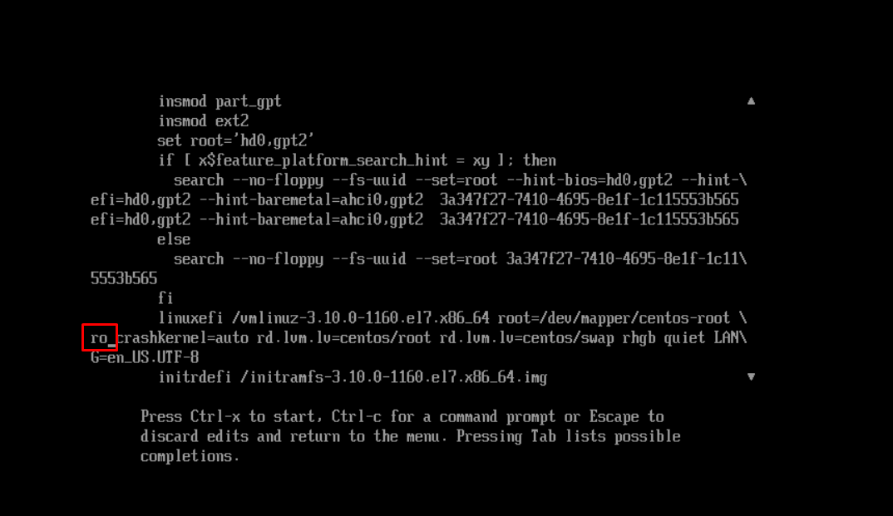

- Thay chữ ```/ro``` thành ```/rw init=/sysroot/bin/bash```


- Sau đó ta nhấn tổ hợp phím ```Ctrl X``` để vào chế độ **1 người dùng**

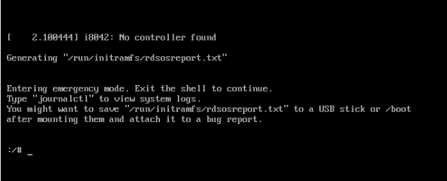

- Truy cập bằng lệnh chroot

```sh
chroot /sysroot
```

- Đổi mật khẩu tài khoản root

```sh
passwd root
```

- Update thông tin selinux

```sh
touch /.autorelabel
```

- Thoát hệ thống và khởi động lại

```sh
exit
reboot
```

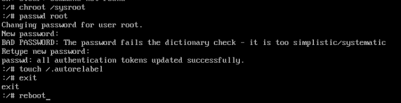

- Đăng nhập vào bằng mật khẩu mới

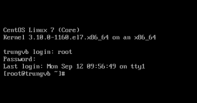