# Cài CentOS 8-stream lên máy chủ vật lý

- Đăng nhập iDRAC vào server, chọn ```Lauch``` để khởi động giao diện console

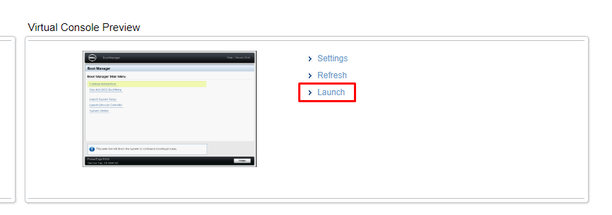

- Trong giao diện Console, chọn ```Virtual Media```

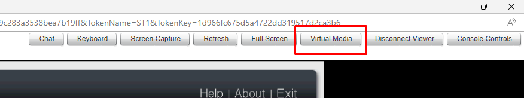

- Chọn file iso cài hđh, sau đó nhấn ```Map Device```

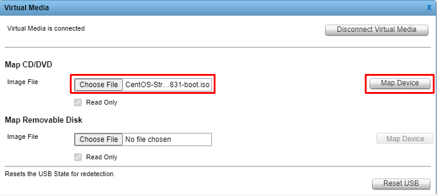

- Sau khi map xong thì tiến hành Reboot server và nhấn ```F11``` để vào **Boot Manager**

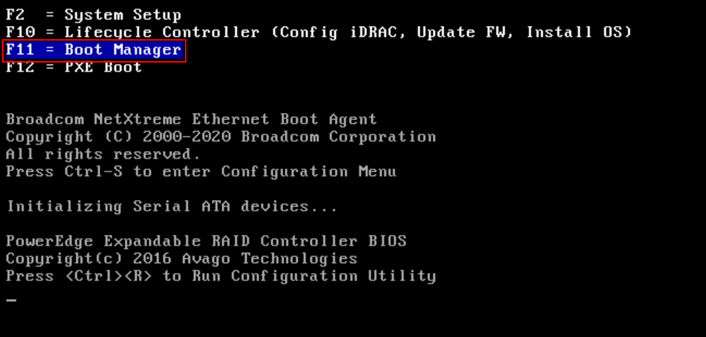

- Chọn ```One-shot BIOS Boot Menu```


- Chọn ```Virtual Optical Drive```

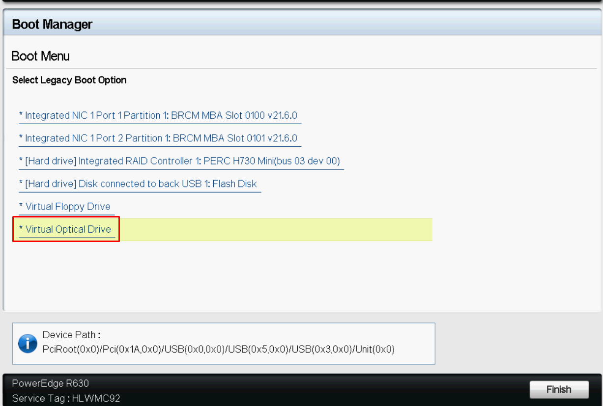

- Chọn ```Install CentOS Stream 8-stream```

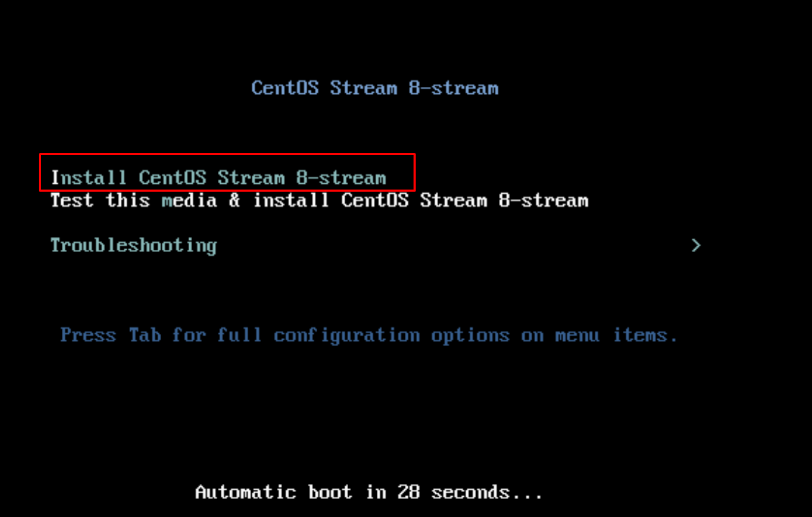

- Chọn ngôn ngữ cho hđh -> ```Continue```

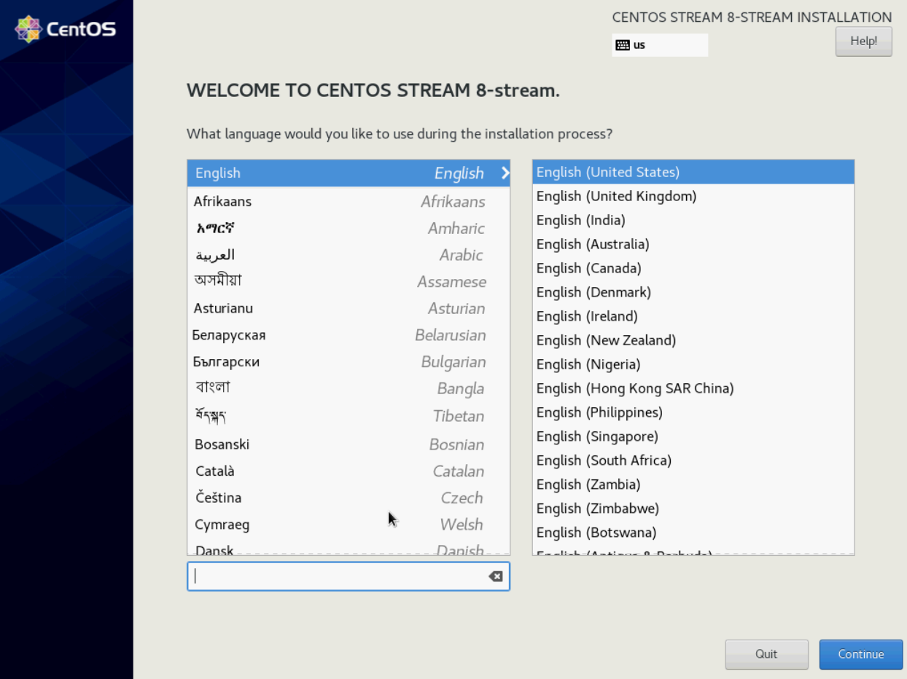

- Chọn ```Installation Destination``` -> ```Custom``` -> ```Done```

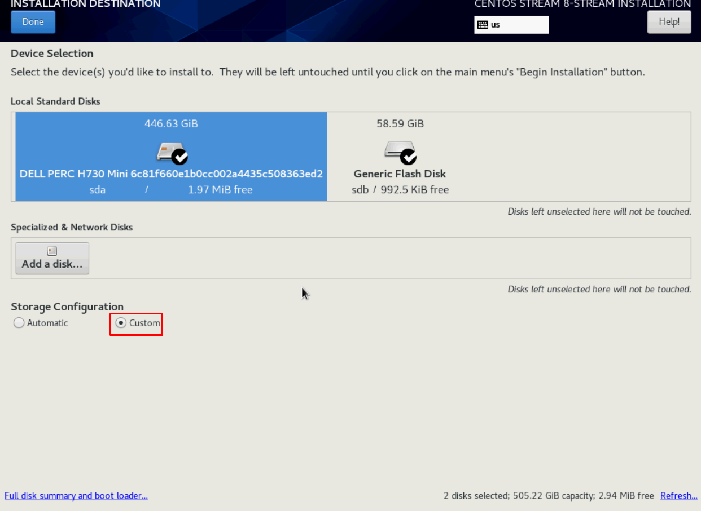

- Phân vùng ổ cứng

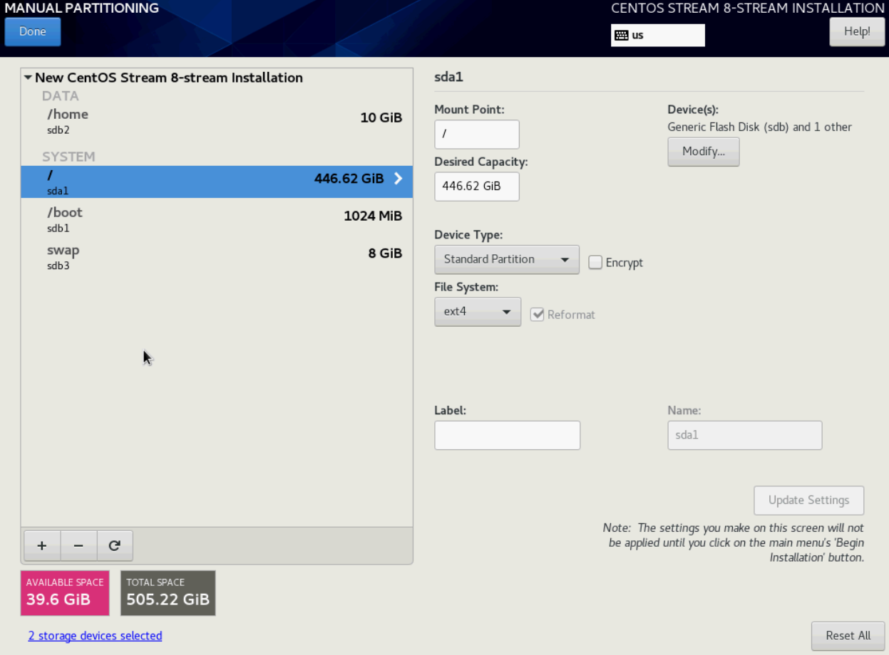

- Đặt lại Root Password

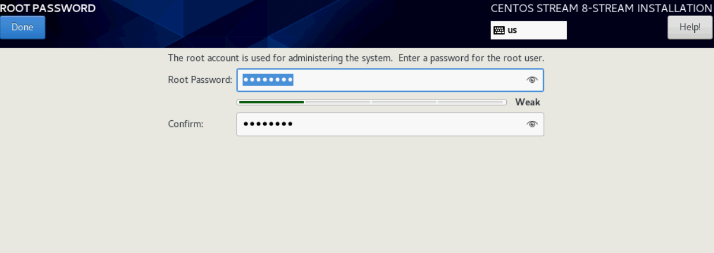

- Thiết lập timezone

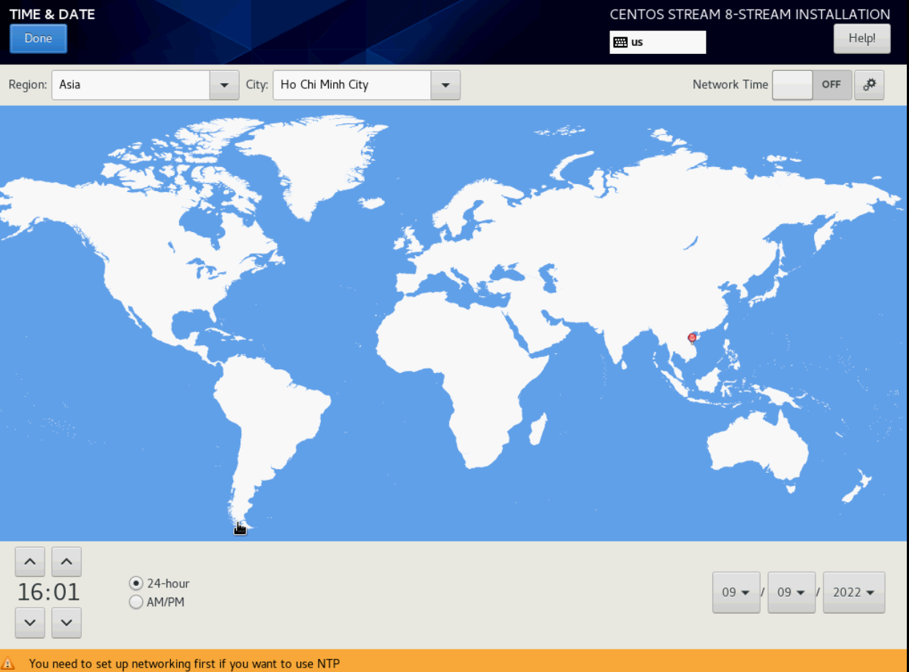

- Sau khi hoàn tất thì chọn ```Begin Installation``` để bắt đầu cài đặt hđh

- Reboot để hoàn tất