# Cài đặt Ubuntu 22.04 live server trên server vật lý

- Reboot lại server

- Nhấn ```F11``` để vào Boot Manager

- Chọn ```One-shot UEFI Boot Menu```

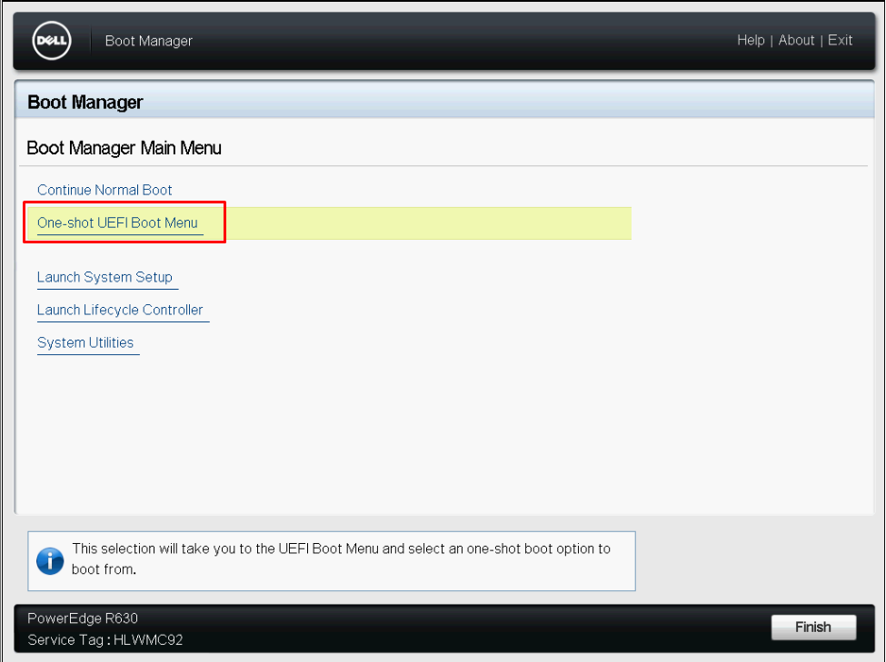

- Chọn boot vào USB chứa file cài OS

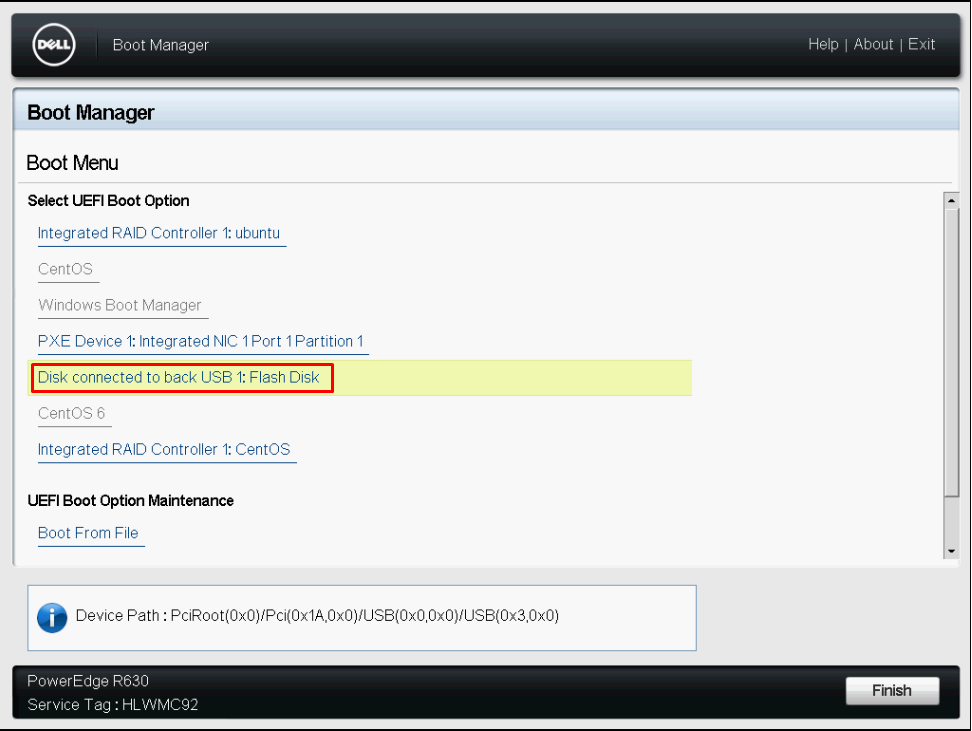

- Chọn ngôn ngữ 

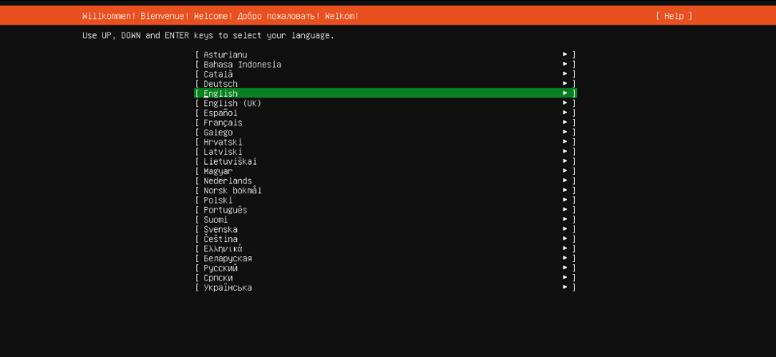

- Chọn loại bàn phím

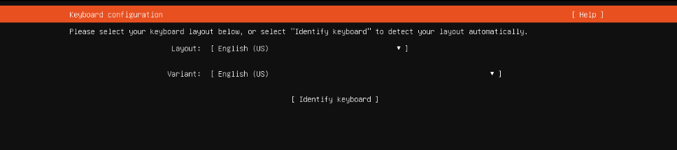

- Chọn loại cài đặt (bản bình thường và bản tối giản)

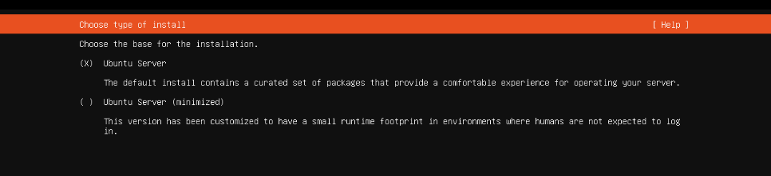

- Thiết lập IP cho máy chủ, chọn ```Done``` để thiết lập mặc định DHCP, hoặc ```Edit``` để đặt IP tĩnh

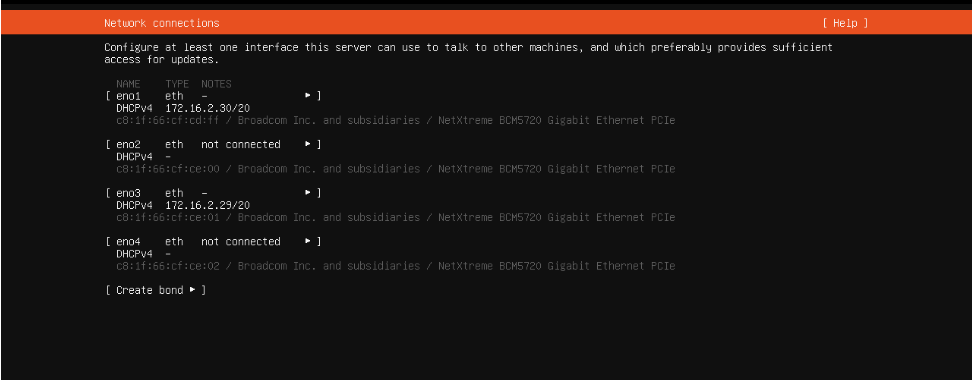

- Thiết lập proxy, chọn ```Done``` để thiết lập proxy theo mặc định

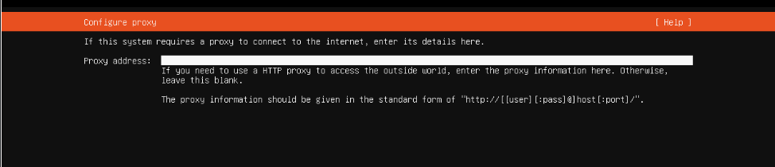

- Cài đặt địa chỉ mirror cho ubuntu. Nhấn ```Done``` để thiết lập mặc định

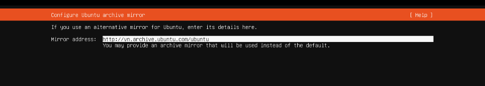

- Phân vùng ổ cứng, chọn ```Done``` để không chia, chỉ sử dụng 1 phân vùng

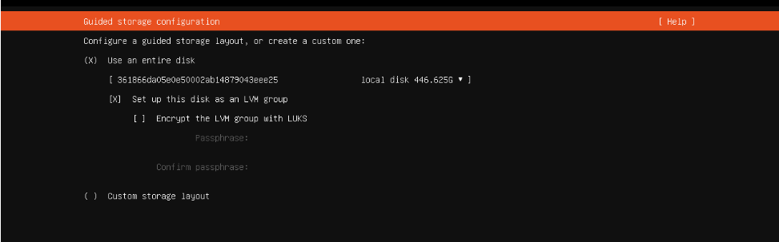

- Thiết lập phân vùng, chọn ```Done``` để tiếp tục

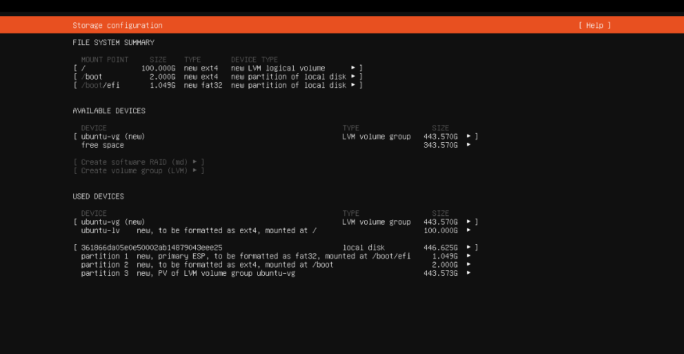

- Điền các thông tin liên quan đến tên và tạo 1 user

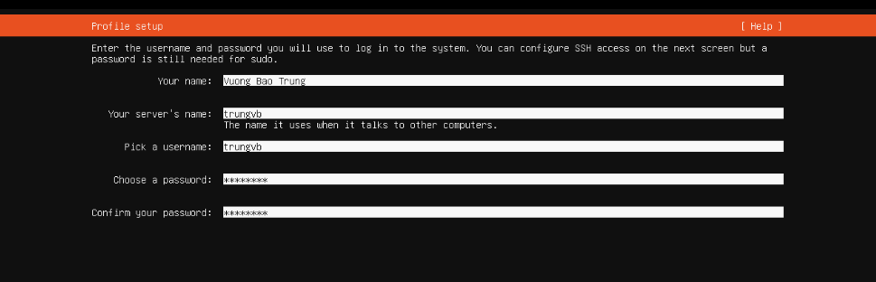

- Chọn có cài đặt dịch vụ SSH cho server hay không. Nếu có thì lựa chọn sử dụng SSH key hay không rồi chọn ```Done``` để tiếp tục

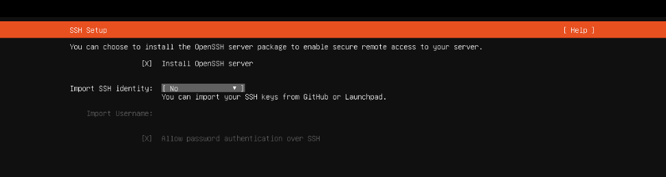

- Lựa chọn cài đặt thêm các gói tính năng phổ biến, ```Done``` để tiếp tục

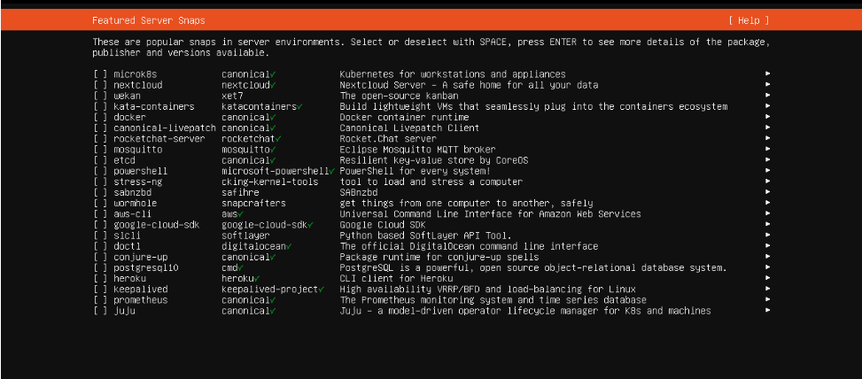

- Wait

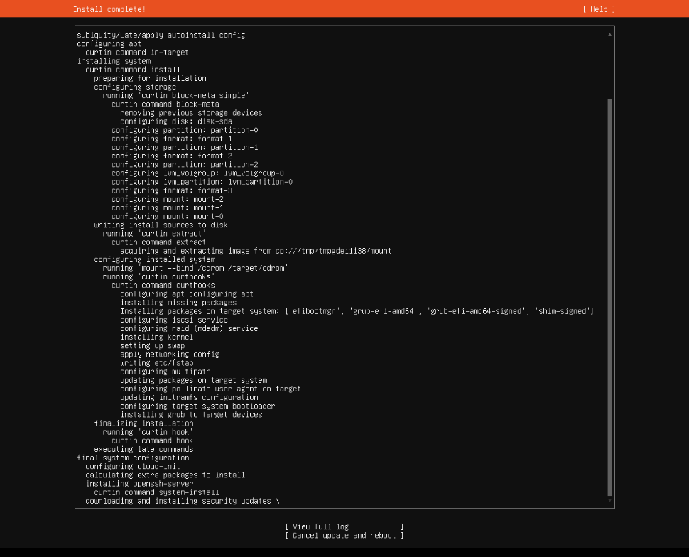

- Sau khi hoàn thành thì chọn ```Reboot Now``` để hoàn thành cài đặt

- Đăng nhập bằng tài khoản vừa tạo

