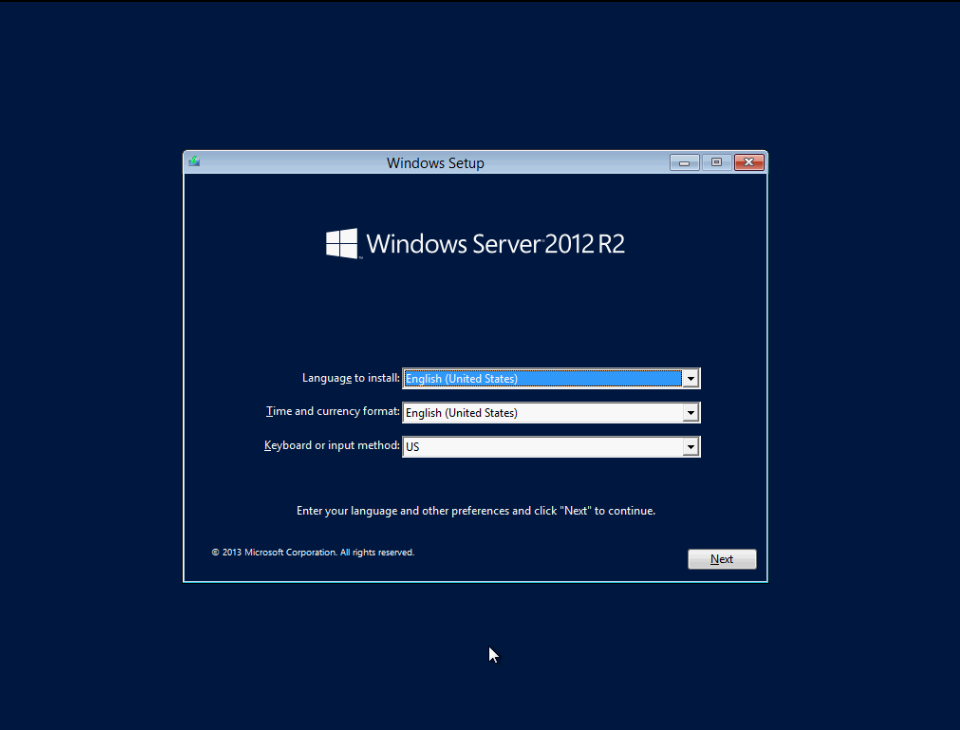
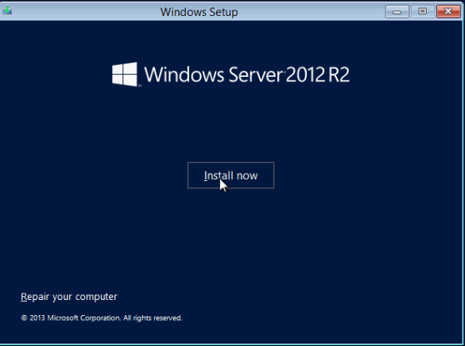
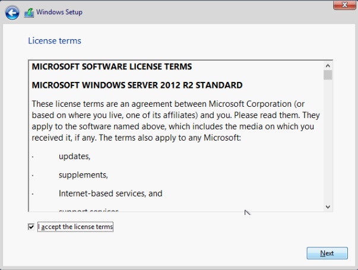
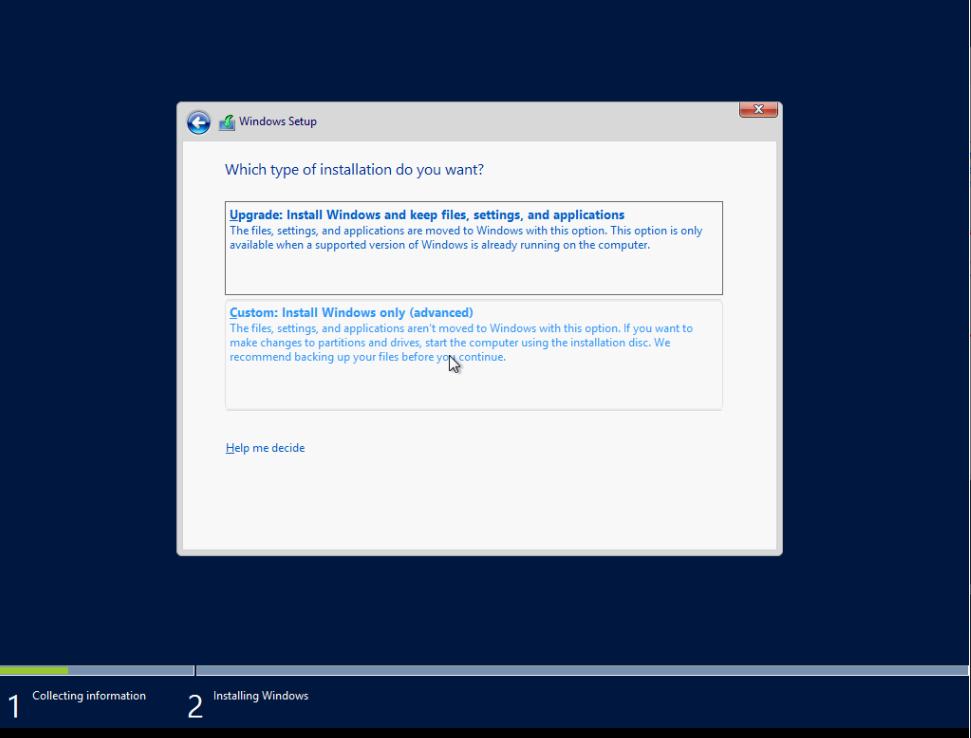
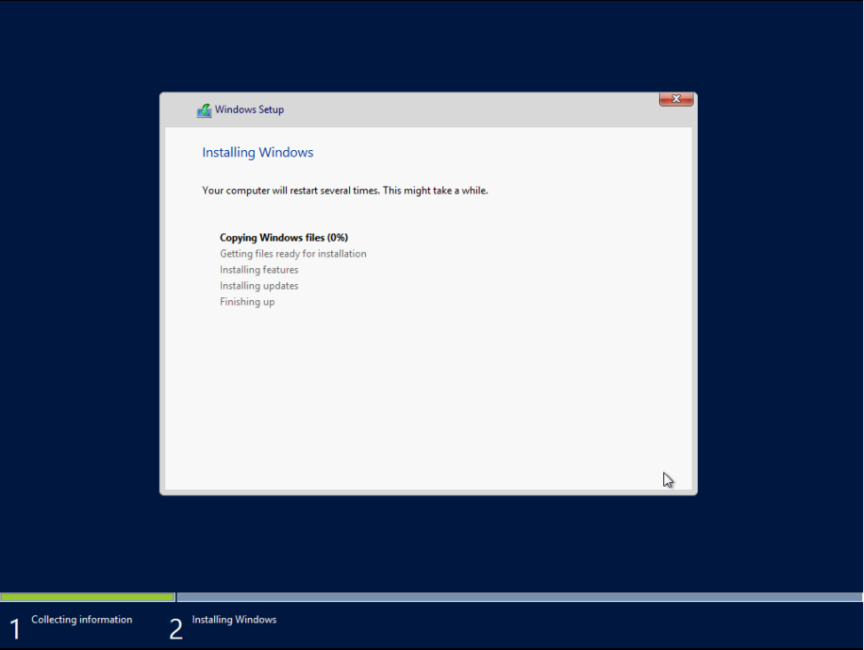
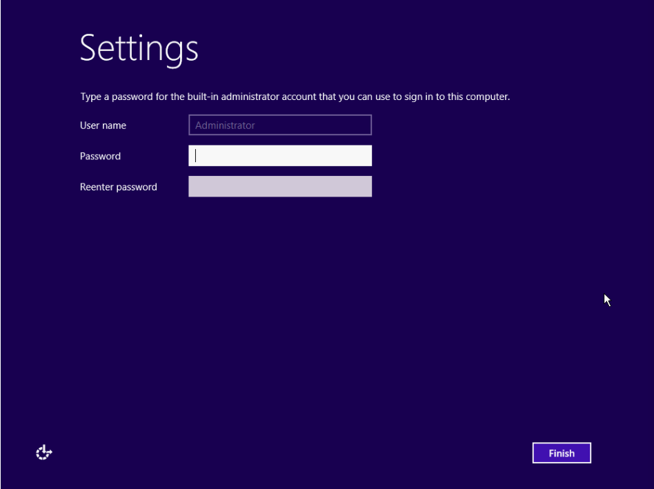

# Cài đặt Windows Server 2012 trên server vật lý

- Reboot server

- Boot vào USB chứa file cài OS

- Thiết lập ngôn ngữ, định dạng thời gian, loại bàn phím



- ```Install now```



- Chọn phiên bản muốn cài đặt


- Đồng ý điều khoản dịch vụ



- Chọn ```Custom: Install Windows only (advanced)```



- Chia ổ


- Chờ đợi~



- Đặt mật khẩu cho tài khoản Administrator



- Done

