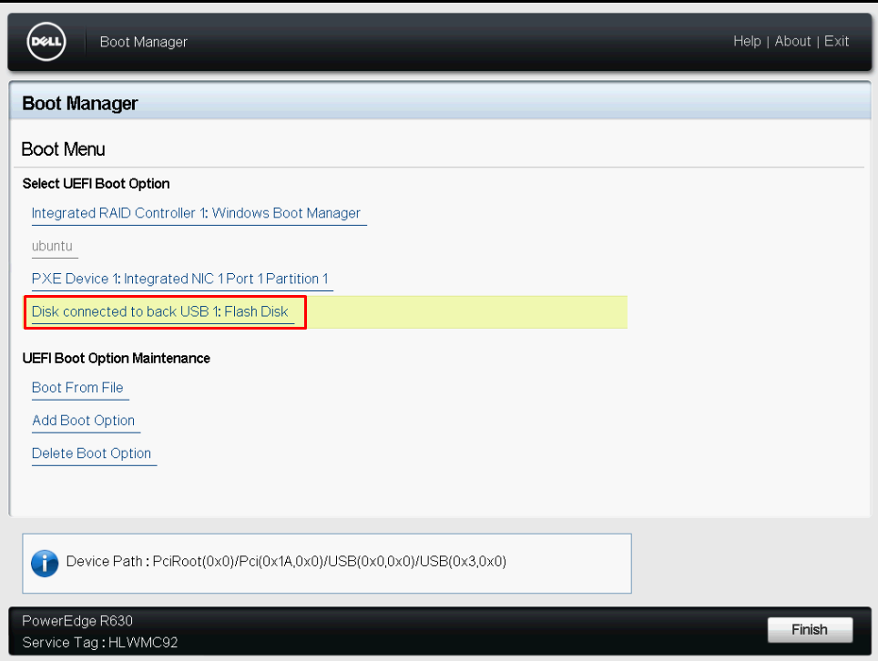
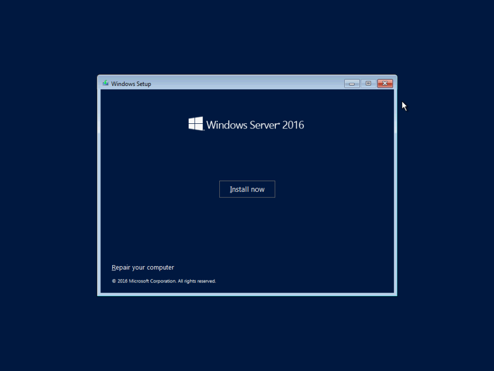
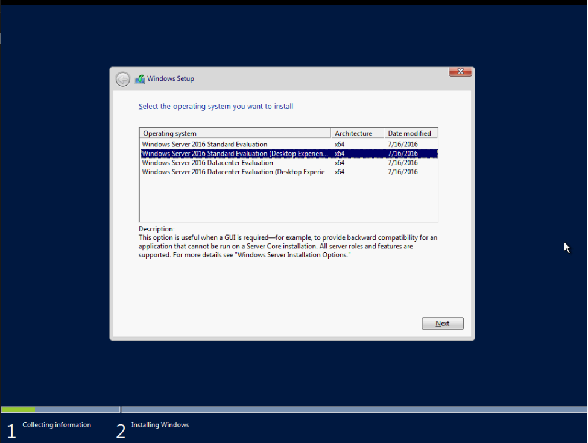
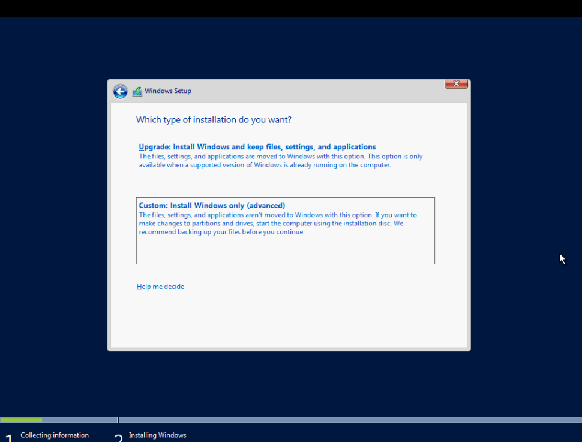
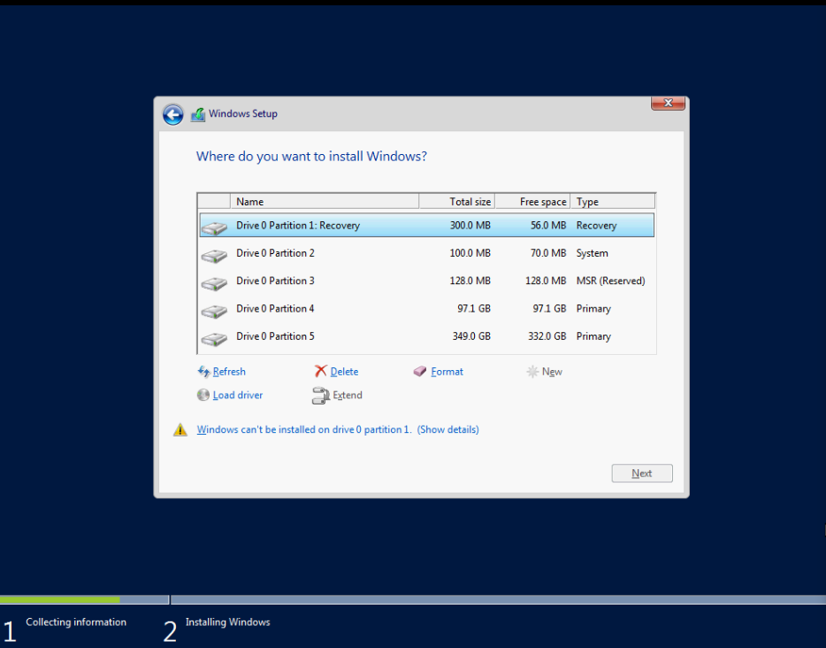
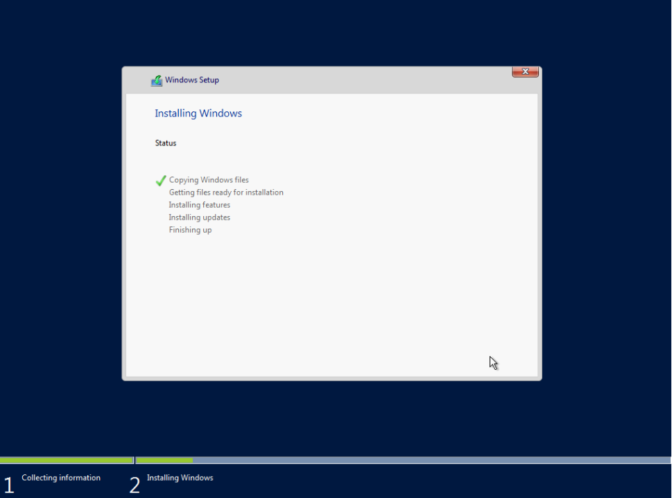
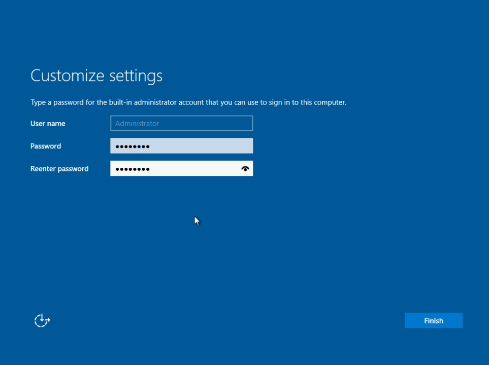
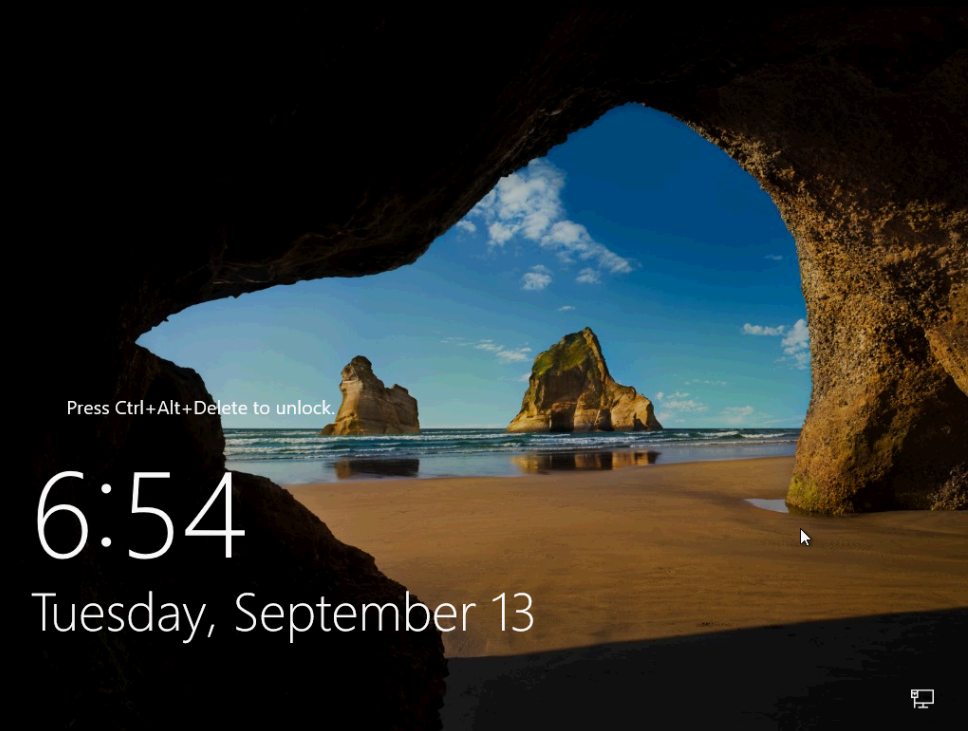
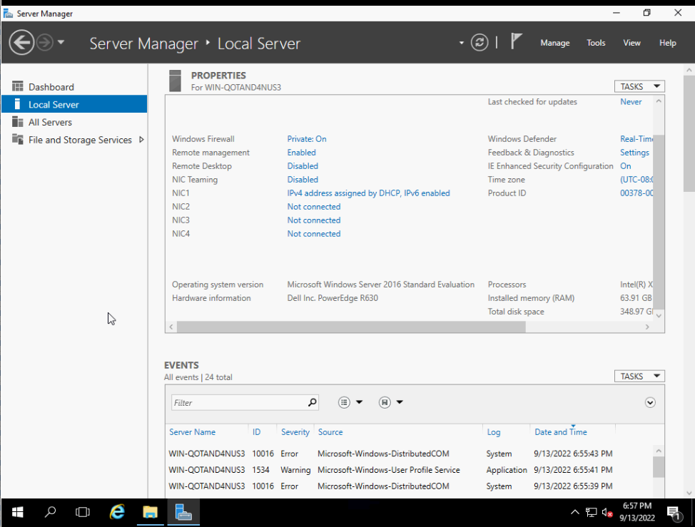

# Cài đặt Windows Server 2016 lên server vật lý

- Reboot lại sv

- Boot vào USB chứa file cài OS



- ```Install now```



- Chọn phiên bản cài đặt



- Chấp nhận điều khoản dịch vụ


- Chọn loại cài đặt, ở đây ta chọn ```Custom: Install Windows only (advanced)



- Chia ổ



- Chờ đợi



- Đặt mật khẩu cho tài khoản Administrator



- ```Ctrl Alt Delete``` để login



- Done

