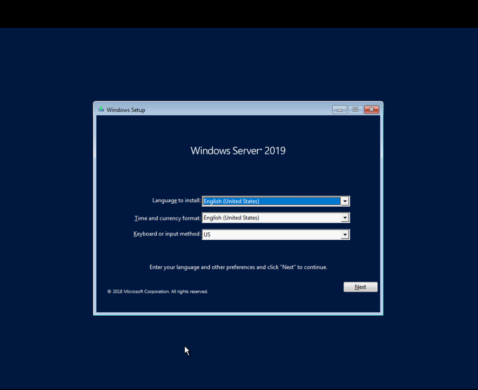
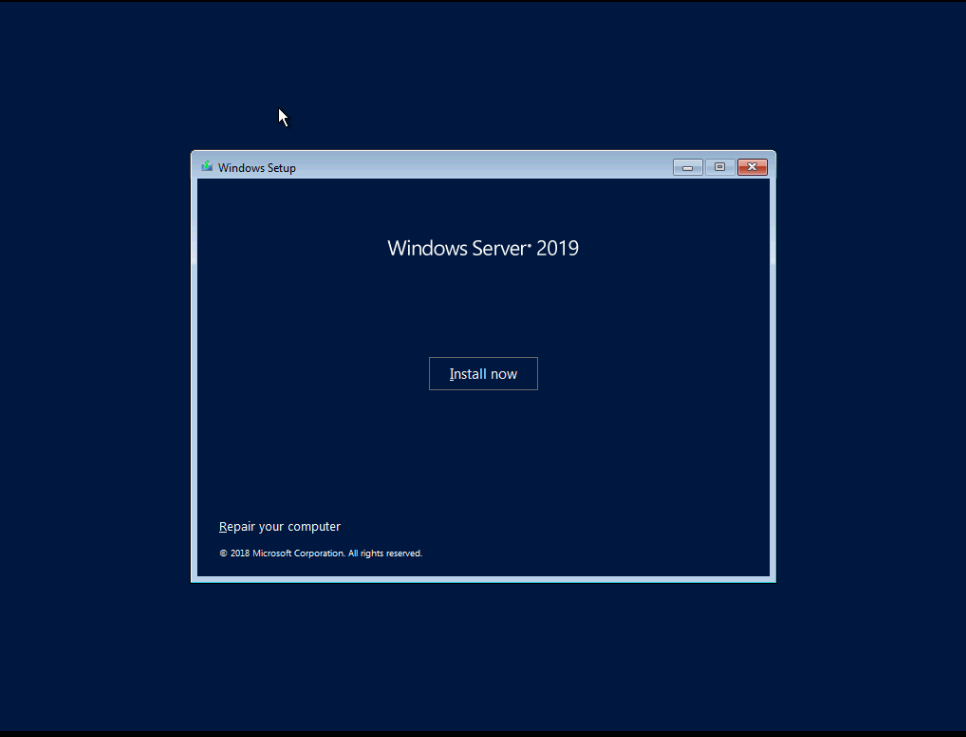
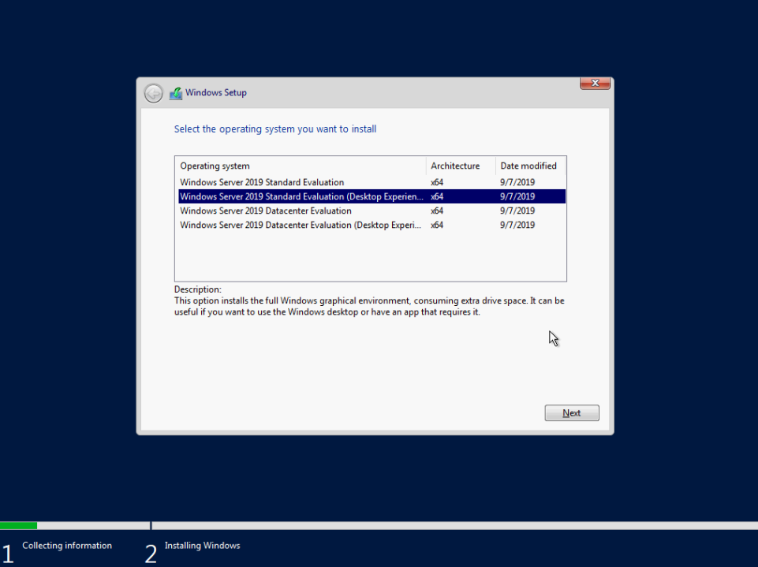
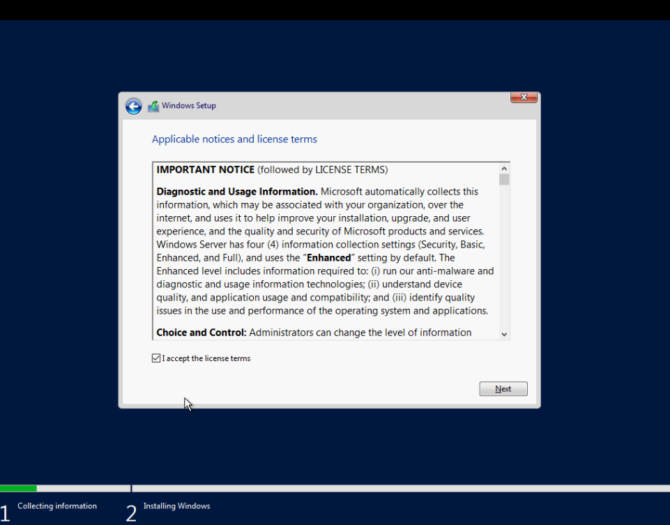
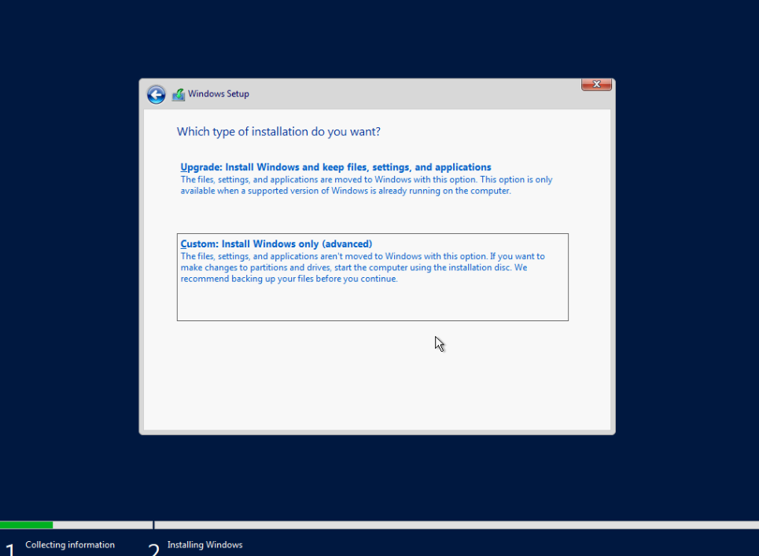
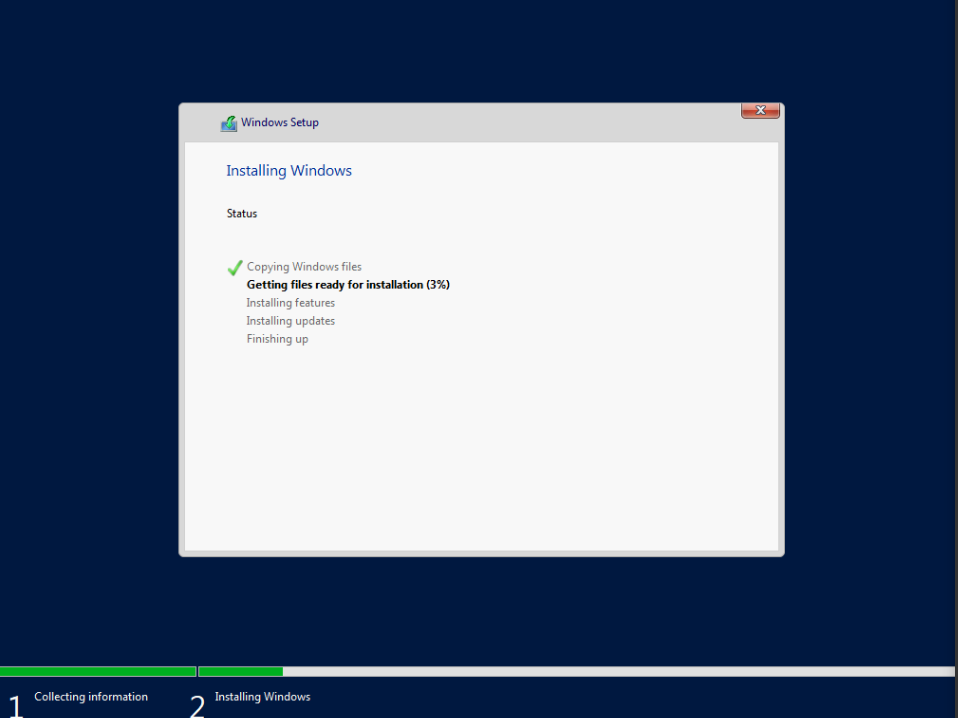
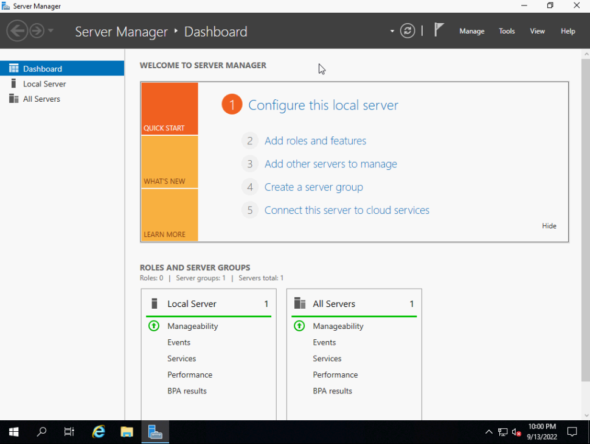

# Cài đặt Windows Server 2019 lên server vật lý

- Reboot lại sv

- Boot vào USB chứa file cài OS

- Chọn ngôn ngữ



- ```Install now```



- Chọn phiên bản cài đặt



- Chấp nhận điều khoản dịch vụ



- Chọn ```Custom: Install Windows only (advanced)```



- Chia ổ như bản 2016

- Chờ đợi



- Done

