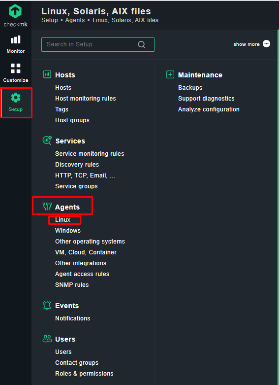
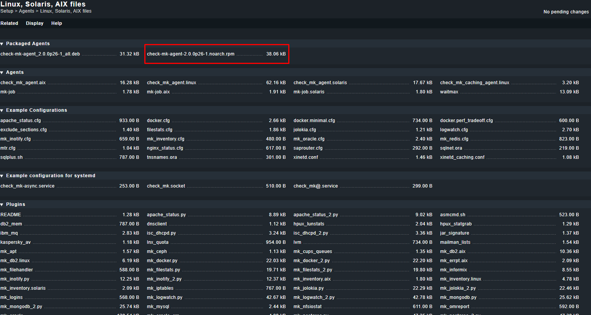
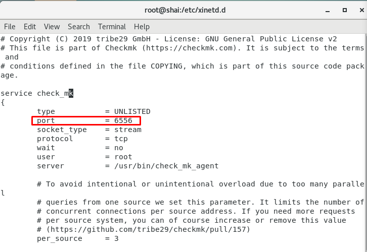
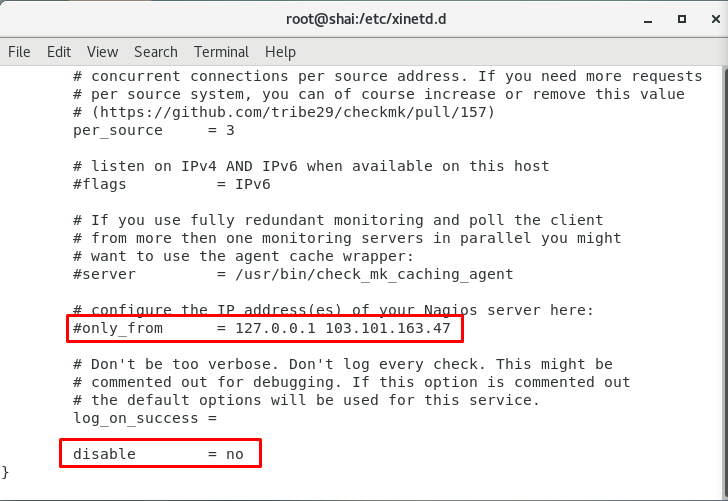
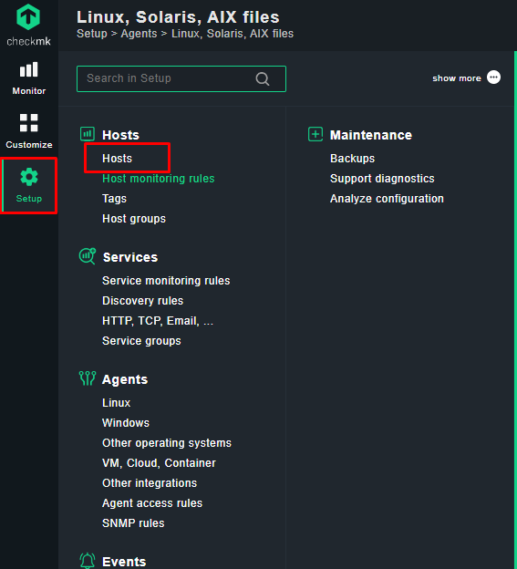
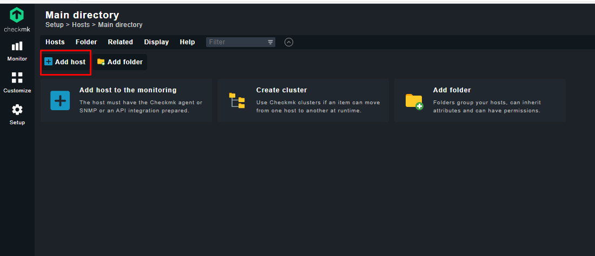
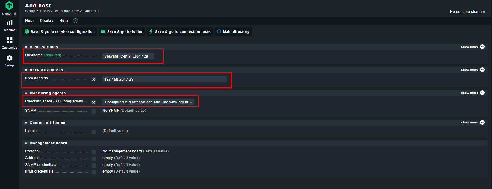
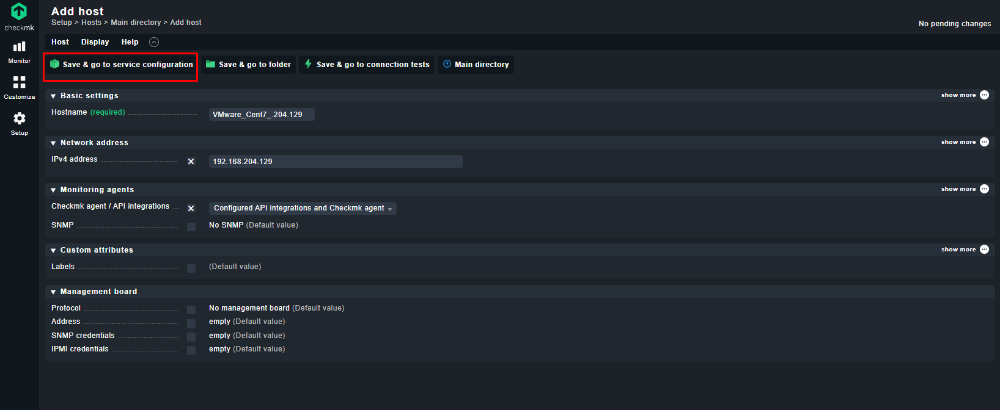
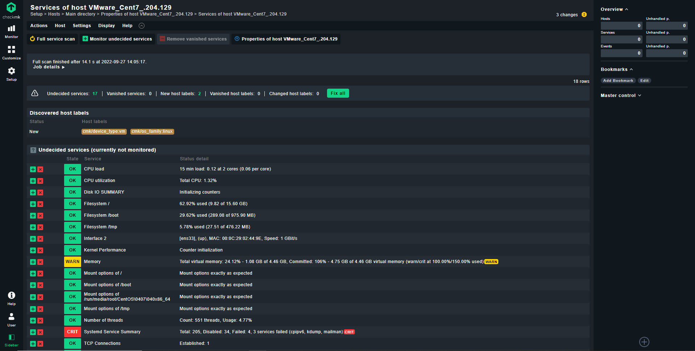
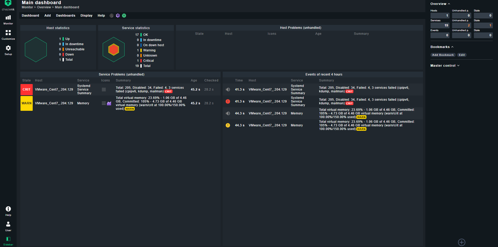

# Cài đặt Agent Check MK trên máy host

- Chuẩn bị:
    - Host: máy chủ client để đẩy metrics về checkmk
    - Server: máy chủ đã được cài đặt checkmk

- Lấy link để cài đặt Agent trên checkmk host: Web GUI -> Setup -> Agents -> Linux



- Có 3 package dành cho 3 distro:
    - *.deb: dành cho các host sử dụng DEBIAN
    - *.rpm: dành cho các host sử dụng RHEL
    - *.msi: dành cho các host sử dụng MS Windows

- Copy lại link **.rpm**



- Cài đặt Agent trên máy host

```sh
wget http://baotrung.xyz/baotrung/check_mk/agents/check-mk-agent-2.0.0p26-1.noarch.rpm
```

- Cài đặt ```xinet.d```

```sh
yum install -y xinetd
```

- Khởi động dịch vụ và cho chạy cùng hệ thống

```sh
systemctl start xinetd
systemctl enable xinetd
```

- Cài đặt Agent bằng lệnh

```sh
rpm -ivh check-mk-agent-*
```

- Sửa file cấu hình ```xinetd``` của checkmk tại ```/etc/xinetd.d/check_mk```





- Có 3 thông số đáng chú ý:
    - ```port = 6556```: cổng để server truy cập vào host
    - ```only_from```: địa chỉ IP server check mk
    - ```disable = no```: bật/tắt dịch vụ

- Khởi động lại xinetd

```sh
systemctl restart xinetd
```

- Kiểm tra port 6556 đã mở chưa, nếu chưa thì mở port

```sh
netstat -nltp | grep 6556
firewall-cmd --add-port=6556 --permanent --zone=public
firewall-cmd --reload
```

- Thêm host trên Web GUI của checkmk server: ```Setup``` -> ```Hosts```



- ```Add host```



- Nhập thông tin về host và chọn các cấu hình phù hợp



- ```Save & go to service configuration```





