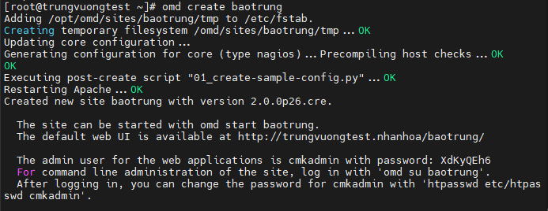
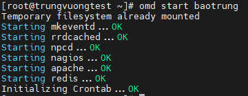
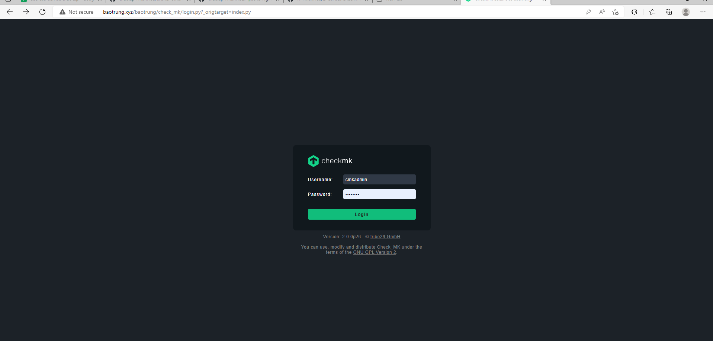
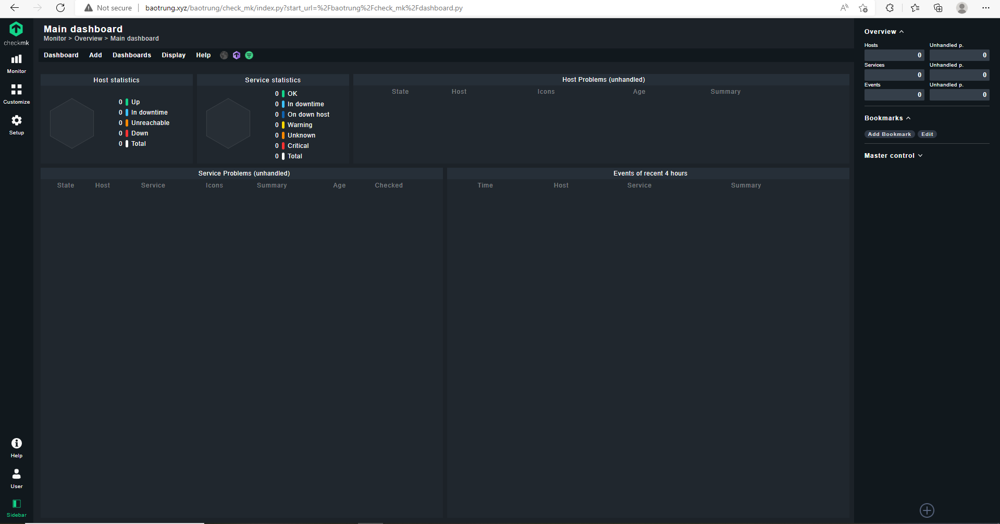

# Cài đặt OMD - Check MK trên CentOS 7

- Cập nhật hệ thống và cài đặt các gói cần thiết

```sh
yum update -y
yum install epel-release wget -y
```

- Tải file cài đặt OMD - Check MK

```sh
wget https://download.checkmk.com/checkmk/2.0.0p26/check-mk-raw-2.0.0p26-el7-38.x86_64.rpm
```

- Cài đặt OMD - Check MK

```sh
yum install -y check-mk-raw-2.0.*
```

- Tạo và khởi động site trên OMD

```sh
omd create baotrung
```



- Thông tin site được cung cấp sau khi tạo thành công

- Khởi động site

```sh
omd start baotrung
```



- Mở port 80 trên firewall

- Tắt SELinux

```sh
setenforce 0
```

- Chỉnh sửa file cấu hình của SELinux

```sh
vi /etc/sysconfig/selinux
```

- Sửa dòng ```SELINUX=enforcing``` thành ```SELINUX=disabled```

- Dùng trình duyệt web truy cập địa chỉ http://domain/baotrung và đăng nhập với tài khoản mật khẩu được cung cấp sau khi chạy lệnh ```omd create baotrung``` bên trên



