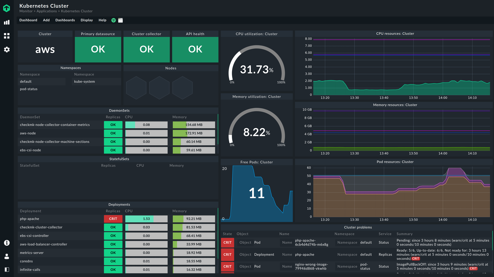
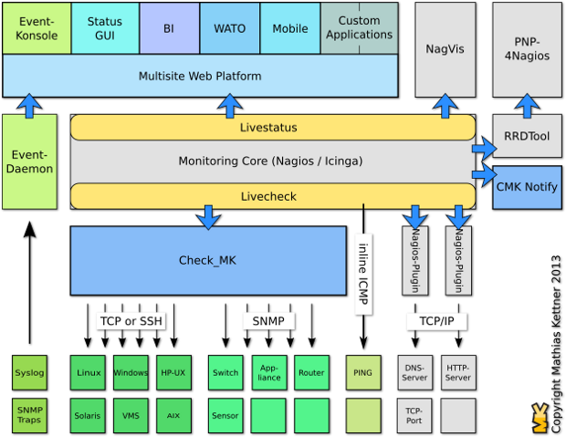

# OMD - CheckMK

## OMD - CheckMK là gì?

- OMD - Open Monitoring Distribution là 1 dự án được phát triển từ năm 2010 bởi Mathias Kettner. OMD sử dụng nhân là Nagios Core, kết hợp với các phần mềm mã nguồn mở khác để đóng gói thành 1 sản phẩm phục vụ nhu cầu giám sát, cảnh báo và hiển thị
- Dự án Check MK được phát triển từ năm 2008 như là 1 plugin của Nagios Core
- Năm 2010 dự án OMD (Open Monitoring Distribution) được khởi động bởi Mathias Kettner, là sự kết hợp của Nagios, Check MK, NagVis, PNP4Nagios, DocuWiki,... tạo nên sự linh hoạt trong giám sát. Các distro của OMD là OMD-LABS và CHECK_MK RAW
- Check MK là 1 phần của OMD, hiện tại đang có 2 phiên bản Check MK là Check MK Raw Edition (CRE) và Check MK Enterprise Edition (CEE)

## Ưu điểm trong thiết kế kiến trúc của OMD

- OMD được xây dựng từ những đóng góp của cộng đồng về những khó khăn hay khuyết điểm mà Nagios gặp phải, từ đó đưa ra quyết định cần tích hợp thêm những sản phẩm gì để cải thiện
- Việc cài đặt trở nên vô cùng đơn giản. OMD được đóng gói hoàn chỉnh trong 1 package, việc cài đặt và cấu hình chỉ mất khoảng 10 phút với chỉ 1 câu lệnh

- Check MK ra đời để giải quyết bài toán về hiệu năng mà Nagios gặp phải trong quá khứ. Cơ chế mới của Check MK cho phép việc mở rộng hệ thống trở nên dễ dàng hơn, có thể giám sát nhiều hệ thống chỉ từ 1 máy chủ Nagios server
- Có 2 module mà Check MK sử dụng để cải thiện đáng kể hiệu năng là Livestatus và Livecheck
- Livestatus có những thay đổi để cải thiện hiệu năng đó làL
    - Livestatus cũng sử dụng Nagios Event Broker API như NDO, nhưng nó sẽ không chủ động ghi dữ liệu ra. Thay vào đó, nó sẽ mở ra 1 socket để dữ liệu có thể được lấy ra theo yêu cầu
    - Livestatus tiêu tốn ít CPU
    - Livestatus không làm cho Disk I/O thay đổi khi truy vấn trạng thái dữ liệu
    - Không cần cấu hình. Không cần cơ sở dữ liệu. Không cần quản lý
- Cách thức hoạt động của Livecheck:
    - Livecheck sử dụng các helper process, các core giao tiếp với helper thông qua Unit socket (điều này không xảy ra trên file system)
    - Chỉ có 1 helper program được fork thay vì toàn bộ Nagios Core
    - Các tiến trình fork được phân tán trên tất cả các CPU thay vì chỉ 1 như trước
    - Process VM size tổng chỉ khoảng 100KB