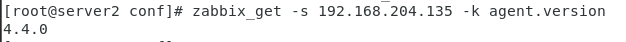
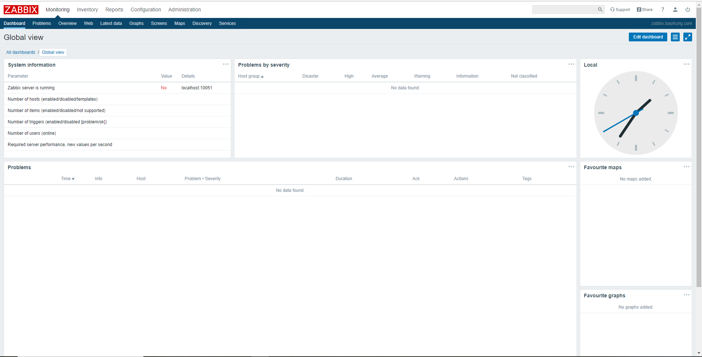
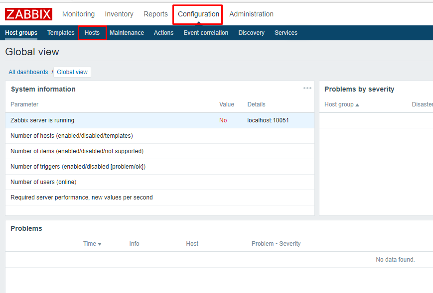
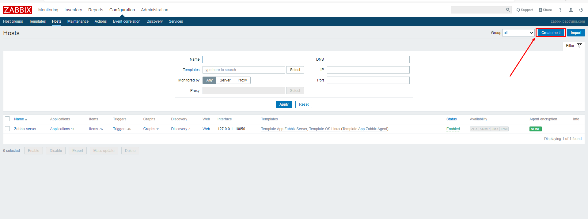
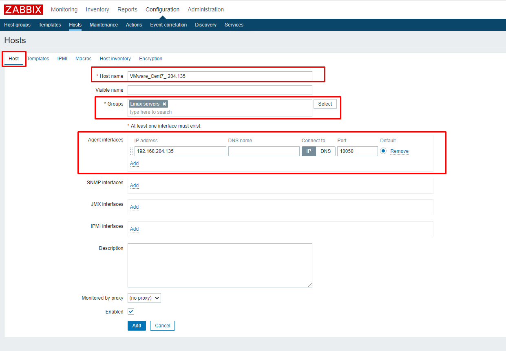
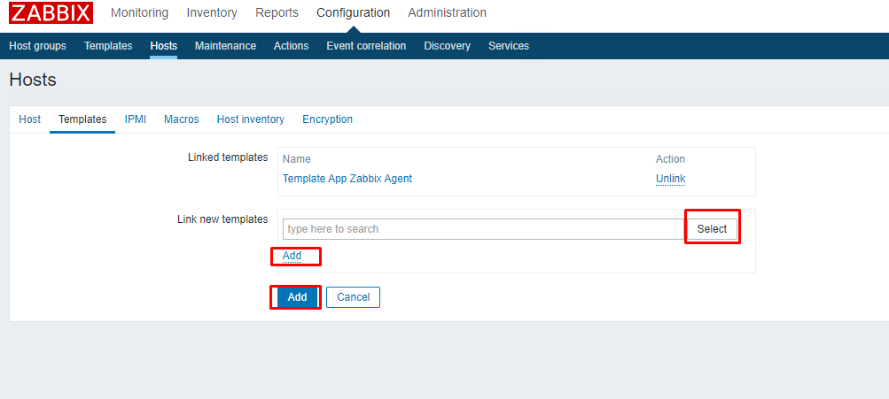
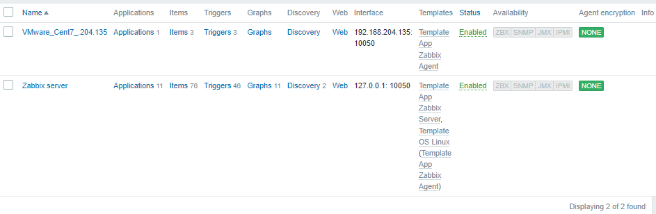

# Cài đặt Zabbix Agent trên Server CentOS 7

- Tải về Zabbix-Agent

```sh
rpm -Uvh https://repo.zabbix.com/zabbix/4.4/rhel/7/x86_64/zabbix-agent-4.4.0-1.el7.x86_64.rpm
```

- Cài đặt Zabbix-Agent

```sh
yum install zabbix-agent -y
```

- Cấu hình Zabbix-Agent

```sh
vi /etc/zabbix/zabbix_agentd.conf
# sửa các thông số sau
Server=<IP_ZABBIX_SERVER>
ServerActive=<IP_ZABBIX_SERVER>
Hostname=<ZABBIX_SERVER_HOSTNAME>
```

- Cấu hình firewall mở port 10050

```sh
firewall-cmd --zone=public --permanent --add-port=10050/tcp
firewall-cmd --reload
```

- Khởi động lại dịch vụ

```sh
systemctl enable zabbix-agent
systemctl restart zabbix-agent
```

- Kiểm tra hoạt động của Zabbix Agent

```sh
zabbix_get -s <ZABBIX_AGENT_IP> -k agent.version
```



- Đăng nhập vào dashboard Zabbix Server



- ```Configuration``` -> ```Host```



- ```Create host```



- Trong tab ```Host``` ta sửa những thông tin sau



- ```Select``` chọn **Template App Zabbix Agent** -> ```Add``` -> ```Add```



- Host added

