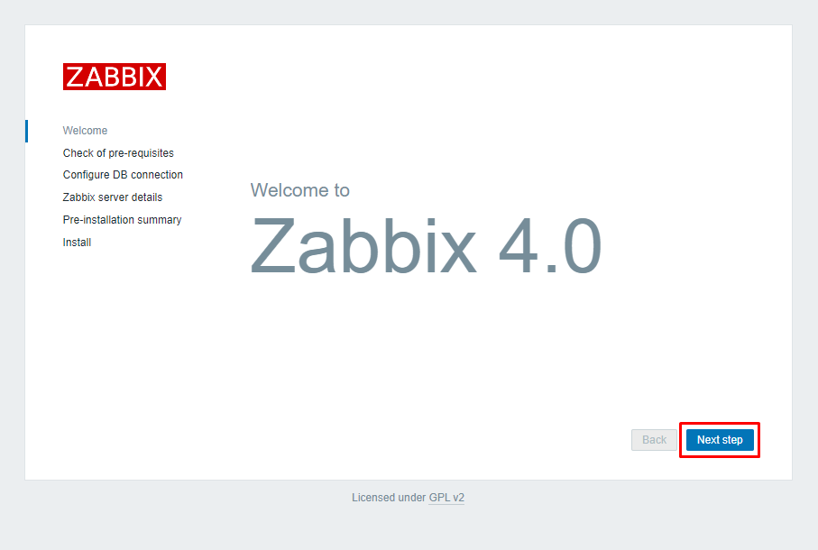
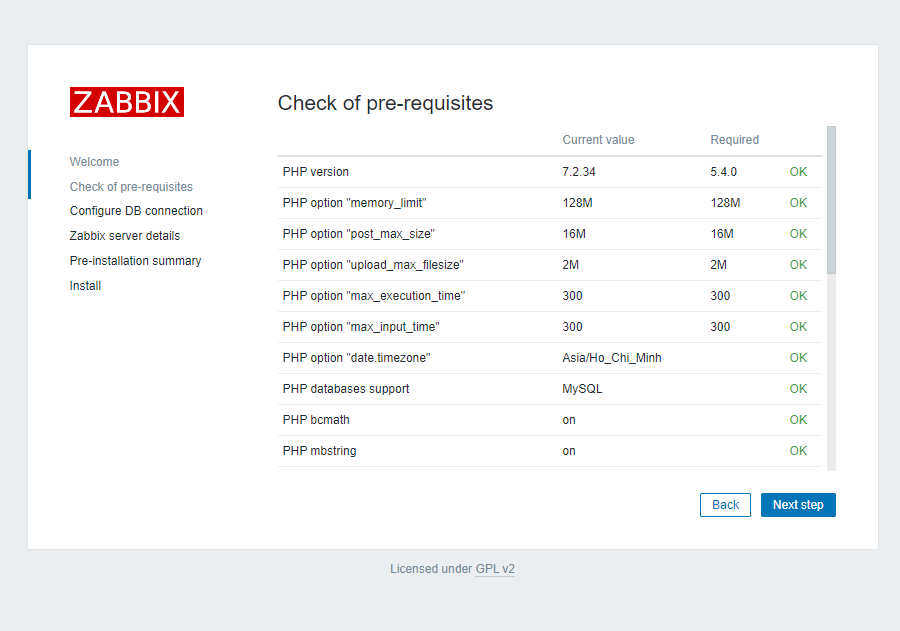
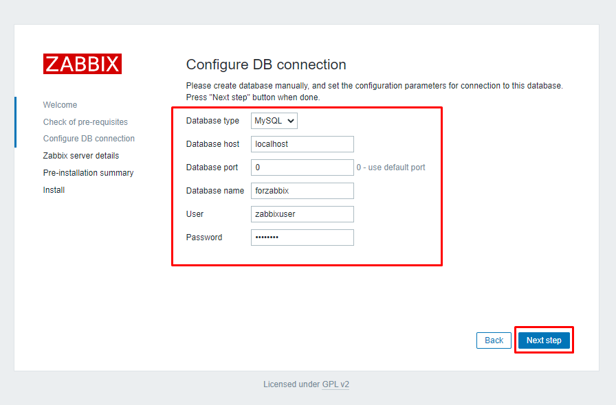
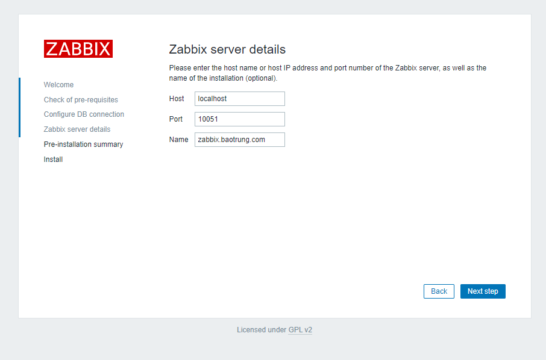
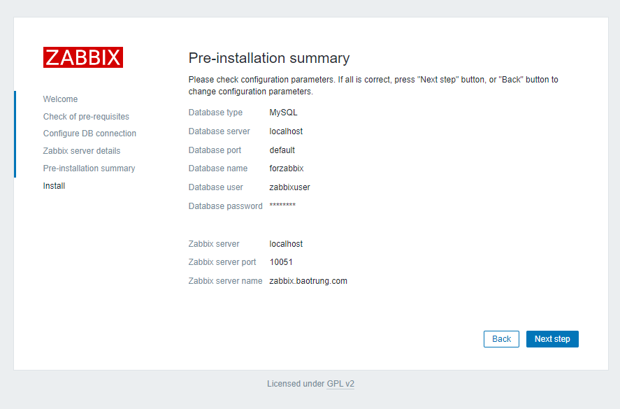
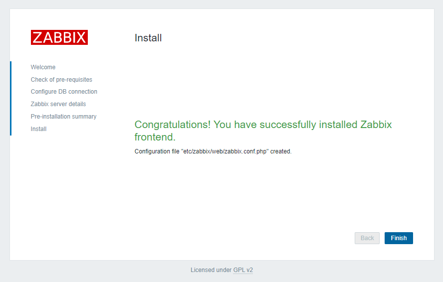
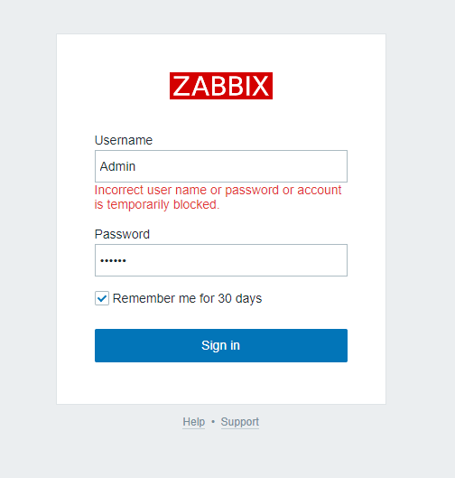

# Cài đặt Zabbix Server trên hđh CentOS 7

- Vô hiệu SElinux

```sh
vi /etc/sysconfig/selinux
# sửa SELINUX = disabled
```

- Cài đặt Apache webserver

```sh
yum -y install httpd
systemctl start httpd
systemctl enable httpd
```

- Cài đặt epel và remi repos

```sh
yum -y install epel-release -y
yum install http://rpms.remirepo.net/enterprise/remi-release-7.rpm
```

- Vô hiệu PHP 5 repositories và enable PHP 7.2 repo

```sh
yum-config-manager --disable remi-php54
yum-config-manager --enable remi-php72
```

- Cài đặt PHP

```sh
yum install php php-pear php-cgi php-common php-mbstring php-snmp php-gd php-pecl-mysql php-xml php-mysql php-gettext php-bcmath
```

- Chỉnh sửa time zone PHP tại file php.ini

```sh
vi /etc/php.ini
date.timezone = Asia/Ho_Chi_Minh
```

- Cài đặt MariaDB

```sh
yum --enablerepo=remi install mariadb-server
systemctl start mariadb
systemctl enable mariadb
```

- Cấu hình bảo mật MariaDB

```sh
mysql_secure_installation
```

```sh

```

- Đăng nhập DB server và nhập password vào

```sh
mysql -u root -p
```

- Tạo Database cho Zabbix

```sh
create database forzabbix CHARACTER SET UTF8 COLLATE UTF8_BIN;
```

- Tạo user cho Database

```sh
create user 'zabbixuser'@'localhost' identified BY '123456a@';
```

- Gán quyền DB với DB User

```sh
grant all privileges on forzabbix.* to zabbixuser@localhost;
flush privileges;
quit;
```

- Cài đặt Zabbix

```sh
rpm -ivh https://repo.zabbix.com/zabbix/4.0/rhel/7/x86_64/zabbix-release-4.0-1.el7.noarch.rpm
yum install zabbix-server-mysql zabbix-web-mysql zabbix-agent zabbix-get
```

- Configure Zabbix

```sh
vi /etc/httpd/conf.d/zabbix.conf
# chỉnh sửa
php_value date.timezone Asia/Ho_Chi_Minh
```

- Sau đó Restart lại httpd

```sh
systemctl restart httpd
```

- Tiếp theo bạn truy cập vào thư mục sau ```/usr/share/doc/zabbix-server-mysql-4.0.43``` và import MySQL

```sh
cd /usr/share/doc/zabbix-server-mysql-4.0.43
zcat create.sql.gz | mysql -u zabbixuser -p forzabbix
```

- Mở file zabbix_server.conf tại đây

```sh
vi /etc/zabbix/zabbix_server.conf
```

- Tại đây tìm và thay đổi thông số cấu hình mặc định thành thông tin database mà trước đó đã tạo

```sh
DBHost=localhost
DBName=forzabbix
DBUser=zabbixuser
DBPassword=123456a@
```

- Sau khi chỉnh sửa hoàn tất thì khởi động lại dịch vụ Zabbix

```sh
systemctl restart zabbix-server
systemctl enable zabbix-server
```

- Lưu ý nếu máy chủ có cài đặt firewall thì mở **port TCP 80, 443, 10051, 10050**

- Setup Zabbix: truy cập Zabbix tại trình duyệt bằng đường dẫn ```http://<ip_address>/zabbix```













- Đăng nhập bằng tài khoản default với username **Admin** và password **zabbix**

