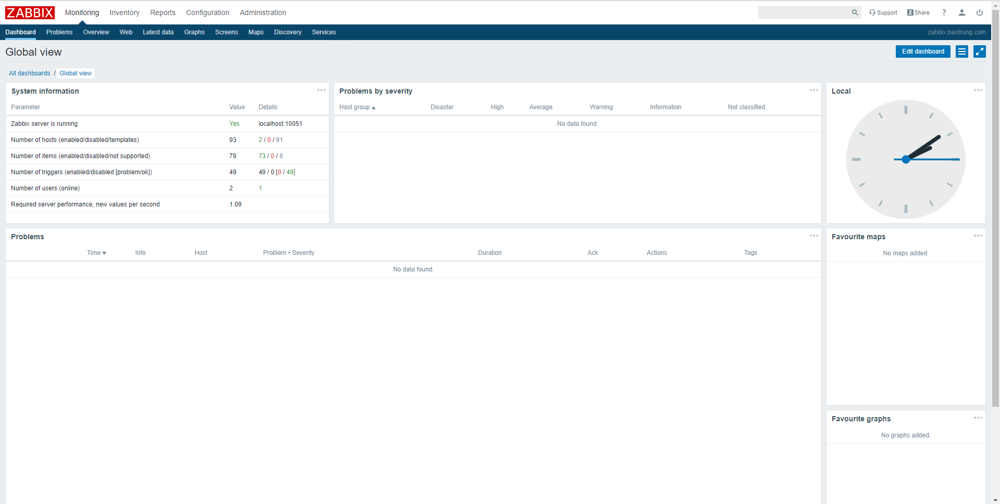
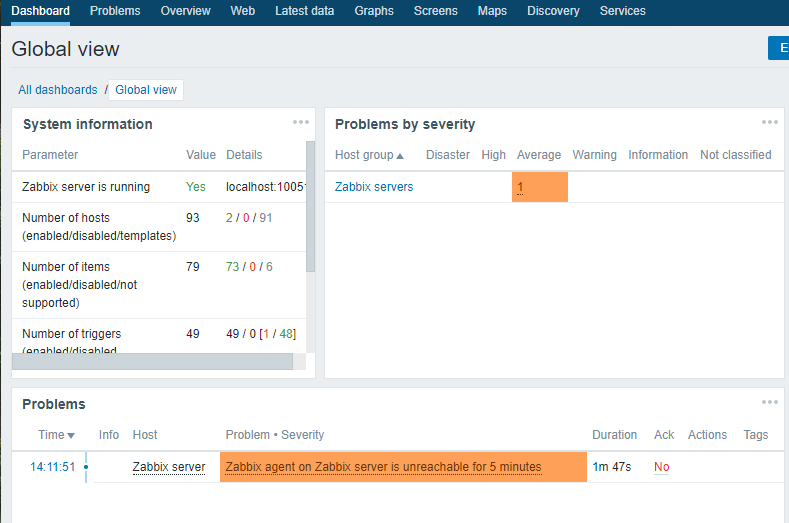
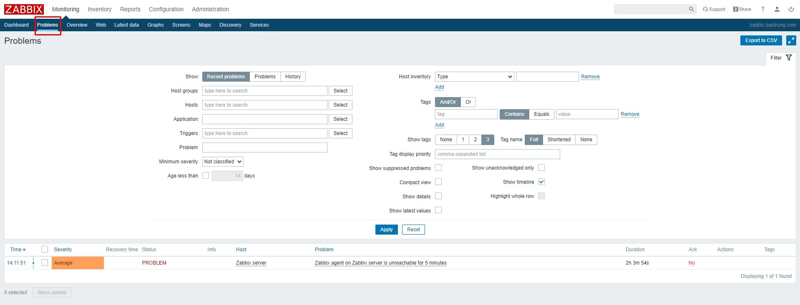
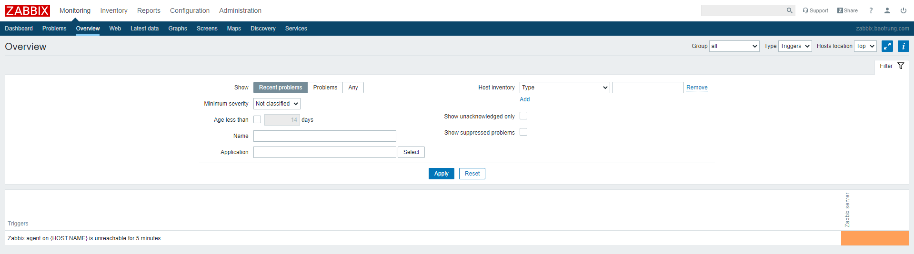
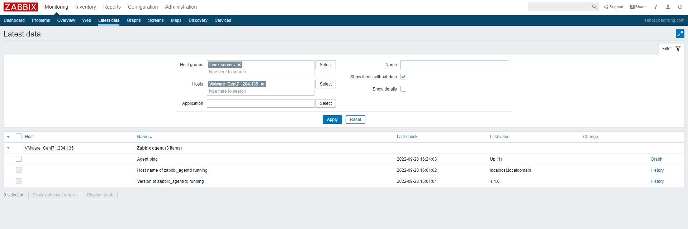

# Các thao tác với Zabbix

## Giao diện chính

- Đây là giao diện tổng quan của Zabbix, gồm nhiều mục lớn như Monitoring, Inventory, Reports, Configuration, Administrator. Trong các tab lớn sẽ bao gồm nhiều task thành phần nhỏ hơn

## Monitoring

#### Dashboard

- Là giao diện hiển thị các dashboard trực quan để người quản trị nhìn trực tiếp, người quản trị có thể tạo ra rất nhiều các dashboard khác nhau, nhưng tại 1 tab screen chỉ có thể xem được 1 dashboard bất kỳ nào đó
- Từ dashboard có thể nhanh chóng liên kết đến các thành phần như Graphs, Screens, Map bằng
cách thêm các thành phần mong muốn vào mục Favourite graphs, Favourite Screen và fFavourite map

#### Problems

- Hiển thị các vấn đề đối với từng device mà zabbix server thu thập dữ liệu về. Hỗ trợ cơ chế lọc theo ý muốn của người quản trị

#### Overview

- Là sự tổng hợp thông tin về data zabbix server thu thập được, có thể lọc theo group, host, kiểu data

#### Latest data

- Dữ liệu mới nhất mà zabbix server thu thập được

#### Screen

- Screen: là sự tập hợp các thông tin như Graphs, map, data, overview,... vào chung 1 màn hình giám sát. Giúp người quản trị có thể lựa chọn các thông tin cần thiết hiển thị, giúp có cái nhìn tổng quát những thông tin mà người quản trị mong muốn

#### Maps

- Là thành phần cung cấp khả năng giám sát hệ thống dưới hình thức mô hình mạng. Giúp người quản trị có cái nhìn tổng quan về hệ thống sống mạng dưới dạng sơ đồ, trong trường hợp có sự cố sẽ giúp người quản trị đánh giá tầm ảnh hưởng của thiết bị gặp sự cố và đưa ra giải pháp phù hợp

#### Discovery

- Tính năng cho phép Zabbix server tự động tìm kiếm các thiết bị được cài đặt Zabbix agent đã cấu hình kết nối về Zabbix server trong cùng mạng với Zabbix server

## Configuration

#### Host group

- Tập hợp lại các host có chung 1 mục đích sử dụng hoặc người quản trị tập hợp lại để phục vụ 1 mục đích quản lý chung 

#### Templates

- Là tập hợp các thực thể có thể áp dụng cho các Host, 1 Template sẽ chứa trong nó các lệnh để truy vấn lấy dữ liệu, hiển thị thông tin dữ liệu lấy được, thông tin tình trạng thiết bị, hiển thị và thông báo lỗi,...
- Trong mỗi Template, các tập lệnh được chia thành: items, triggers, graphs, applications, screens (có từ Zabbix 2.0), low-level discovery rules (có từ Zabbix 2.0), web scenarios (có từ Zabbix 2.2). Tùy theo giám sát thiết bị, dịch vụ, ứng dụng nào thì các thành phần này sẽ được thiết lập khác nhau

#### Host

- Host là 1 máy tính, server, vps chạy các hđh khác nhau hoặc 1 thực thể trong hệ thống mạng như là máy in, máy chấm công, máy photo, camera có hỗ trợ các giao thức mà monitor zabbix cung cấp

#### Maintance

- Có thể xác định thời gian bảo trì cho máy chủ và group trong Zabbix. Có 2 loại Maintance - với thu thập dữ liệu và không thu thập dữ liệu
- Ví dụ server của bạn off trong khoảng thời gian này để nâng cấp sửa chữa, thì maintance sẽ được lựa chọn cấu hình để không thu thập dữ liệu trong khoảng thời gian đó

#### Action

- Nơi cấu hình, lựa chọn các kiểu thông báo khi có sự kiện xảy ra bởi cấu hình trigger. Người dùng phải tự định nghĩa các action theo mục đích

#### Event correlation

- Cho phép cấu hình tương quan giữa các sự kiện với độ chính xác và tùy biến linh hoạt

#### Discovery

Thiết lập range IP, nếu trong range có thiết bị nào mà cài đặt các giao thức mà Zabbix server hỗ trợ thì sẽ tự động thu thập data về

## Administration

- Chức năng của tab Administration là để cấu hình chung cho Zabbix đối với user có quyền Admin

#### General

- Là nơi cho phép người quản trị tùy chỉnh giao diện cho Zabbix WebInterface
- GUI: cung cấp 1 số tùy chỉnh mặc định liên quan đến giao diện người dùng
    - Default theme: chủ đề mặc định của giao diện. Thường là màu xanh da trời
    - Dropdown first entry: chọn nó là mục đầu tiên trong Dropdown
    - Search/Filter elements limit: số lượng tối đa hiển thị các hàng trong tìm kiếm và lọc
    - Max count of element to show inside table cell: giới hạn hiển thị trong bảng
    - Enable event ackowledges: cho phép các event trong Zabbix kích hoạt
    - Show events not older than (in days): cho phép hiển thị trạng thái Trigger bao nhiêu ngày
    - Max count of events per trigger to show: số event được kích hoạt tối đa trong màn hình trạng thái
    - Show warning if Zabbix server is down: cho phép hiển thị 1 thông điệp cảnh báo khi ko kết nối được Zabbix Server
- HouseKeeping: quy định các thời gian định kỳ được thực hiện bởi Zabbix. Quá trình xóa thông tin hết hạn và thông tin được xóa bởi người dùng. Có thể tùy chỉnh các dữ liệu được lưu tối đa trong bao lâu trên Zabbix. Gồm các phần có thể cấu hình như Event and alerts, Services, Audit, User sessions, History, Trends
    - Enable internal housekeeping: lựa chọn bật hoặc tính time để xóa bỏ thông tin 
    - Tigger data storage period: khoảng thời gian dọn dẹp các thông tin về việc lưu trữ data trigger
    - Internal data storage period: khoảng thời gian dọn dẹp Internal data storage
    - Network discovery data storage period: khoảng thời gian dọn dẹp discovery data storage
- Images: chứa tất cả các hình ảnh, icon, background được hiển thị trong Zabbix
- Icon mapping: phần này cho phép tạo biểu tượng bản đồ của 1 host với các biểu tượng nhất định. Các thông tin trong các tùy chọn đều phục vụ cho việc tạo bản đồ
    - Name: tên icon map (duy nhất)
    - Mappings: danh sách các ánh xạ mà icon map tham chiếu đến
    - Inventory field: list các danh sách thiết bị tồn tại
    - Expression: mô tả biểu thức chính quy
    - Icon: icon được dùng nếu biểu thức chính quy lỗi
    - Default: icon mặc định được dùng
- Regular expressions: tạo và quy ước các biểu thức chính quy
- Macros: tạo các đoạn macro tương ứng với giá trị
- Value mapping: tạo các giá trị tương ứng với các mức
- Working time: tham số toàn hệ thống xác định thời gian làm việc
- Trigger severities: cấu hình màu hiển thị đối với các mức của trigger
- Trigger displaying options: màu sắc, hiệu hiển thị khi có event
- Other configuration parameters

#### Proxies

- Cho phép cấu hình các Proxy trên giao diện Zabbix
- Name: tên của proxy
- Mode: chế độ của proxy (active hoặc passive)
- Encryption: mã hóa kết nối từ Zabbix Server đến Proxy
- Last seen (age): thời gian tại thời điểm kết nối cuối cùng với proxy
- Host count: số host mà proxy quản lý 
- Item count: số lượng item mà proxy sử dụng
- Required performance (VPS): hiệu suất của proxy
- Host: danh sách các host mà proxy quản lý

#### Authentication

- Phương pháp xác thực người dùng Zabbix: thẩm định nội bộ, LDAP và HTTP

#### User groups

- Quản lý các nhóm trong Zabbix

#### Users

- Tùy chỉnh các tài khoản user cho Zabbix, có thể tạo thêm các user khác với việc phân quyền tương ứng

#### Media types

- Các kênh alert

#### Scripts

#### Queue

- Thông tin về hàng đợi trong quá trình cập nhật dữ liệu về từ các nguồn agent
