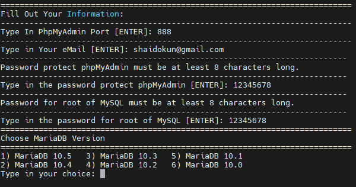
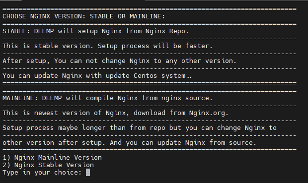
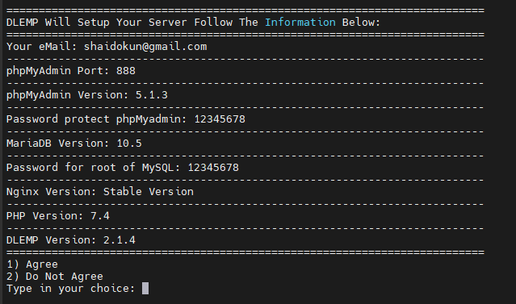
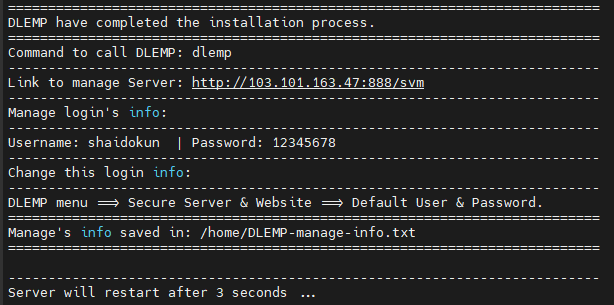

# Giới thiệu DLEMP

DLEMP viết tắt của D - Docker, L - Linux, E - Nginx, M - MySQL, P - PHP

Là bộ phần mềm tích hợp trên máy chủ Linux với nhiều đoạn mã được cấu hình sẵn, điều này giúp việc sử dụng và cấu hình máy chủ trở nên đơn giản hơn

### Ưu điểm của DLEMP

DLEMP nhanh, nhẹ và an toàn: DLEMP không phải là 1 hosting controller và không có bất kỳ dịch vụ dư thừa nào chạy ngầm 

DLEMP chỉ sử dụng những đoạn script được cấu hình sẵn và được tối ưu cực kỳ, chỉ thực thi khi được gọi

### Các tính năng có thể kể đến

- Tự động cài đặt và cấu hình WordPress
- Cài đặt và tự động gia hạn SSL miễn phí
- Tự động sao lưu dữ liệu website và cơ sở dữ liệu hàng ngày, hàng tuần, hàng tháng tùy theo cấu hình
- Tự động upload backup lên Google Drive để bảo vệ dữ liệu
- Dễ dàng cấu hình và thay đổi phiên bản nginx, MySQL, PHP
- Dễ dàng thao tác bằng việc sử dụng số tương ứng với lệnh được lập trình sẵn

## Cài đặt DLEMP

- Trước tiên, cập nhật các gói phần mềm của hệ điều hành

```sh
yum update -y
```

Để bắt đầu cài DLEMP, sử dụng lệnh

```sh
curl -L https://script.dlemp.net -o dlemp && bash dlemp
```

Chọn ```1``` để tiến hành cài đặt 

Nhập số cổng của phpMyAdmin tùy ý, nhập email, mật khẩu phpMyAdmin, mật khẩu root của MySQL và chọn phiên bản cho MariaDB



Chọn phiên bản của nginx



Xác nhận lại cấu hình cài đặt để bắt đầu cài đặt



Cài đặt thành công và server tự khởi động lại 



