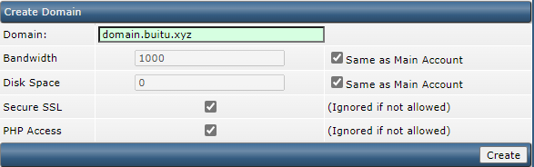
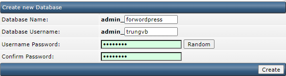
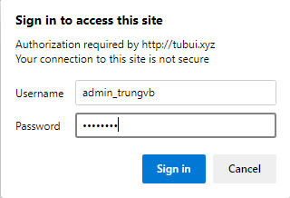

# Tạo Domain và Database cho User

## Tạo domain

1. Ở Menu của User level, chọn ```Domain Setup``` -> ```Add another domain```

2. Nhập thông tin domain và chọn ```Create```



## Tạo database cho domain

1. Tại Menu của User level, chọn ```MySQL Management``` -> ```Create new Database```



2. Đăng nhập vào phpMyAdmin để kiểm tra

Ở menu Advanced Features, chọn ```phpMyAdmin``` -> Nhập username và password đã tạo khi thiết lập database



Lúc này ta sẽ thấy database mình vừa tạo, người dùng có thể thực hiện nhiều thao tác quản lý database mà phpMyAdmin cung cấp ở đây

