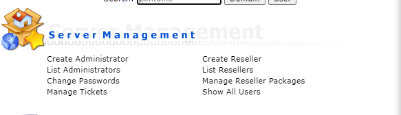
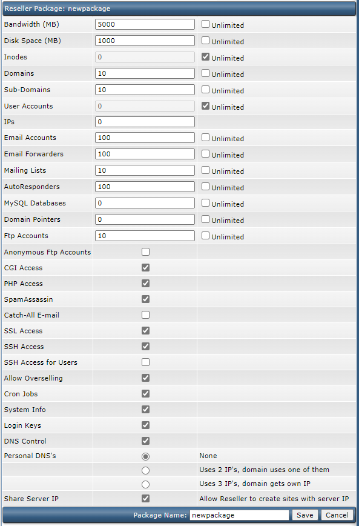
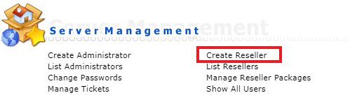
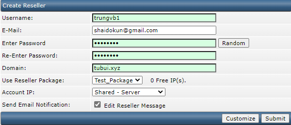
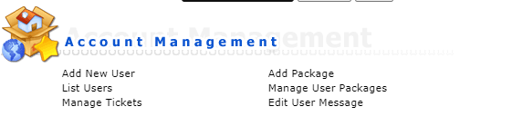
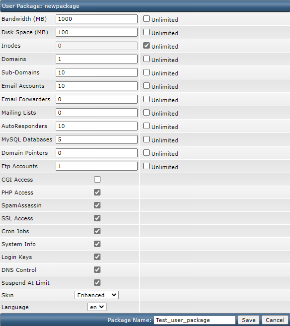
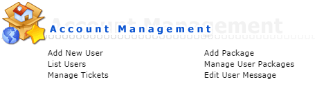
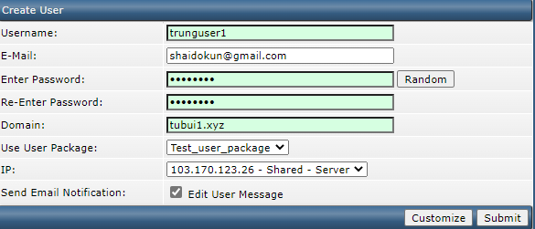

# Add Reseller và User cho DirectAdmin

## Add Reseller

1. Trước khi tạo reseller, ta phải tạo package trước

Chọn ```Manage Reseller Packages``` -> ```Add Package```



2. Thiết lập thông số cho Package
- **Bandwidth**: Băng thông cấp phát cho User
- **Disk space**: Dung lượng ổ cứng cấp phát cho User
- **Inodes**: Số file tối đa được phép tạo
- **Domains**: Số lượng tên miền website được tạo trên User
- **Email Accounts**: Số lượng email mà User có thể tạo



Sau khi thiết lập xong thông số, thay đổi tên Package và chọn ```Save``` để tạo Package

*Lưu ý: Ta hoàn toàn có thể thay đổi thông số Package với menu Manage Reseller Package*

3. Tạo Reseller

Chọn ```Create Reseller``` từ màn hình menu chính



Thiết lập thông tin Reseller



## Add User

1. Tạo Package cho User

Đăng nhập vào tài khoản Reseller, chọn ```Add Package```



2. Thiết lập thông số cho Package



Ý nghĩa của các thông số giống như Reseller Package

3. Tạo User

Tại menu chính, chọn ```Add new user```



Nhập thông tin User



