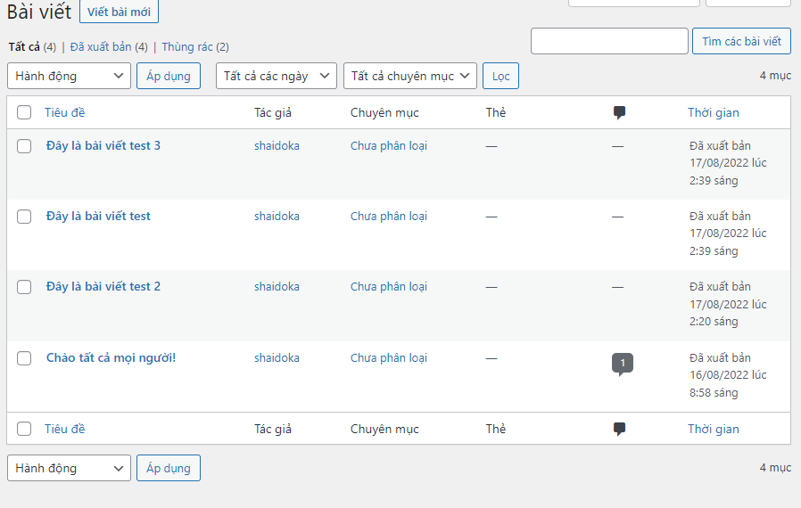
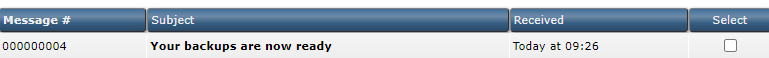
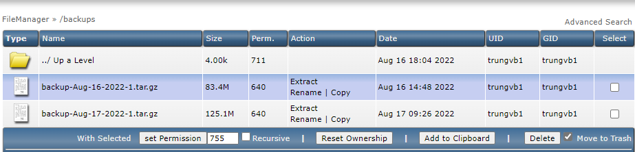
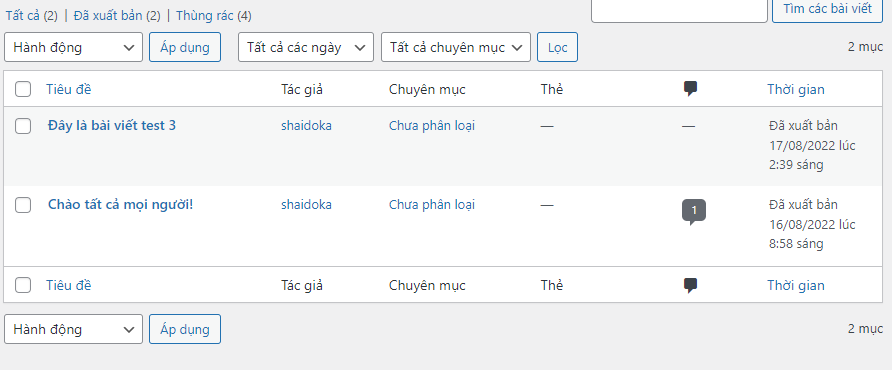
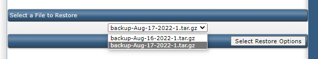
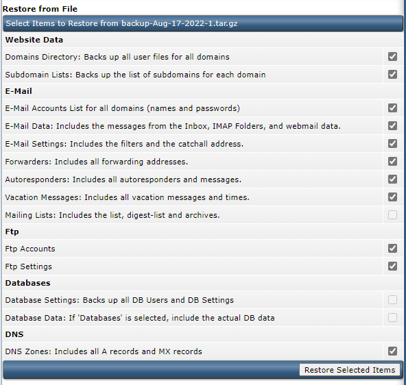
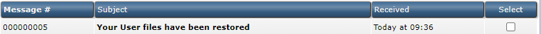
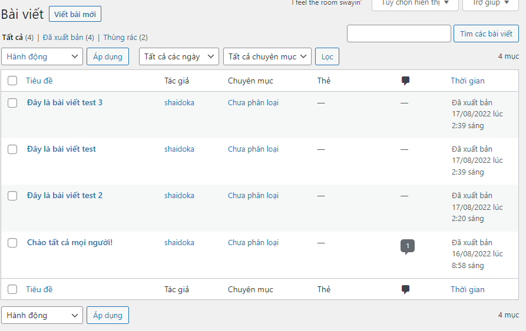

# Thực hiện Backup và Restore database trên DirectAdmin

#### 1. Tạo 1 vài bài viết trên WordPress



#### 2. Tạo file backup

- Đăng nhập vào trang quản trị DA -> Tại User Level, chọn ```Create/Restore Backups```

- Chọn những thông tin muốn backup và nhấn ```Create Backup```


- Sau đó, chờ vài phút để hệ thống tiến hành tạo file backup, sau khi hoàn thành sẽ có tin nhắn gửi về phần ```Message System```



- Kiểm tra file backup ở ```FileManager >> /backups```



#### 3. Xóa 1 vài bài viết trước khi thực hiện Restore



#### 4. Restore database

- Tại menu ```Create/Restore Backups```, chọn file backup muốn thực hiện Restore và nhấn ```Select Restore Options```



- Chọn những thông tin muốn Restore và nhấn ```Restore Selected Items```



- Khi quá trình Restore hoàn tất sẽ có tín nhắn gửi về ```System Message```



- Các bài viết đã quay trở lại

