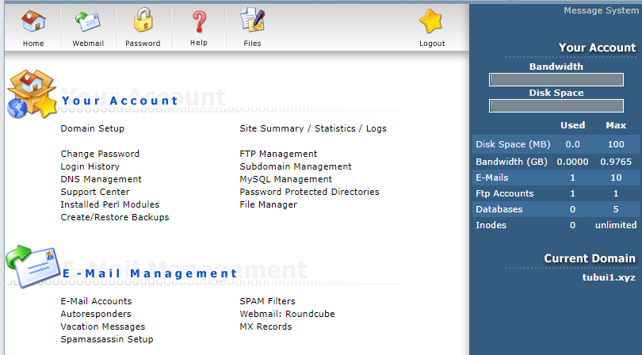
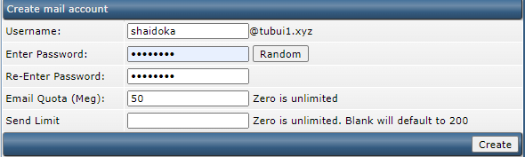
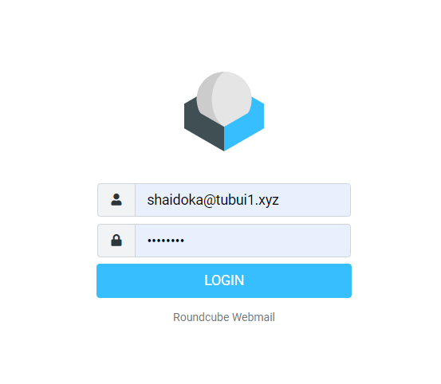
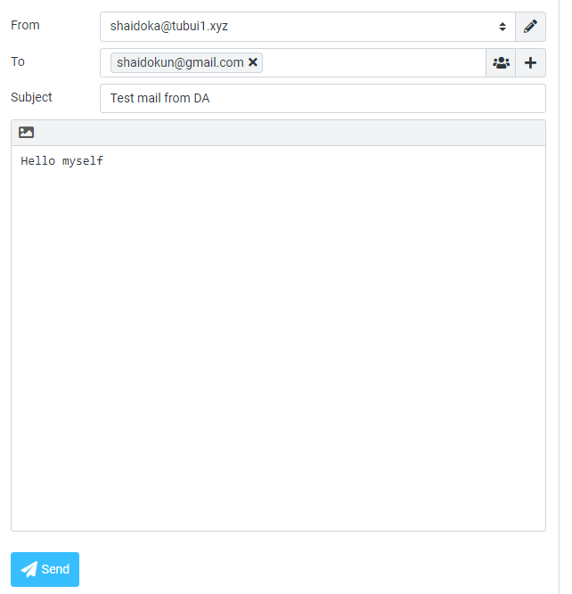
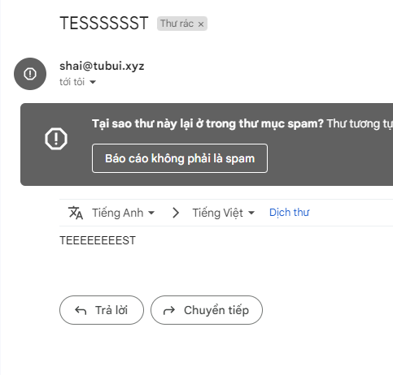

# Tạo email trên DA

1. Login vào user muốn tạo email



2. Tạo tài khoản email

Tại menu user, chọn ```E-mail Accounts``` -> ```Create mail account```



Nhập thông tin và chọn ```Create``` để tạo mail account

3. Kiểm tra gửi nhận mail

Tại giao diện menu, chọn ```Webmail: RoundCube``` hoặc truy cập đường dẫn ```tubui.xyz/roundcube```

Đăng nhập với tài khoản email vừa tạo



Gửi thư kiểm tra



Nhận thư thành công



**Lưu ý:** Để gửi được mail phải thêm những bản ghi sau

- Host ```mail```, type ```A```, value ```103.170.123.26```
- Host ```@```, type ```MX```, value ```mail.tubui.xyz```
- Host ```_dmarc```, type ```TXT```, value ```"v=DMARC1; p=none; rua=mailto:mailauth-reports@mail.tubui.xyz"```
- Host ```@```, type ```TXT```, value ```"v=spf1 +a +mx +ip4:103.170.123.26 ~all"```

