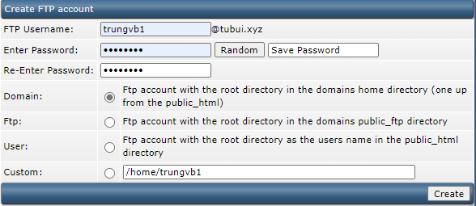
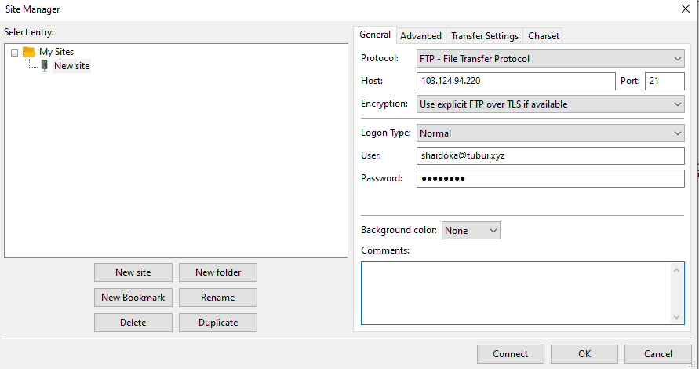
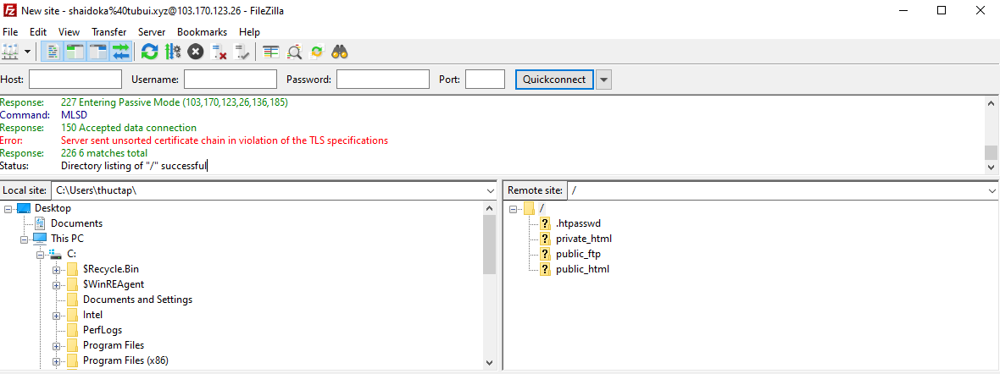

# Tạo và sử dụng FTP trên DA

1. Tạo tài khoản FTP

Tại giao diện Menu của user level, chọn ```FTP Management``` -> ```Create FTP Account```

2. Thiết lập thông tin tài khoản FTP



Trong đó có 4 lựa chọn đường dẫn dữ liệu cho tài khoản FTP:
- ```Domain```: cho phép truy cập vào thư mục chứa mã nguồn của tài khoản FTP (public_html)
- ```FTP```: cho phép truy cập vào public_ftp của domain
- ```User```: cho phép truy cập vào thư mục FTP của user
- ```Custom```: cho phép tùy chỉnh đường dẫn truy cập bất kỳ

Sau khi lựa chọn xong, nhấn ```Create``` để hoàn tất tạo tài khoản FTP

3. Sử dụng FileZilla Client để kết nối đến FTP server

Ở giao diện chính của FileZilla, chọn ```File``` -> ```Site Manager```

Thông tin điền như sau (với user và password đã tạo ở bước 2):



Sau đó nhấn ```Connect``` để kết nối đến server

