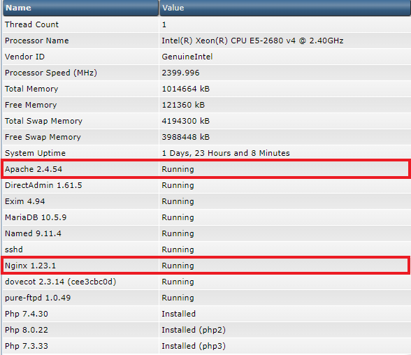

# Reverse-proxy Nginx-Apache

Webserver Nginx hay Apache thì đều có điểm yếu điểm mạnh riêng. Trong khi Nginx vượt trội hơn về việc truyền tải những trang web tĩnh, thì Apache lại phục vụ tốt hơn với những trang web động. Do đó, để tận dụng được ưu thế của cả 2 webserver này, người ta sử dụng Reverse-proxy Nginx-Apache

Lúc này, Nginx được sử dụng như 1 reverse proxy của Apache. Đối với nội dung tĩnh là lợi thế của Nginx, các file sẽ được Nginx phục vụ 1 cách nhanh chóng và trực tiếp cho client. Còn đối với nội dung động là lợi thế của Apache, Nginx chuyển cho Apache thực hiện rồi trả về kết quả cho Nginx, Nginx đưa lại kết quả đó cho client. Nói cách khác, Nginx xử lý nội dung tĩnh như HTML, CSS, JS,... còn Apache lo các tập tin đọng như PHP,...

### Cài đặt reverse-proxy Nginx-Apache trên DirectAdmin

1. Đi đến thư mục custombuid

```sh
cd /usr/local/directadmin/custombuild
```

2. Sửa cấu hình webserver trong ```options.conf```

```sh
webserver=nginx_apache
```

3. Update và rebuild

```sh
./build update
./build nginx_apache
./build rewrite_confs
```

4. Check hoạt động

