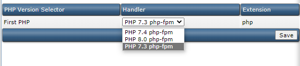
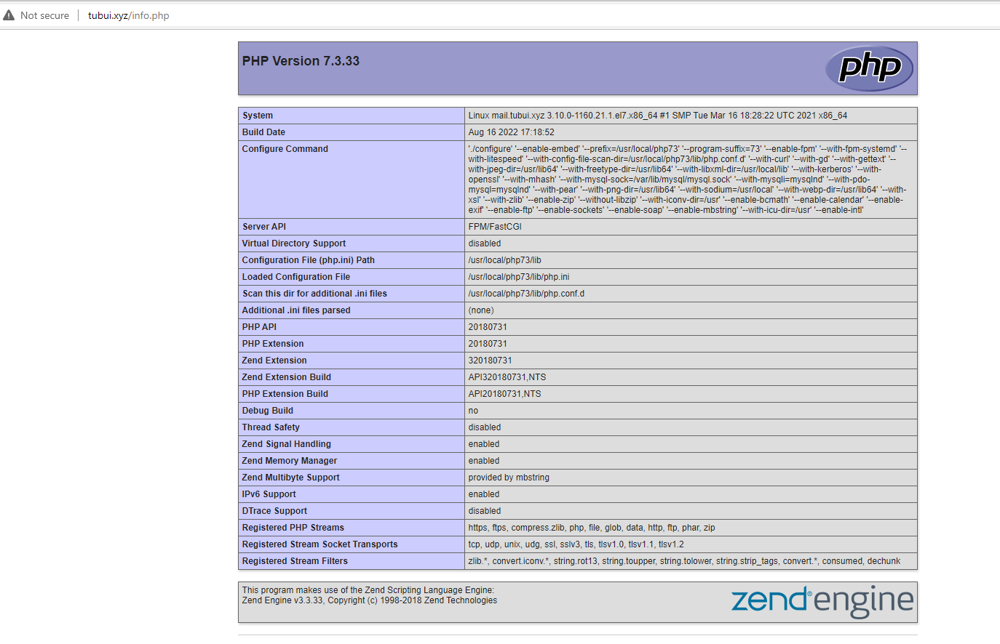

# Cài đặt Nginx + PHP custombuild cho DA

#### 1. Đổi phiên bản PHP và đổi webserver thành nginx

- Vào thư mục Custombuild của DA:

```sh
cd /usr/local/directadmin/custombuild
```

- Kiểm tra file cấu hình ```options.conf```:

```sh
vi options.conf
```

- Có thể thấy, DA cho phép ta build tối đa 4 phiên bản PHP cho hệ thống của mình để tùy chọn sử dụng theo mục đích riêng. Ở đây 2 phiên bản đầu tiên đã được cài đặt sẵn, ta sửa lại ```php3_release``` thành phiên bản mà mình muốn cài đặt. Bên cạnh đó, ta sửa 1 vài thông tin để build nginx. 1 số cấu hình cần phải sửa như sau:

```sh
php3_release=7.3
php3_mode=php-fpm
webserver=nginx
phpmyadmin=yes
```

#### 2. Tiến hành cài đặt custombuild

- Lần lượt sử dụng các lệnh sau:

```sh
./build update
./build nginx
./build php n
./build rewrite_confs
```

**Lưu ý 1:** Nếu gặp thông báo "Your DirectAdmin version (1.61) is older than minimal required for this version of CustomBuild (1.63)" thì ta hạ phiên bản Custombuild bằng lệnh sau:

```sh
sed -i 's/1.63/1.61/g'  /usr/local/directadmin/custombuild/build
```

**Lưu ý 2:** Trong quá trình cài đặt php, vps có thể bị tràn RAM khiến cho việc cài đặt thất bại, trong trường hợp này ta nên tạo thêm 4GB swap bằng các thao tác sau:

```sh
dd if=/dev/zero of=/swapfile count=4096 bs=1MiB
chmod 600 /swapfile
mkswap /swapfile
swapon /swapfile
#Sau đó vào file /etc/fstab và thêm dòng này vào cuối file:
/swapfile swap swap sw 0 0
```

#### 3. Kiểm tra thành quả

- Thêm file ```info.php``` vào trong thư mục ```public_html``` với nội dung như sau:

```sh
<?php
phpinfo();
?>
```

- Đổi phiên bản php thành phiên bản ta vừa cài đặt



- Vào trang ```<domain>/info.php```


