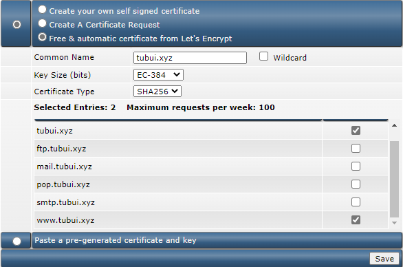
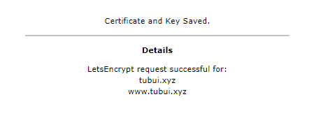
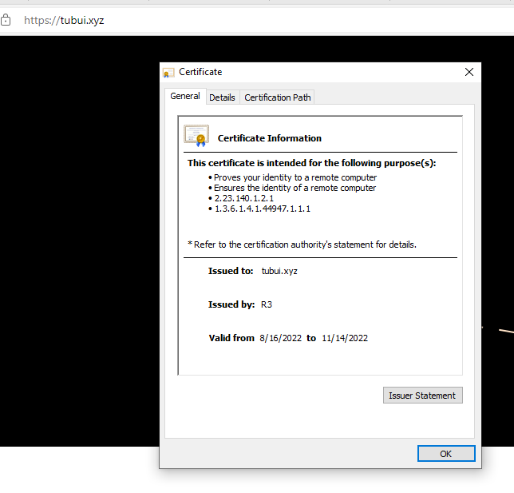

# Cài đặt SSL Let's Encrypt trên DA

1. Tại giao diện chính, chọn ```SSL Certificate```

2. Chọn sử dụng ```Free & automatic certificate from Let's Encrypt```

Thiết lập thông tin như sau



3. Nhấn ```Save``` và chờ xác nhận SSL



4. Kiểm tra

