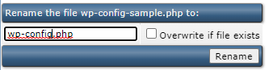
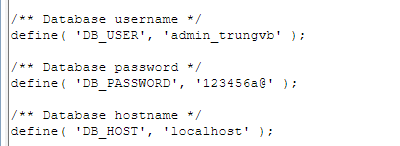

# Thiết lập 1 trang WordPress cho User trên DA

1. Cần ít nhất 1 user và domain

2. Tạo database cho user trên

3. Download WordPress ở trang chủ [WordPress](https://vi.wordpress.org/latest-vi.tar.gz)

4. Upload WordPress lên server bằng File Manager

Tại menu chính chọn ```File Manager``` -> Vào thư mục ```public_html``` -> ```Upload files to current directory``` -> Upload file .tar.gz vừa tải về và giải nén

5. Đưa toàn bộ file trong thư mục WordPress vừa giải nén ra thư mục public_html

Select all -> ```Add to Clipboard``` -> Về thư mục ```public_html``` -> ```Move Clipboard files here```

6. Rename ```wp-config-sample.php``` -> ```wp-config.php```



7. Sửa thông tin về database name, username và password trong file wp-config.php



8. Đăng nhập trang quản trị WordPress bằng đường dẫn ```tên-miền-user/wp-admin```

